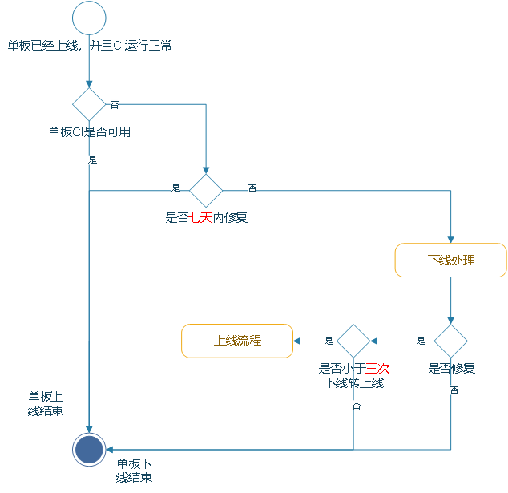

# 三方芯片社区主干准入规范

芯片适配按照解决方案的维度展开，当前有四大类解决方案：智能家居、轻量带屏、智慧视觉和富媒体交互。如果发现芯片不属于这四类定义里面，可以新增解决方案，由PMC评审通过。

### 代码架构适配规范

以轻量带屏解决方案为例，其他解决方案，可由对应的SIG决定：

| **大类**      | **描述**                                                     | **是否必须** | **备注**                                                     |
| ------------- | ------------------------------------------------------------ | ------------ | ------------------------------------------------------------ |
| Board SoC分离 | 1. 芯片厂商目录/device/soc/<soc_company>，需要考虑SoC系列的代码复用2. 单板厂商目录/device/boards/<board_company>，需要考虑扩展板 | 是           |                                                              |
| 内核          | 1. 按照轻量系统三方芯片移植指导适配内核使用内核提供的CMSIS或者POSIX接口 2.使用内核提供的文件系统，而不是FileUtils接口适配 3. 按照轻量系统三方芯片移植指导适配LWIP，特别是lwipopts不要随意改动，软总线等编译依赖它 | 是           | 类似3861的ROM化内核不适合作为OH社区                          |
| WiFi、蓝牙    | 当前OH不提供WiFi、蓝牙协议栈，适配需要保证适配WiFi、蓝牙的OH API | 是           |                                                              |
| HDF           | 需要使用采用HDF的框架（linux可选），适配HDI，采用HCS配置文件 | 是           | 某些HDF驱动模型待完善，因此驱动模型不做强制要求              |
| 系统基本能力  | 使用hilog、startup、samgr、ams、security分布式能力dsoftbus   | 是           | 1. bms验签能力还不具备2. 轻量系统分布式子系统dm、dms还未适配完，可选 |
| 图形显示      | 适配graphic_ui，使用ace                                      | 是           | 如果有硬件加速，需要适配                                     |
| 多媒体        | 本地mp3音频播放                                              | 是           | Mp4、aac、网络流音频待适配，视频和camera能力待支持           |
| 样例          | 贡献产品解决方案样例                                         | 否           |                                                              |

### 产品兼容性规范PCS

以轻量带屏解决方案为例，其他解决方案，可由对应的SIG决定：

| **大类**                                  | **描述**                                                     | **是否必须** | **备注**                                                  |
| ----------------------------------------- | ------------------------------------------------------------ | ------------ | --------------------------------------------------------- |
| DTS（Device Test Suite）                  | 确保 HAL 向前兼容，提高OpenHarmony系统 ( 核心硬件抽象层HALs和库libraries ) 和底层系统软件（内核kernel，模块moduls，固件firmware等）的健壮性、可依赖性和依从性WiFi API、蓝牙 API XTS用例HDI接口：Platform驱动、Peripheral驱动、图形HAL接口内核Posix接口、CMSIS接口等 | 是           | 蓝牙XTS用例缺失轻量系统 HDI接口XTS用例缺失                |
| ACTS（Application Compatible Test Suite） | 确保子系统 API 兼容性。1. Samgr、dsoftbus、dm、dms、ui、ace、ams、bms测试 | 是           | 轻量系统dsoftbus、dm、dms、ui、ace、ams、bms等XTS用例缺失 |
| 性能用例                                  | 强烈建议在benchmark用例下，能够达到30fps                     | 是           |                                                           |

### 工程工具

OpenHarmony社区选择几款典型的开发板作为门禁，其余的三方芯片开发板由三方开发板厂商维护，至少每日进行构建，保证功能可用。

### 开发板介绍资料

[devboard_intro_template](assets/xxboard.md)

### 开发板下架规则

