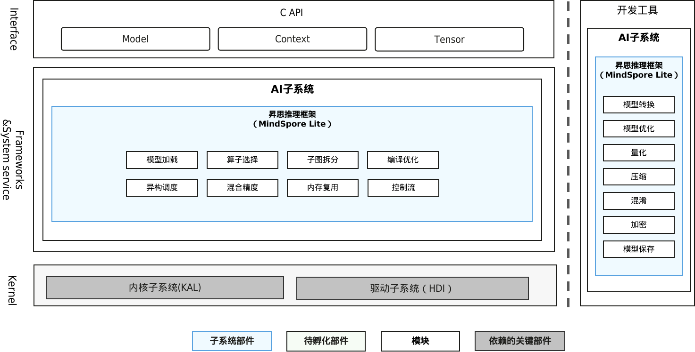

# SIG-AI-Framework

简体中文 | [English](./sig-ai-framework.md)

说明：本SIG的内容遵循OpenHarmony的PMC管理章程 [README](/zh/pmc.md)中描述的约定。

## SIG组工作目标和范围

### 工作目标

MindSpore Lite是一个极速、极智、极简的AI引擎，使能全场景智能应用，为用户提供端到端的解决方案，帮助用户使能AI能力。更多信息，请见[MindSpore Lite官网](https://www.mindspore.cn/lite)。MindSpore SIG不仅需要为用户提供基础的训练和推理服务；更重要的是，为了拓展生态，我们需要与广大开发者合作，协助他们贡献他们的代码上库。

### 工作范围

- 模型转换

MindSpore Lite模型转换工具不仅提供了将TensorFlow、TensorFlow Lite、Caffe、ONNX等模型格式转换为MindSpore Lite模型格式，还提供了算子融合、量化等功能。

- 模型训练

支持在端侧的小样本、迁移、增量训练，实现个性化AI体验。

- 模型推理

主要完成模型推理工作，即加载模型，完成模型相关的所有计算。推理是通过模型运行输入数据，获取预测的过程。

- 专用AI芯片支持

支持专用AI芯片接入MindSpore Lite。

## 代码仓
|             部件名称             |       部件功能描述       |                                   部件仓名称                                   |
| :------------------------------: | :----------------------: | :----------------------------------------------------------------------------: |
| 昇思推理框架 (MindSpore Lite) | 提供模型转换和推理的功能 | third_party_mindspore, third_party_flatbuffers|
- 代码仓地址:
  - MindSpore: https://gitee.com/openharmony/third_party_mindspore
  - DLLite-micro: https://gitee.com/openharmony-sig/dllite_micro
  - FlatBuffers: https://gitee.com/openharmony/third_party_flatbuffers
  - OpenCL-Headers: https://gitee.com/openharmony/third_party_opencl-headers
  - OpenCL-CLHPP: https://gitee.com/openharmony-sig/third_party_opencl-clhpp

## SIG组成员

### Leader

- @ivss(https://gitee.com/ivss)
- @zhanghaibo5(https://gitee.com/zhanghaibo5)

### Committers列表

- @zhaizhiqiang(https://gitee.com/zhaizhiqiang)
- @sunsuodong(https://gitee.com/sunsuodong)
- @zhang_xue_tong(https://gitee.com/zhang_xue_tong)
- @HilbertDavid(https://gitee.com/HilbertDavid)
- @jpc_chenjianping(https://gitee.com/jpc_chenjianping)

### 会议
 - 会议时间：双周例会，周一晚上19：00, UTC+8
 - 会议链接：请[订阅](https://lists.openatom.io/postorius/lists/dev.openharmony.io)邮件列表 dev@openharmony.io 获取会议链接

### 联系方式(可选)

- 邮件列表：xxx
- Zulip群组：https://zulip.openharmony.cn
- 微信群：xxx
