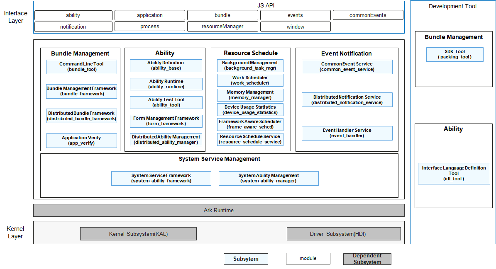

# SIG_ApplicationFramework
English | [简体中文](./sig-appframework_cn.md)

Note: The content of this SIG follows the convention described in OpenHarmony's PMC Management Charter [README](/zh/pmc.md).

## SIG group work objectives and scope

### work goals

Specifies basic design requirements of OpenHarmony ApplicationFramework, ApplicationFramework Review Process. Review the ApplicationFramework design document.

### work scope

OpenHarmony ApplicationFramework Governance Charter、ApplicationFramework Review, etc.

OpenHarmony ApplicationFramework technology stack scope is shown in the following figure.

## The repository

| Component Name                     | Component Description                                        | Component Repository Name                     |
| ---------------------------------- | ------------------------------------------------------------ | --------------------------------------------- |
| Command Line Tool                  | Provides the command line to install, update, uninstall and query information of OpenHarmony bundles. | bundlemanager_bundle_framework                |
| Bundle Management Framework        | Provides the ability to install, update, uninstall and query information of OpenHarmony bundles and service installation bundles. | bundlemanager_bundle_framework                |
| Distributed Bundle Framework       | Provides the ability to distributed manage bundles.          | bundlemanager_bundle_framework                |
| SDK Tool                           | Provide hap packaging, unpacking tools, and application manifest file checking tools used by IDE. | developtools_packing_tool                     |
| Application Verify                 | Provides integrity verification and source control capabilities for hap applications. | security_appverify                            |
| Common Event Service               | Provides applications with the ability to subscribe, publish, and unsubscribe from public events. | notification_common_event_service             |
| Distributed Notification Service   | Provides applications with the ability to publish, subscribe and unsubscribe notifications, and provides distributed notification data management capabilities. | notification_distributed_notification_service |
| Event Handler Service              | Provides the basic ability of OpenHarmony inter-thread communication. You can create new threads through EventRunner and throw time-consuming operations on new threads for execution, so as to reasonably handle time-consuming tasks without blocking the thread execution. | notification_eventhandler                     |
| Ability Definition                 | Definition of basic concepts of ability, mainly including want, configration, etc. | ability_ability_base                          |
| Ability Runtime                    | The ability framework subsystem is a development framework provided by OpenHarmony for developers to develop Harmony applications | ability_ability_runtime                       |
| Ability Test Tool                  | Ability testing tool, third-party developers can test their target abilities based on this testing tool, obtain the internal objects of meta-capabilities, control the life cycle scheduling of abilities, and simulate click events. | ability_ability_runtime/tree/master/tools     |
| Interface Definition Language Tool | IDL (Interface Definition Language) is a tool for defining the communication interface between client and server. | ability_idl_tool                              |
| Form Management Framework          | A development framework for developing and using OpenHamrony form. | ability_form_fwk                              |
| Distributed Schedule Framework     | Provides the ability to launch, invoke and migrate components across devices. | distributedschedule_dms_fwk                   |
| System Management Service          | Manages the registration of system services, local query and cross-device query, and control the access rights of system services. | distributedschedule_samgr                     |
| System Framework Service           | Defines how to implement a system ability in OpenHarmony and provides APIs to start and register system abilities. | distributedschedule_safwk                     |
| Background Task Management         | To manage long-term and short-term tasks in the background, and provide interfaces such as application, cancellation and query of corresponding tasks。 | resourceschedule_background_task_mgr          |
| Work Scheduler                     | Responsible for scheduling background delayed tasks, and providing corresponding application, cancellation, query interfaces and other interfaces for applications to perform tasks with low real-time performance. | resourceschedule_work_scheduler               |
| Device Usage Statistics            | Responsible for statistics and calculation of device usage information, including application usage, notification statistics and other information statistics, application group calculation, and provide corresponding query interfaces for privileged applications. | resourceschedule_device_usage_statistics      |
| Resource Schedule Service          | Provides the perception and distribution of system events such as application startup, exit, screen on and off, etc. The grouping of scheduling processes is jointly decided by sensing events, user operations, and background task execution status. | resourceschedule_resource_schedule_service    |
| Memory Management                  | Based on the life cycle status of the application, update the process recycling priority list, and manage system memory through memory recycling, killing and other means to ensure memory supply. | resourceschedule_memmgr                       |
| Framework Aware Scheduler          | In order to ensure the cpu scheduling supply, it updates the process scheduling groups and adjust the kernel schedule parameters to influence the kernel scheduling behavior according to the information of the application frame drawing and the application life cycle status. | frame_aware_sched                             |

- project name:
  - ability_ability_lite:https://gitee.com/openharmony/ability_ability_lite
  - ability_ability_runtime:https://gitee.com/openharmony/ability_ability_runtime
  - ability_ability_base:https://gitee.com/openharmony/ability_ability_base
  - ability_dmsfwk:https://gitee.com/openharmony/ability_dmsfwk
  - ability_dmsfwk_lite:https://gitee.com/openharmony/ability_dmsfwk_lite
  - ability_form_fwk:https://gitee.com/openharmony/ability_form_fwk
  - ability_idl_tool:https://gitee.com/openharmony/ability_idl_tool
  - security_appverify:https://gitee.com/openharmony/security_appverify
  - notification_common_event_service:https://gitee.com/openharmony/notification_common_event_service
  - resourceschedule_resource_schedule_service:https://gitee.com/openharmony/resourceschedule_resource_schedule_service
  - frame_aware_sched:https://gitee.com/openharmony/frame_aware_sched
  - resourceschedule_memmgr:https://gitee.com/openharmony/resourceschedule_memmgr
  - distributedschedule_samgr:https://gitee.com/openharmony/distributedschedule_samgr
  - resourceschedule_work_scheduler:https://gitee.com/openharmony/resourceschedule_work_scheduler
  - resourceschedule_device_usage_statistics:https://gitee.com/openharmony/resourceschedule_device_usage_statistics
  - resourceschedule_background_task_mgr:https://gitee.com/openharmony/resourceschedule_background_task_mgr
  - notification_distributed_notification_service:https://gitee.com/openharmony/notification_distributed_notification_service
  - notification_eventhandler:https://gitee.com/openharmony/notification_eventhandler
  - distributedschedule_safwk:https://gitee.com/openharmony/distributedschedule_safwk
  - distributedschedule_dms_fwk:https://gitee.com/openharmony/distributedschedule_dms_fwk
  - developtools_packing_tool:https://gitee.com/openharmony/developtools_packing_tool
  - bundlemanager_bundle_framework:https://gitee.com/openharmony/bundlemanager_bundle_framework
  - bundlemanager_bundle_framework_lite:https://gitee.com/openharmony/bundlemanager_bundle_framework_lite
  - developtools_ace_js2bundle:https://gitee.com/openharmony/developtools_ace_js2bundle
  - developtools_ace_ets2bundle:https://gitee.com/openharmony/developtools_ace_ets2bundle
  - third_party_weex-loader:https://gitee.com/openharmony/third_party_weex-loader
  - third_party_parse5:https://gitee.com/openharmony/third_party_parse5
  - third_party_glfw:https://gitee.com/openharmony/third_party_glfw
  - global_resource_tool:"https://gitee.com/openharmony/global_resource_tool"
  - third_party_chromium:https://gitee.com/openharmony/third_party_chromium
  - third_party_cef:https://gitee.com/openharmony/third_party_cef
  - web_webview:https://gitee.com/openharmony/web_webview
  - arkui_ace_engine_lite:https://gitee.com/openharmony/arkui_ace_engine_lite
  - arkui_napi:https://gitee.com/openharmony/arkui_napi
  - arkui_ace_engine:https://gitee.com/openharmony/arkui_ace_engine
  - global_resource_management:https://gitee.com/openharmony/global_resource_management
  - global_resource_management_lite:https://gitee.com/openharmony/global_resource_management_lite
  - utils_system_resources:https://gitee.com/openharmony/utils_system_resources
  - global_i18n:https://gitee.com/openharmony/global_i18n
  - global_i18n_lite:https://gitee.com/openharmony/global_i18n_lite
  - developtools_global_resource_tool:https://gitee.com/openharmony/developtools_global_resource_tool

## SIG Members

### Leader
- @huawei_qiangbo(https://gitee.com/huawei_qiangbo)

### Committers
- @huawei_qiangbo(https://gitee.com/huawei_qiangbo)
- @gongpingde(https://gitee.com/gongpingde)
- @lihong67(https://gitee.com/lihong67)
- @seaside_wu(https://gitee.com/seaside_wu)
- @laigerendaqiu(https://gitee.com/laigerendaqiu)
- @lanshouren(https://gitee.com/lanshouren)

### Meetings
 - Meeting time：Every Tuesday at 16:00 o'clock
 - Meeting application: https://shimo.im/sheets/qhwcqXRkqCXkcPcX/MODOC/
 - Meeting link: Welink Meeting or Others
 - Meeting notification: [Subscribe to] (https://lists.openatom.io/postorius/lists/dev.openharmony.io) mailing list dev@openharmony.io for the meeting link
 - Meeting-Minutes: [Archive link address](https://gitee.com/openharmony-sig/sig-content)

### Contact (optional)

- Mailing list: dev@openharmony.io
- Zulip group: https://zulip.openharmony.cn
- Wechat group：NA
