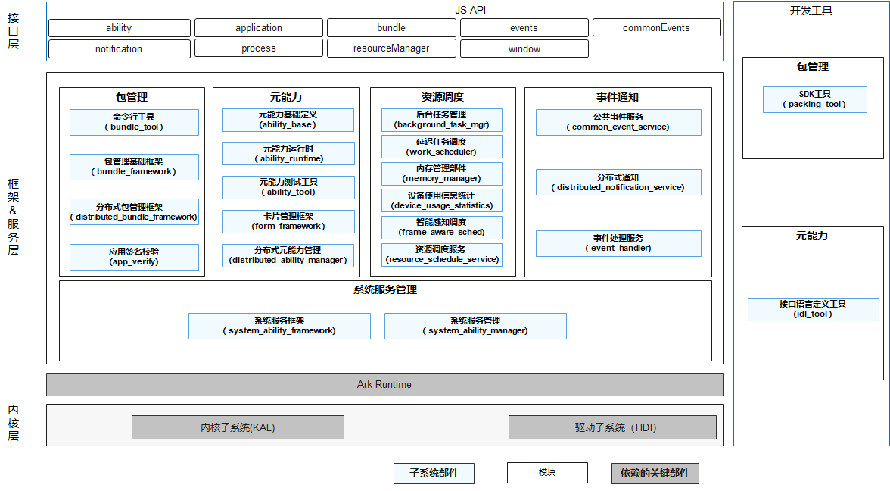

# SIG_ApplicationFramework
简体中文 | [English](./sig-appframework_cn.md)

说明：本SIG的内容遵循OpenHarmony的PMC管理章程 [README](/zh/pmc.md)中描述的约定。

## SIG组工作目标和范围

### 工作目标
OpenHarmony ApplicationFramework治理，制定相应的设计规范、评审流程要求等，负责ApplicationFramework相关的设计与提交评审。

### 工作范围
ApplicationFramework相关的设计评审、提交评审、《OpenHarmony ApplicationFramework治理章程》修订。

ApplicationFramework SIG技术栈范围全景图如下图所示：

## 代码仓
| 部件名称         | 部件功能描述                                                 | 部件仓名称                                    |
| ---------------- | ------------------------------------------------------------ | --------------------------------------------- |
| 命令行工具       | 包管理命令行工具：提供命令行中执行hap包的安装、更新、卸载及信息查询的能力。 | bundlemanager_bundle_framework                |
| 包管理基础框架   | 提供OpenHarmony应用和服务安装包的安装、更新、卸载以及信息查询等能力，包含包管理接口和包管理服务。 | bundlemanager_bundle_framework                |
| 分布式包管理框架 | 分布式包管理服务。                                           | bundlemanager_bundle_framework                |
| SDK工具          | 提供IDE使用的hap包打包、拆包工具、应用清单文件检查工具。     | developtools_packing_tool                     |
| 应用签名校验     | 提供了对hap应用的完整性校验和来源管控能力，是OpenHarmony生态安全的基础。 | security_appverify                            |
| 公共事件服务     | 为应用程序提供订阅、发布、退订公共事件的能力。               | notification_common_event_service             |
| 分布式通知服务   | 为应用程序提供通知发布和取消、订阅和退订和通知管理的能力，提供分布式通知数据管理的能力。 | notification_distributed_notification_service |
| 事件处理服务     | 提供了OpenHarmony线程间通信的基本能力，可以通过EventRunner创建新线程，将耗时的操作抛到新线程上执行，从而实现在不阻塞原来的线程的基础上合理地处理耗时任务。 | notification_eventhandler                     |
| 元能力基础定义   | 元能力基础概念定义，主要包括：want、configration等。         | ability_ability_base                          |
| 元能力运行时     | 元能力框架子系统，是OpenHarmony为开发者提供的一套开发OpenHarmony应用的开发框架。 | ability_ability_runtime                       |
| 元能力测试工具   | 元能力测试工具，第三方开发者都可以基于这个测试工具测试其目标元能力，可以获取元能力的内部对象，可以控制元能力的生命周期调度，也可以模拟点击事件。 | ability_ability_runtime/tree/master/tools     |
| 接口语言定义工具 | IDL（Interface Definition Language）则是一种定义客户端和服务器端通信接口的工具。 | ability_idl_tool                              |
| 卡片管理框架     | 一套开发和使用OpenHarmony卡片的开发框架。                           | ability_form_fwk                              |
| 分布式调度框架   | 提供对跨设备组件启动、调用和迁移的能力。                     | distributedschedule_dms_fwk                   |
| 系统服务管理     | 管理系统服务的注册、本次查询和跨设备查询，系统服务的访问权限控制。 | distributedschedule_samgr                     |
| 系统服务框架     | 系统服务框架定义。                                           | distributedschedule_safwk                     |
| 后台任务管理     | 负责管理后台长时、短时任务，并提供对应任务的申请、取消和查询等接口。 | resourceschedule_background_task_mgr          |
| 延迟任务调度     | 负责调度后台延迟任务，并提供对应的申请、取消、查询接口等接口给应用执行实时性不高的任务。 | resourceschedule_work_scheduler               |
| 设备使用信息统计 | 负责设备使用信息统计与计算，包括应用使用、通知统计等信息统计、应用分组计算，并为特权应用提供对应的查询接口。 | resourceschedule_device_usage_statistics      |
| 资源调度服务     | 提供系统事件如应用启动、退出、亮灭屏等的感知和分发，同时，通过感知事件、用户操作、后台任务执行状态等共同决策调度进程的分组。 | resourceschedule_resource_schedule_service    |
| 内存管理部件     | 基于应用的生命周期状态，更新进程回收优先级列表，并通过内存回收、查杀等手段管理系统内存，保障内存供给。 | resourceschedule_memmgr                       |
| 智能感知调度     | 通过获取应用的生命周期状态、应用绘帧等信息，调节内核调度参数，从而控制内核调度行为，保障系统进程调度供给。 | frame_aware_sched                             |

- 代码仓地址：
  - ability_ability_lite:https://gitee.com/openharmony/ability_ability_lite
  - ability_ability_runtime:https://gitee.com/openharmony/ability_ability_runtime
  - ability_ability_base:https://gitee.com/openharmony/ability_ability_base
  - ability_dmsfwk:https://gitee.com/openharmony/ability_dmsfwk
  - ability_dmsfwk_lite:https://gitee.com/openharmony/ability_dmsfwk_lite
  - ability_form_fwk:https://gitee.com/openharmony/ability_form_fwk
  - ability_idl_tool:https://gitee.com/openharmony/ability_idl_tool
  - security_appverify:https://gitee.com/openharmony/security_appverify
  - notification_common_event_service:https://gitee.com/openharmony/notification_common_event_service
  - resourceschedule_resource_schedule_service:https://gitee.com/openharmony/resourceschedule_resource_schedule_service
  - frame_aware_sched:https://gitee.com/openharmony/frame_aware_sched
  - resourceschedule_memmgr:https://gitee.com/openharmony/resourceschedule_memmgr
  - distributedschedule_samgr:https://gitee.com/openharmony/distributedschedule_samgr
  - resourceschedule_work_scheduler:https://gitee.com/openharmony/resourceschedule_work_scheduler
  - resourceschedule_device_usage_statistics:https://gitee.com/openharmony/resourceschedule_device_usage_statistics
  - resourceschedule_background_task_mgr:https://gitee.com/openharmony/resourceschedule_background_task_mgr
  - notification_distributed_notification_service:https://gitee.com/openharmony/notification_distributed_notification_service
  - notification_eventhandler:https://gitee.com/openharmony/notification_eventhandler
  - distributedschedule_safwk:https://gitee.com/openharmony/distributedschedule_safwk
  - distributedschedule_dms_fwk:https://gitee.com/openharmony/distributedschedule_dms_fwk
  - developtools_packing_tool:https://gitee.com/openharmony/developtools_packing_tool
  - bundlemanager_bundle_framework:https://gitee.com/openharmony/bundlemanager_bundle_framework
  - bundlemanager_bundle_framework_lite:https://gitee.com/openharmony/bundlemanager_bundle_framework_lite
  - developtools_ace_js2bundle:https://gitee.com/openharmony/developtools_ace_js2bundle
  - developtools_ace_ets2bundle:https://gitee.com/openharmony/developtools_ace_ets2bundle
  - third_party_weex-loader:https://gitee.com/openharmony/third_party_weex-loader
  - third_party_parse5:https://gitee.com/openharmony/third_party_parse5
  - third_party_glfw:https://gitee.com/openharmony/third_party_glfw
  - global_resource_tool:"https://gitee.com/openharmony/global_resource_tool"
  - third_party_chromium:https://gitee.com/openharmony/third_party_chromium
  - third_party_cef:https://gitee.com/openharmony/third_party_cef
  - web_webview:https://gitee.com/openharmony/web_webview
  - arkui_ace_engine_lite:https://gitee.com/openharmony/arkui_ace_engine_lite
  - arkui_napi:https://gitee.com/openharmony/arkui_napi
  - arkui_ace_engine:https://gitee.com/openharmony/arkui_ace_engine
  - global_resource_management:https://gitee.com/openharmony/global_resource_management
  - global_resource_management_lite:https://gitee.com/openharmony/global_resource_management_lite
  - utils_system_resources:https://gitee.com/openharmony/utils_system_resources

## SIG组成员

### Leader
- @huawei_qiangbo(https://gitee.com/huawei_qiangbo)

### Committers列表
- @huawei_qiangbo(https://gitee.com/huawei_qiangbo)
- @gongpingde(https://gitee.com/gongpingde)
- @lihong67(https://gitee.com/lihong67)
- @seaside_wu(https://gitee.com/seaside_wu)
- @laigerendaqiu(https://gitee.com/laigerendaqiu)
- @lanshouren(https://gitee.com/lanshouren)

### 会议
 - 会议时间：每周二 16:00
 - 会议申报：https://shimo.im/sheets/qhwcqXRkqCXkcPcX/MODOC/
 - 会议链接: Welink或其他会议
 - 会议通知: 请[订阅](https://lists.openatom.io/postorius/lists/dev.openharmony.io)邮件列表 dev@openharmony.io 获取会议链接
 - 会议纪要: [归档链接地址](https://gitee.com/openharmony-sig/sig-content)

### 联系方式(可选)

- 邮件列表： dev@openharmony.io
- Zulip群组： https://zulip.openharmony.cn
- 微信群：NA
