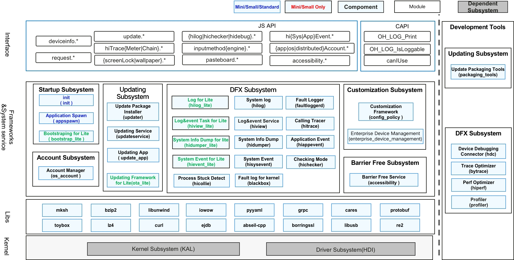

# SIG_BasicSoftwareService 
English | [简体中文](./sig-basicsoftwareservice_cn.md)

Note: The content of this SIG follows the convention described in OpenHarmony's PMC Management Charter [README](/zh/pmc.md).

## SIG group work objectives and scope

### Work Goals
Provide simple and effective Basic Software Services for Open Harmony Operating System; By modular design, Basic Software Services can support various kinds of devices, scaling from Level 0 to Level 5.

OpenHarmony Basic Software Services technology stack scope is shown in the following figure:

### Work Scope
Basic Software Services includes the following sub-systems:
| Name|Explanation|
| :----- | :----- |
|Startup SubSystem|Booting OpenHarmony, and provide init process manager and system parameters for the whole system|
|Upgrade SubSystem|Provide Operating System upgrade capability|
|DFX SubSystem|Design-for-Test, Design-for-Reliability and Design-for-Manufacturing|
|Account Management SubSystem|Manage user accounts for Open Harmony|
|Barrier Free SubSystem|Provide barrier free common capabilities for Open Harmony|
|Customization SubSystem|Provide customization framework for OpenHarmony|

## The repositories

| Component Name               | Repository                                                   | Component Description                                        |
| :--------------------------- | :----------------------------------------------------------- | ------------------------------------------------------------ |
| System Log                   | [hiviewdfx_hilog](https://gitee.com/openharmony/hiviewdfx_hilog) | HiLog provides logging utilities for system services and applications. |
| Log for Lite                 | [hiviewdfx_hilog_lite](https://gitee.com/openharmony/hiviewdfx_hilog_lite) | Logging system for OpenHarmony mini and small system.        |
| Calling Tracer               | [hiviewdfx_hitrace](https://gitee.com/openharmony/hiviewdfx_hitrace) | Distributed tracing utilities for performance debugging.     |
| Log&Event Service            | [hiviewdfx_hiview](https://gitee.com/openharmony/hiviewdfx_hiview) | hiview component provides logging statistic utilities for business intelligence. It has a plugin platform for extending. |
| Log&Event Task for Lite      | [hiviewdfx_hiview_lite](https://gitee.com/openharmony/hiviewdfx_hiview_lite) | hivew service for OpenHarmony mini and small system.         |
| Checking Mode                | [hiviewdfx_hichecker](https://gitee.com/openharmony/hiviewdfx_hichecker) | hicheck is used to help detect faults may be encountered during application development. |
| Process Stuck Detect         | [hiviewdfx_hicollie](https://gitee.com/openharmony/hiviewdfx_hicollie) | hicollie provides process stuck detection and watchdog framework for developers. |
| Application Event            | [hiviewdfx_hiappevent](https://gitee.com/openharmony/hiviewdfx_hiappevent) | hiappevent provides event reporting, persisting and querying capabilities for application development. |
| System Event                 | [hiviewdfx_hisysevent](https://gitee.com/openharmony/hiviewdfx_hisysevent) | hisysevent provides event reporting, persisting and querying capabilities for system development. |
| System Event for Lite        | [hiviewdfx_hievent_lite](https://gitee.com/openharmony/hiviewdfx_hievent_lite) | hievent_lite provides fault logging, user activity and power comsumption statistics for mini and small system. |
| Fault Logger                 | [hiviewdfx_faultloggerd](https://gitee.com/openharmony/hiviewdfx_faultloggerd) | faultloggerd can collect logs when native processes crash.   |
| System Info Dump             | [hiviewdfx_hidumper](https://gitee.com/openharmony-sig/hiviewdfx_hidumper) | hidumper can export information about CPU, memory and System Abilities. |
| System Info Dump for Mini    | [hiviewdfx_hidumper_mini](https://gitee.com/openharmony/hiviewdfx_hidumper_lite) | hidumper for OpenHarmony small system.                       |
| System Info Dump for Lite    | [hiviewdfx_hidumper_lite](https://gitee.com/openharmony/hiviewdfx_hidumper_lite) | hidumper for OpenHarmony mini system.                        |
| Fault log for kernel         | [hiviewdfx_blackbox](https://gitee.com/openharmony/hiviewdfx_blackbox) | blackbox can help collecting logs when system panic.         |
| HiPerf                       | [hiperf](https://gitee.com/openharmony/developtools_hiperf)  | hiperf can help developers to collect performace logs.       |
| Profiler                     | [hiprofiler](https://gitee.com/openharmony/hiviewdfx_blackbox) | profiler is used by IDE for performance optimization.        |
| Trace Optimizer              | [developtools_bytrace](https://gitee.com/openharmony/developtools_bytrace) | bytrace proivdes performance tracing API for applications.   |
| Device Debugging Collector   | [developtools_hdc](https://gitee.com/openharmony/developtools_hdc) | hdc is OpenHarmony device debugging collector.               |
| Bootstrapping for Lite       | [startup_bootstrap_lite](https://gitee.com/openharmony/startup_bootstrap_lite) | bootstrap provides starting API to bootstrap system abilities for OpenHarmony lite system. |
| init                         | [startup_init_lite](https://gitee.com/openharmony/startup_init_lite) | init is used to start all userspace native processes.        |
| Application Spawn            | [startup_appspawn](https://gitee.com/openharmony/startup_appspawn) | Appspawn is used to spawn application processes.             |
| Updating Framework for Lite  | [update_ota_lite](https://gitee.com/openharmony/update_ota_lite) | ota_lite provides OTA updating framework for OpenHarmony mini and small system. |
| Updating App                 | [update_app](https://gitee.com/openharmony/update_app)       | update_app provides user interfaces for end users to upgrade OpenHarmony devices. |
| Update Pakaging Tools        | [update_packaging_tools](https://gitee.com/openharmony/update_packaging_tools) | Update Packaging Tools provide tools to build full OTA packages and differential packages. |
| Update Package Installer     | [update_updater](https://gitee.com/openharmony/update_updater) | Update Package Installer can verify OTA package, and install the package to the OpenHarmony device. |
| Updating Service             | [update_updateservice](https://gitee.com/openharmony/update_updateservice) | Updating Service can query and download OTA packages.        |
| Update System Installer      | [update_sys_installer](https://gitee.com/openharmony-sig/update_sys_installer) | Update System Installer can verify OTA package, and install the package to the OpenHarmony device for AB system. |
| Account Manager              | [account_os_account](https://gitee.com/openharmony/account_os_account) | Account Manager can create/delete, login/logout and query system accounts. It can also manage application accounts and distributed accounts. |
| Barrier Free Service         | [accessibility](https://gitee.com/openharmony/accessibility) | Barrier Free Service can provide information exchange framework between application and accessibilities applications. |
| Enterprise Device Management | [customization_enterprise_device_management](https://gitee.com/openharmony-sig/customization_enterprise_device_management) | Enterprise Device Management provide API for enterprise applications to manager OpenHarmony devices in scale. |
| Customization Framework      | [config_policy](https://gitee.com/openharmony/customization_config_policy) | Customization Framework provide API for accessing configuration files with priority. |

## SIG Members

### Leader
- @handyohos(https://gitee.com/handyohos)
- @ericlee(https://gitee.com/ericlee)

### Committers
|SubSystem|Committer|Mail|
| :----- | :----- |:----- |
|HiviewDFX|[stesen](https://gitee.com/stesen)|[mail](stesen.ma@huawei.com)|
|HiviewDFX|[ericlee](https://gitee.com/ericlee)|[mail](liyu1@huawei.com)|
|HiviewDFX|[maplestorys](https://gitee.com/maplestorys)|[mail](zengzhi5@huawei.com)|
|HiviewDFX|[yaomanhai](https://gitee.com/yaomanhai)|[mail](yaomanhai@huawei.com)|
|HiviewDFX|[shenchenkai](https://gitee.com/shenchenkai)|[mail](shenchenkai@huawei.com)|
|HiviewDFX|[guochuanqi](https://gitee.com/guochuanqi)|[mail](guochuanqi@huawei.com)|
|HiviewDFX|[qidechun](https://gitee.com/pcwlno1)|[mail](qidechun@huawei.com)|
|StartUp|[handyohos](https://gitee.com/handyohos)|[mail](zhangxiaotian@huawei.com)|
|StartUp|[derek520](https://gitee.com/derek520)|[mail](wtweitao.wei@huawei.com)|
|StartUp|[mytide](https://gitee.com/mytide)|[mail](max.liuwei@huawei.com)|
|Update|[ailorna](https://gitee.com/ailorna)|[mail](hehuan1@huawei.com)|
|Account|[verystone](https://gitee.com/verystone)|[mail](xudaqing@huawei.com)|
|Barrier Free|[dubingjian](https://gitee.com/bj1010)|[mail](dubingjian@huawei.com)|
| Customization |[jameshw](https://gitee.com/jameshw)|[mail](jameslee@huawei.com)|

### Meetings
 - Meeting time: Wednesday at 14:00 o'clock, biweekly
 - Meeting proposal: [OpenHarmony SIG-BasicSoftware Meeting Proposal](https://etherpad.openharmony.cn/p/sig-basicsoftware)
 - Meeting link: Welink

### Contact (optional)

- Mailing list：stesen.ma@huawei.com;liyu1@huawei.com;zengzhi5@huawei.com;yaomanhai@huawei.com;shenchenkai@huawei.com;guochuanqi@huawei.com;zhangxiaotian@huawei.com;wtweitao.wei@huawei.com;hehuan1@huawei.com;hw.liuwei@huawei.com;xudaqing@huawei.com;qidechun@huawei.com
- Zulip group: https://zulip.openharmony.cn
- Wechat group：NA
