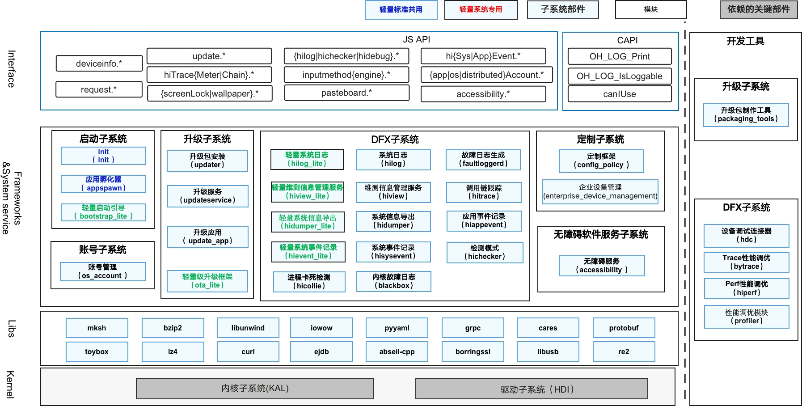

# SIG_BasicSoftwareService 
简体中文 | [English](./sig-basicsoftwareservice.md)

说明：本SIG的内容遵循OpenHarmony的PMC管理章程 [README](/zh/pmc.md)中描述的约定。

## SIG组工作目标和范围

### 工作目标
为OpenHarmony提供简洁、高效的基础软件服务；通过部件化设计，可组合支撑L0~L5多种不同级别设备的系统软件开发。

BasicSoftwareService SIG技术栈范围全景图如下图所示：

### 工作范围
基础软件服务主要包括以下几个子系统：
| 名称|说明|
| :----- | :----- |
|启动子系统|提供系统OS系统启动框架，包括系统引导过程，init初始进程管理以及系统参数属性机制|
|升级服务子系统|提供系统升级能力|
|DFX子系统|提供DFT、DFR、DFM等系统能力|
|账号子系统|提供系统的账号管理能力|
|无障碍软件服务子系统|提供无障碍软件服务能力|
|定制子系统|提供系统定制化能力，包括基于配置层级的定制框架、企业环境下的设备管理和定制化设置等|
|时间时区子系统|提供管理系统时间时区和定时的能力，支持设置获取时间、日期、时区和系统定时器功能|
|主题框架子系统|提供壁纸管理服务能力，支持系统显示、设置、切换壁纸等功能，以及锁屏管理服务|
|输出法框架子系统|提供输入法开发框架，供输入法应用使用，以及提供输入法管理接口|
|上传下载子系统|向三方应用提供系统下载/上传服务能力|
|打印子系统|支持三方应用创建打印任务，拉起后台打印任务管理，管理打印扩展和打印任务|

## 代码仓

| 部件名称 |代码仓|部件功能描述|
| :----- | :----- | :----- |
| 流水日志 |[hiviewdfx_hilog](https://gitee.com/openharmony/hiviewdfx_hilog)|HiLog是OpenHarmony日志系统，提供给系统框架、服务、以及应用打印日志，记录用户操作、系统运行状态等。|
|轻量流水日志|[hiviewdfx_hilog_lite](https://gitee.com/openharmony/hiviewdfx_hilog_lite)|提供轻量系统和小型系统的流水日志功能。|
|分布式跟踪| [hiviewdfx_hitrace](https://gitee.com/openharmony/hiviewdfx_hitrace) | 分布式追踪能力，提供性能trace打点接口、工具，以及分布式业务追踪打点接口。 |
|hiview服务| [hiviewdfx_hiview](https://gitee.com/openharmony/hiviewdfx_hiview) | hiview服务，包含插件平台和维测插件，供系统各服务的打点能力。 |
|轻量hiview服务|[hiviewdfx_hiview_lite](https://gitee.com/openharmony/hiviewdfx_hiview_lite)|提供DFX子系统整体的初始化功能，控制各组件按需启动。|
|检测模式|[hiviewdfx_hichecker](https://gitee.com/openharmony/hiviewdfx_hichecker)|提供一套检测能力给开发者，用来检测应用开发过程容易忽略的部分问题。|
|卡死检测|[hiviewdfx_hicollie](https://gitee.com/openharmony/hiviewdfx_hicollie)|卡死检测能力，为系统开发者提供超时检测、watchdog实现框架。|
|应用事件打点|[hiviewdfx_hiappevent](https://gitee.com/openharmony/hiviewdfx_hiappevent)|北向生态事件打点能力，用于应用自定义打点，提供应用本地落盘、查询等功能。|
|系统事件打点|[hiviewdfx_hisysevent](https://gitee.com/openharmony/hiviewdfx_hisysevent)|系统和南向生态事件打点能力，用于系统稳定性、性能、功耗、用户行为等大数据打点。|
|轻量事件打点|[hiviewdfx_hievent_lite](https://gitee.com/openharmony/hiviewdfx_hievent_lite)|在轻量系统中提供故障、用户行为、功耗统计三类事件打点接口，支持对事件进行序列化。|
|故障日志生成服务|[hiviewdfx_faultloggerd](https://gitee.com/openharmony/hiviewdfx_faultloggerd)|Native Crash故障日志采集服务，用于采集Native崩溃时必要的定性信息。|
|系统信息导出|[hiviewdfx_hidumper](https://gitee.com/openharmony-sig/hiviewdfx_hidumper)|系统信息导出，用于导出系统CPU、内存、日志、SA Dump等功能。|
|小型系统信息导出|[hiviewdfx_hidumper_mini](https://gitee.com/openharmony/hiviewdfx_hidumper_lite)|提供小型系统故障日志、内存、CPU等信息的导出功能。|
|轻量系统信息导出|[hiviewdfx_hidumper_lite](https://gitee.com/openharmony/hiviewdfx_hidumper_lite)|提供轻量系统故障日志、内存、CPU等信息的导出功能。|
|黑匣子|[hiviewdfx_blackbox](https://gitee.com/openharmony/hiviewdfx_blackbox)|提供故障信息获取，故障日志保存，死机重启功能。|
|Perf性能调优|[hiperf](https://gitee.com/openharmony/developtools_hiperf)|hiperf是OpenHarmony为开发人员提供的用于调试的命令行工具，用于抓取特定程序或者系统的性能数据。|
|profiler调试|[hiprofiler](https://gitee.com/openharmony/hiviewdfx_blackbox)|提供端侧调试调优能力，对接IDE profiler调试，包含内存调优、CPU调优、功耗调优、网络调优等调优能力的端侧数据采集。|
|性能打点跟踪|[developtools_bytrace](https://gitee.com/openharmony/developtools_bytrace)|Trace性能调优，提供性能trace打点接口。|
|调试连接器|[developtools_hdc](https://gitee.com/openharmony/developtools_hdc)|设备调试连接器，支持提供标准系统中上位机和下位机的调试shell、文件传输、端口转发等功能。|
|轻量启动引导|[startup_bootstrap_lite](https://gitee.com/openharmony/startup_bootstrap_lite)|bootstrap启动引导组件，提供了各服务和功能的启动入口标识。在SAMGR启动时，会调用boostrap标识的入口函数，并启动系统服务。|
|init|[startup_init_lite](https://gitee.com/openharmony/startup_init_lite)|启动引导模块，init进程，内核完成初始化后加载的第一个用户态进程，启动后解析/etc/init.cfg配置文件，并根据解析结果拉起其他系统关键进程，同时分别赋予其对应权限。|
|应用孵化器|[startup_appspawn](https://gitee.com/openharmony/startup_appspawn)|应用孵化模块，appspawn进程，配合轻量级元能力框架子系统，通过轻量级IPC机制接收来自AMS的消息，根据消息解析结果启动元能力进程AbilityMain并赋予其对应权限。|
|安全启动|[startup_hvb](https://gitee.com/openharmony/startup_hvb)|提供OpenHarmony Verified Boot安全启动的核心能力，实现对启动过程中各个镜像的完整性以及合法性校验，确保OpenHarmony设备运行的镜像来源合法，不经篡改，且不能回滚到老的漏洞版本。|
|轻量系统安装|[update_sys_installer_lite](https://gitee.com/openharmony/update_sys_installer_lite)|轻量系统安装提供对轻量级设备远程升级能力，基于提供的接口进行二次开发后，可以让您的设备轻松支持OTA升级能力。升级子系统对用户屏蔽了底层芯片的差异，对外提供了统一的升级接口。|
|升级应用|[update_app](https://gitee.com/openharmony/update_app)|升级客户端应用运行于OHOS 上，提供与用户进行交互的界面，并进行升级操作。主要功能包括： 1、触发升级服务组件检查可用的升级包，显示升级包检查的结果； 2、下载升级包，显示下载的进度和状态； 3、触发升级； 4、升级完成后，显示升级后版本信息|
|升级工具|[update_packaging_tools](https://gitee.com/openharmony/update_packaging_tools)|升级包制作工具是用于制作升级包的工具，功能主要包括：全量升级包制作、差分升级包制作以及变分区升级包制作。|
|升级包安装|[update_updater](https://gitee.com/openharmony/update_updater)|升级包安装组件，其功能主要包括读取misc分区信息获取升级包状态，对升级包进行校验，确保升级包合法有效；然后从升级包中解析出升级的可执行程序，创建子进程并启动升级程序。具体升级的动作由升级脚本控制。|
|升级服务|[update_updateservice](https://gitee.com/openharmony/update_updateservice)|升级服务组件是一个SA(System Ability)，由OHOS 的init 进程负责启动。主要功能包括： 1、查找可用的升级包； 2、下载升级包； 3、设置/获取升级策略； 4、触发升级|
|系统安装|[update_sys_installer](https://gitee.com/openharmony/update_sys_installer)|系统安装组件，其功能主要包括读取AB系统启动状态，对升级包进行校验，确保升级包合法有效；然后从升级包中解析出升级的可执行程序，创建子进程并启动升级程序，完成对AB系统主备分区的升级。|
|系统账号|[account_os_account](https://gitee.com/openharmony/account_os_account)|提供系统帐号生命周期管理，包括系统帐号的创建、切换、删除、查询和修改。提供应用帐号的管理和应用账号OAuth鉴权能力，提供分布式帐号状态管理能力。|
|无障碍|[accessibility](https://gitee.com/openharmony/accessibility)|提供在应用程序和辅助应用之间交换信息的机制，支持辅助应用开发框架，增强无障碍功能体验。|
|企业设备管理|[customization_enterprise_device_management](https://gitee.com/openharmony-sig/customization_enterprise_device_management)|提供企业对设备进行管理和配置的API，支持企业MDM应用对设备的管控。|
|配置策略|[config_policy](https://gitee.com/openharmony/customization_config_policy)|为各业务模块提供获取各配置层级的配置目录或配置文件路径的接口。|
|时间时区部件|[time_time_service](https://gitee.com/openharmony/time_time_service)|提供管理系统时间时区和定时的能力，支持设置获取时间、日期、时区和系统定时器功能。|
|壁纸管理服务|[theme_wallpaper_mgr](https://gitee.com/openharmony/theme_wallpaper_mgr)|主要为系统提供壁纸管理服务能力，支持系统显示、设置、切换壁纸等功能。|
|锁屏管理服务|[theme_screenlock_mgr](https://gitee.com/openharmony/theme_screenlock_mgr)|为锁屏应用提供注册亮屏、灭屏、开启屏幕、结束休眠、退出动画、请求解锁结果监听，并提供回调结果给锁屏应用。锁屏管理服务向三方应用提供请求解锁、查询锁屏状态、查询是否设置锁屏密码的能力。|
|输入法框架|[inputmethod_imf](https://gitee.com/openharmony/inputmethod_imf)|提供输入法开发框架，供输入法应用使用，以及提供输入法管理接口。|
|Request服务|[request_request](https://gitee.com/openharmony/request_request)|向三方应用提供系统下载/上传服务能力，以支撑应用开发者方便、高效地使用以及管理下载/上传业务的功能，包含新建、移除、暂停、恢复以及查询下载/上传任务。|
|打印框架服务|[print_print_fwk](https://gitee.com/openharmony/print_print_fwk)|支持三方应用创建打印任务，拉起后台打印任务管理，管理打印扩展和打印任务。 提供打印扩展框架，实现三方打印扩展的接入，管理打印任务与打印机之间的关系，启动、暂停/恢复、取消打印任务，查询打印进度等。|
|三方库libabigail|[third_party_libabigail](https://gitee.com/openharmony/third_party_libabigail)|用于不同版本动态库的ABI检查。|
|三方库elfutils|[third_party_elfutils](https://gitee.com/openharmony/third_party_elfutils)|用于读取、创建和修改ELF二进制文件，查找和处理GNU/Linux上进程和核心文件的DWARF调试数据、符号、线程状态和堆栈跟踪的工具和库的集合。|

## SIG组成员

### Leader
- @handyohos(https://gitee.com/handyohos)
- @ericlee(https://gitee.com/ericlee)

### Committers列表

|子系统|Committer|Mail|
| :----- | :----- |:----- |
|DFX子系统|[stesen](https://gitee.com/stesen)|[mail](stesen.ma@huawei.com)|
|DFX子系统|[ericlee](https://gitee.com/ericlee)|[mail](liyu1@huawei.com)|
|DFX子系统|[maplestorys](https://gitee.com/maplestorys)|[mail](zengzhi5@huawei.com)|
|DFX子系统|[yaomanhai](https://gitee.com/yaomanhai)|[mail](yaomanhai@huawei.com)|
|DFX子系统|[shenchenkai](https://gitee.com/shenchenkai)|[mail](shenchenkai@huawei.com)|
|DFX子系统|[guochuanqi](https://gitee.com/guochuanqi)|[mail](guochuanqi@huawei.com)|
|DFX子系统|[qidechun](https://gitee.com/pcwlno1)|[mail](qidechun@huawei.com)|
|启动恢复子系统|[handyohos](https://gitee.com/handyohos)|[mail](zhangxiaotian@huawei.com)|
|启动恢复子系统|[derek520](https://gitee.com/derek520)|[mail](wtweitao.wei@huawei.com)|
|启动恢复子系统|[mytide](https://gitee.com/mytide)|[mail](max.liuwei@huawei.com)|
|升级服务子系统|[ailorna](https://gitee.com/ailorna)|[mail](hehuan1@huawei.com)|
|账号子系统|[verystone](https://gitee.com/verystone)|[mail](xudaqing@huawei.com)|
|无障碍软件服务子系统|[dubingjian](https://gitee.com/bj1010)|[mail](dubingjian@huawei.com)|
|定制子系统|[jameshw](https://gitee.com/jameshw)|[mail](jameslee@huawei.com)|
|时间时区部件|[time_service](https://gitee.com/openharmony/time_time_service)|[mail](baoyayong@huawei.com)|
|壁纸管理服务|[wallpaper_mgr](https://gitee.com/openharmony/theme_wallpaper_mgr)|[mail](baoyayong@huawei.com)|
|锁屏管理服务|[screenlock_mgr](https://gitee.com/openharmony/theme_screenlock_mgr)|[mail](baoyayong@huawei.com)|
|输入法框架|[imf](https://gitee.com/openharmony/inputmethod_imf)|[mail](baoyayong@huawei.com)|
|Request服务|[request](https://gitee.com/openharmony/request_request)|[mail](baoyayong@huawei.com)|
|打印框架服务|[print_fwk](https://gitee.com/openharmony/print_print_fwk)|[mail](yuanyulu@huawei.com)|

### 会议
 - 会议时间: 双周三 14:00
 - 会议申报: [OpenHarmony SIG-BasicSoftware Meeting Proposal](https://etherpad.openharmony.cn/p/sig-basicsoftware)
 - 会议链接: Welink

### 联系方式(可选)

- 邮件列表：stesen.ma@huawei.com;liyu1@huawei.com;zengzhi5@huawei.com;yaomanhai@huawei.com;shenchenkai@huawei.com;zhangxiaotian@huawei.com;wtweitao.wei@huawei.com;hehuan1@huawei.com;hw.liuwei@huawei.com;xudaqing@huawei.com;qidechun@huawei.com
- Zulip群组：https://zulip.openharmony.cn
- 微信群：NA
