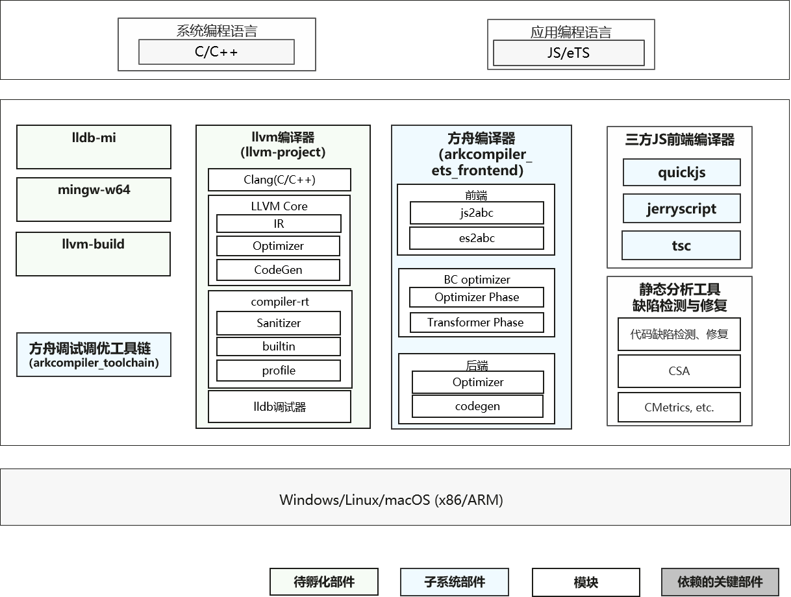
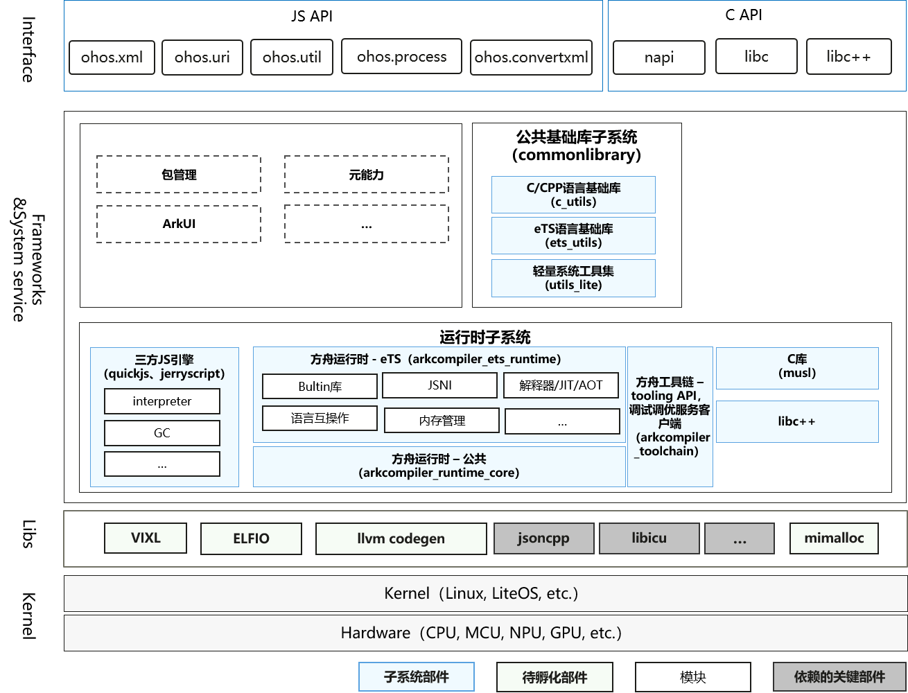

# SIG_COMPILERUNTIME
简体中文 | [English](./sig-compile-runtime.md)

说明：本SIG的内容遵循OpenHarmony的PMC管理章程 [README](/zh/pmc.md)中描述的约定。

## SIG组工作目标和范围

### 工作目标
- 支持JS/TS语言编译及运行时，打造高性能JS/TS虚拟机。提供基础的JSAPI能力，包括多线程能力，字符串编解码能力，以及URL解析等能力。
- 基于Clang/LLVM提供C/C++编译构建、调试能力。
- 提供Musl等基础库支持, 及相关能力演进。

### 工作范围
- 负责语言编译和运行时相关软件模块架构设计、评审和决策；
- 负责语言编译和运行时领域软件模块的代码审核、合入，禁止低质量代码合入开源版本主干；
- 积极有效参与开源社区代码检视与点评，共享编程经验，与开源社区开发者交流，传递软件开发技能，有效辅导开源社区开发者写出好代码；
- 处理开源社区上的需求、issue、邮件列表和开发问题，闭环周期满足开源社区的SLA要求；
- 结合评审和开发活动，给予代码质量反馈与指导，促进开源社区代码质量提升。

### 技术栈范围
- Compiler

- Runtime

### 代码仓
  - arkcompiler_runtime_core: https://gitee.com/openharmony/arkcompiler_runtime_core
  - arkcompiler_ets_runtime: https://gitee.com/openharmony/arkcompiler_ets_runtime
  - arkcompiler_ets_frontend: https://gitee.com/openharmony/arkcompiler_ets_frontend
  - arkcompiler_toolchain: https://gitee.com/openharmony/arkcompiler_toolchain

  - ets_utils: https://gitee.com/openharmony-sig/commonlibrary_ets_utils

  - third_party_jerryscript: https://gitee.com/openharmony/third_party_jerryscript
  - third_party_quickjs: https://gitee.com/openharmony/third_party_quickjs

  - third_party_llvm-project: https://gitee.com/openharmony-sig/third_party_llvm-project
  - third_party_lldb-mi: https://gitee.com/openharmony-sig/third_party_lldb-mi
  - third_party_mingw-w64: https://gitee.com/openharmony/third_party_mingw-w64
  - third_party_musl: https://gitee.com/openharmony/third_party_musl
  - third_party_mimalloc: https://gitee.com/openharmony-sig/third_party_mimalloc

  - commonlibrary_c_utils: https://gitee.com/openharmony/commonlibrary_c_utils
  - commonlibrary_utils_lite: https://gitee.com/openharmony/commonlibrary_utils_lite

  - utils_memory: https://gitee.com/openharmony/utils_memory

  - third_party_miniz: https://gitee.com/openharmony/third_party_miniz

## SIG组成员

### Leader
- @klooer (https://gitee.com/klooer)

### Committers
- @huanghuijin (https://gitee.com/huanghuijin)
- @wuzhefengh (https://gitee.com/wuzhefengh)
- @gongjunsong (https://gitee.com/gongjunsong)
- @sunzhe23 (https://gitee.com/sunzhe23)
- @weng-changcheng (https://gitee.com/weng-changcheng)
- @yingguofeng (https://gitee.com/yingguofeng)
- @xliu-huanwei (https://gitee.com/xliu-huanwei)
- @flyingwolf (https://gitee.com/flyingwolf)
- @godmiaozi (https://gitee.com/godmiaozi)
- @dhy308 (https://gitee.com/dhy308)
- @pengzhuoli (https://gitee.com/zhuoli72)
- @JerryH1011 (https://gitee.com/JerryH1011)
- @dongduResearcher (https://gitee.com/dongduResearcher)

### 会议
 - 会议时间：双周例会，周一晚上19:00，UTC+8
 - 会议申报：[SIG-COMPILERUNTIME Meeting Proposal](https://shimo.im/sheets/cHkjRvDJQtt638y3/MODOC)
 - 会议链接: Welink或其他会议
 - 会议通知: 请订阅邮件列表 dev@openharmony.io 获取会议链接
 - 会议纪要: [归档链接地址](https://gitee.com/openharmony-sig/sig-content)

### 联系方式

- 邮件列表：dev@openharmony.io
- Zulip群组：https://zulip.openharmony.cn
- 微信群：NA
