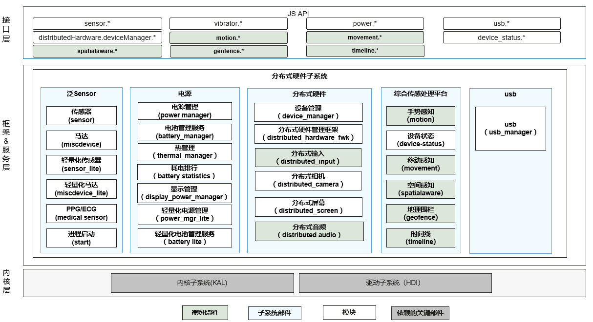

# SIG组
简体中文 | [English](./sig-distributedhardwaremgr.md)

说明：本SIG的内容遵循OpenHarmony的PMC管理章程 [README](/zh/pmc.md)中描述的约定。

## SIG组工作目标和范围

### 工作目标
构建面向1+8+N设备全场景的分布式硬件管理框架，为开发者提供便捷、高效、稳定、安全的硬件管理相关服务

### 工作范围
综合传感处理平台子系统、电源服务子系统、泛Sensor服务子系统、USB服务子系统、分布式硬件管理子系统

分布式硬件SIG（ sig-distributedhardwaremgr ）技术栈范围全景图如下图所示：

## 代码仓
|部件名称|部件功能描述|部件仓名称|
| ------------ | ------------ |------------ |
|传感器|提供传感器数据上报能力。|sensors_sensor|
|马达|提供控制马达振动能力。|sensors_miscdevice|
|轻量级传感器|提供传感器数据上报能力，适用于轻设备。|sensor_lite|
|轻量级马达|提供传感器数据上报能力，适用于轻设备，暂未实现。|sensors_miscdevice_lite|
|健康传感器|提供PPG/ECG健康数据上报能力。|sensors_medical_sensor|
|进程启动|提供传感器、马达部件的启动能力。|sensor_start|
|USB|提供USB的设备列表查询、热插拔、批量数据传输、控制命令传输、权限控制能力。|usb_manager|
|电源管理|提供重启系统、系统休眠、电源状态查询能力。|powermgr_power_manager|
|电池管理|提供电池信息查询、充放电状态查询、关机充电能力。|powermgr_battery_manager|
|热管理|提供设备温度管理控制能力、保障整机热安全及热体验。|powermgr_thermal_manager|
|耗电统计|统计每个应用或者软件的耗电情况，软件耗电之外的耗电都归属到硬件耗电，包括用户耗电、通话耗电、屏幕耗电、wifi功耗、蓝牙消耗。|powermgr_battery_statistics|
|显示能效|提供显示屏的亮/灭，显示屏亮度调节。|powermgr_display_manager|
|轻量级电源管理|提供重启系统、系统休眠、电源状态查询能力，适用于轻设备。|powermgr_powermgr_lite|
|轻量级电池管理|提供电池信息查询、充放电状态查询、关机充电能力，适用于轻设备。|powermgr_battery_lite|
|设备管理|提供账号无关的分布式设备的认证组网能力，并为开发者提供一套用于分布式设备间监听、发现和认证的接口。|distributedhardware_device_manager|
|分布式框架|提供统一的硬件接入、查询和使能能力。|distributedhardware_distributed_hardware_fwk|
|分布式输入|分布式输入组件提供了设备间输入外设的跨设备调用能力，使一台设备可以使用另一台设备的输入外设作为本设备的外设使用。|distributedhardware_distributed_input|
|分布式相机|提供多个设备的相机同时协同使用的能力。|distributedhardware_distributed_camera|
|分布式屏幕|提供单个分布式屏幕投屏能力。|distributedhardware_distributed_screen|
|分布式音频|提供多个设备的音频同时协同使用的能力，暂未实现。|distributedhardware_distributed_audio|
|手势感知|提供手势感知能力，暂未实现。|msdp_motion|
|移动感知|提供移动感知能力，暂未实现。|msdp_movement|
|设备状态|提供设备状态感知能力。|msdp_device_status|
|空间感知|提供空间感知能力，暂未实现。|msdp_spatial_awareness|
|地理围栏|提供地理围栏能力，暂未实现。|msdp_geofence|
|时间线|提供时间线能力，暂未实现。|msdp_timeline|

## 代码仓
- 代码仓地址：
  - sensors_miscdevice_lite: https://gitee.com/openharmony/sensors_miscdevice_lite
  - sensors_sensor_lite: https://gitee.com/openharmony/sensors_sensor_lite
  - sensors_miscdevice: https://gitee.com/openharmony/sensors_miscdevice
  - sensors_sensor: https://gitee.com/openharmony/sensors_sensor
  - sensors_medical_sensor: https://gitee.com/openharmony/sensors_medical_sensor
  - sensors_start: https://gitee.com/openharmony/sensors_start
  - usb_usb_manager: https://gitee.com/openharmony/usb_usb_manager
  - powermgr_powermgr_lite: https://gitee.com/openharmony/powermgr_powermgr_lite
  - powermgr_battery_manager: https://gitee.com/openharmony/powermgr_battery_manager
  - powermgr_display_manager: https://gitee.com/openharmony/powermgr_display_manager
  - powermgr_power_manager: https://gitee.com/openharmony/powermgr_power_manager
  - powermgr_battery_lite: https://gitee.com/openharmony/powermgr_battery_lite
  - powermgr_battery_statistics: https://gitee.com/openharmony/powermgr_battery_statistics
  - powermgr_thermal_manager: https://gitee.com/openharmony/powermgr_thermal_manager
  - distributedhardware_device_manager: https://gitee.com/openharmony/distributedhardware_device_manager
  - distributedhardware_distributed_hardware_fwk: https://gitee.com/openharmony/distributedhardware_distributed_hardware_fwk
  - distributedhardware_distributed_input: https://gitee.com/openharmony/distributedhardware_distributed_input
  - distributedhardware_distributed_camera: https://gitee.com/openharmony/distributedhardware_distributed_camera
  - distributedhardware_distributed_screen: https://gitee.com/openharmony/distributedhardware_distributed_screen
  - distributedhardware_distributed_audio: https://gitee.com/openharmony/distributedhardware_distributed_audio
  - msdp_start: https://gitee.com/openharmony-sig/msdp_start
  - msdp_motion: https://gitee.com/openharmony-sig/msdp_motion
  - msdp_movement: https://gitee.com/openharmony-sig/msdp_movement
  - msdp_device_status: https://gitee.com/openharmony-sig/msdp_device_status
  - msdp_spatial_awareness: https://gitee.com/openharmony-sig/msdp_spatial_awareness
  - msdp_geofence: https://gitee.com/openharmony-sig/msdp_geofence
  - msdp_timeline: https://gitee.com/openharmony-sig/msdp_timeline

## SIG组成员

### Leader
- @hhh2(https://gitee.com/hhh2)

### Committers列表
- @hujun211(https://gitee.com/hujun211)
- @aqxyjay(https://gitee.com/aqxyjay)
- @pengguanqi(https://gitee.com/pengguanqi)
- @locheng7(https://gitee.com/locheng7)
- @hhh2(https://gitee.com/hhh2)

### 会议
 - 会议时间：每周六 10:00
 - 会议链接：Welink

### 联系方式(可选)
- 邮件列表：dev@openharmony.io;
- Zulip群组：https://zulip.openharmony.cn
- 微信群：NA
