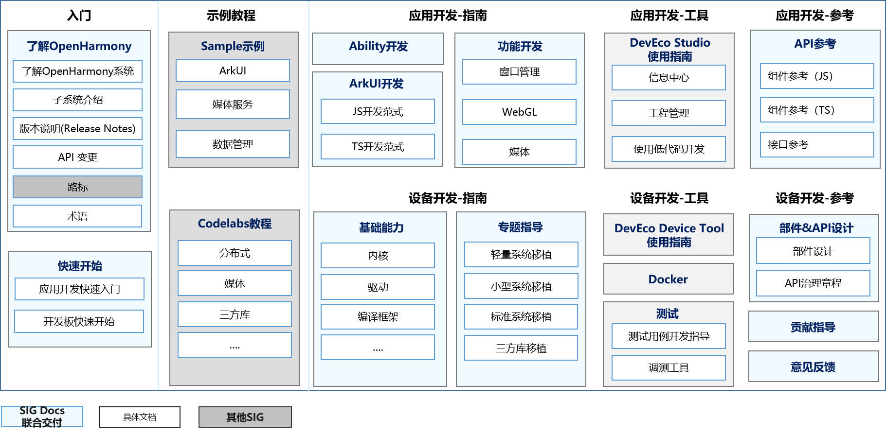

# SIG-Docs
简体中文 | [English](./sig_template.md)

说明：本SIG的内容遵循OpenHarmony的PMC管理章程 [README](/zh/pmc.md)中描述的约定。

## SIG组工作目标和范围

### 工作目标
 OpenHarmony项目Docs仓相关开发者文档工作，包含文档流程、文档发布、文档体验提升。

### 工作范围
- 处理OpenHarmony版本配套开发者文档的构建和发布。
- 参与讨论OpenHarmony文档的规划，并及时响应用户反馈。
- 检查文档，发现文档问题并修改。
- 帮助开发者参与OpenHarmony的文档贡献，提供标准和内容编辑上的支持。

## 文档仓
文档源码仓地址：https://gitee.com/openharmony/docs

官网文档地址：https://www.openharmony.cn/docs

| 文档名称                                                     | 描述                                                         | 仓名称          |
| ------------------------------------------------------------ | ------------------------------------------------------------ | --------------- |
| [设备开发](https://gitee.com/openharmony/docs/blob/master/zh-cn/device-dev/Readme-CN.md) | 用于指导开发者通过OpenHarmony提供的系统能力完成设备开发。    | device-dev      |
| [应用开发](https://gitee.com/openharmony/docs/blob/master/zh-cn/application-dev/Readme-CN.md) | 用于指导开发者通过OpenHarmony提供的接口完成应用开发。        | application-dev |
| [版本说明](https://gitee.com/openharmony/docs/blob/master/zh-cn/release-notes/Readme.md) | 提供版本配套信息、特性变更、接口变更等。                     | release-notes   |
| [子系统介绍](https://gitee.com/openharmony/docs/blob/master/zh-cn/readme) | OpenHarmony系统功能按照“系统 > 子系统  > 功能/模块”逐级展开，提供子系统介绍、子系统框架原理。 | readme          |
| [设计介绍](https://gitee.com/openharmony/docs/tree/master/zh-cn/design) | 提供开发者希望了解的API治理章程、部件化设计和开发指南。      | design          |
| [贡献指南](https://gitee.com/openharmony/docs/tree/master/zh-cn/contribute) | 用于指导开发者了解如何参与OpenHarmony贡献，反馈问题、贡献代码及文档。 | contribute      |

OpenHarmony开发者文档概览如下图所示，包含入门学习、上手体验、开发、调试等开发者历程需要的相关文档。

其他资源：

Samples：https://gitee.com/openharmony/app_samples

Codelabs：https://gitee.com/openharmony/codelabs

## SIG组成员

### Leader
[@neeen](https://gitee.com/neeen)：负责OpenHarmony SIG Docs整体运作、与业务SIG协同，负责社区公共类文档交付、审查。

### Committers列表
- [@duangavin123](https://gitee.com/duangavin123)：与业务SIG协同，负责OpenHarmony设备开发相关文档交付、审查。
- [@RayShih](https://gitee.com/RayShih)：与业务SIG协同，负责OpenHarmony应用开发相关文档交付、审查，配合SIG Release完成社区版本文档交付。
- [@Peter_1988](https://gitee.com/Peter_1988)：与业务SIG协同，负责OpenHarmony英文文档交付、审查。

### 会议
 - 会议时间：每月第一周，周五下午
 - 会议申报：[OpenHarmony SIG-Docs Meeting Proposal]( https://etherpad.openharmony.cn/p/sig-docs)
 - 会议链接: Welink或其他会议
 - 会议通知: 请[订阅](https://lists.openatom.io/postorius/lists/docs.openharmony.io/)邮件列表获取会议链接

### 联系方式(可选)

- 邮件列表：docs@openharmony.io

- Zulip群组：documentation_sig

- 微信群：暂无

### 我们期待您的反馈
我们看到400+位社区开发者参与了OpenHarmony Docs仓贡献，欢迎广大开发者在参与OpenHarmony开源项目中，持续关注SIG Docs，反馈文档建议和需求，与我们一同持续提升文档体验。
欢迎前往Gitee Docs仓，反馈文档使用意见。
https://gitee.com/openharmony/docs/issues

