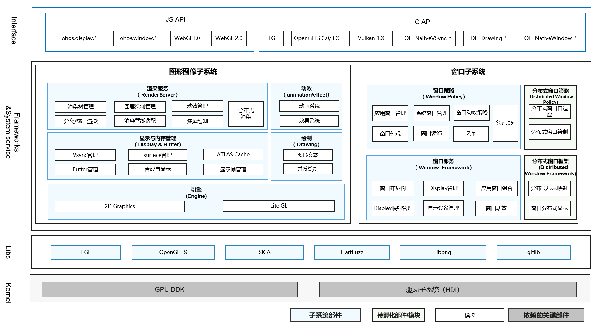

# SIG-Graphics
简体中文 | [English](./sig-graphics.md)

说明：本SIG的内容遵循OpenHarmony的PMC管理章程 [README](/zh/pmc.md)中描述的约定。

## SIG组工作目标和范围

### 工作目标
OpenHarmony 图形管理。

### 工作范围
图形和窗口相关的设计和提交评审。
1. 新一代图形系统、窗口系统架构及特性的孵化
2. 主干仓库的图形系统需求的开发与维护
3. 识别图形对其他子系统的依赖，并提出相应需求，促进系统完善
4. 与开发者交流、合作，持续完善图形子系统、窗口子系统特性
5. 组织社区相关问题的澄清并及时给予解答

图形SIG（ sig-graphics ）技术栈范围全景图如下图所示：

## 代码仓

|部件名称|部件功能描述|部件仓名称|
| ------------ | ------------ |------------ |
|2D图形【graphic_2d】|提供2D图形的绘制，渲染，合成，支持egl,OpenGLES等图形表标准化接口 |graphic_graphic_2d|
|窗口管理【window_manager】|提供窗口管理和Display管理的基础能力，是系统图形界面显示所需的基础子系统 |windowmanager|
|SKIA|图形的2D渲染库，支持文本、图形、图片等图形渲染基础工作 |third_party_skia|
|EGL|EGL 是 OpenGL ES 渲染 API 和本地窗口系统(native platform window system)之间的一个中间接口层，它主要由系统制造商实现。EGL提供如下机制：与设备的原生窗口系统通信、查询绘图表面的可用类型和配置、创建绘面、在OpenGL ES 和其他图形渲染API之间同步渲染、管理纹理贴图等渲染资源 |third_party_egl|
|OpenGL ES|OpenGL ES 是从 OpenGL 裁剪的定制而来的，去除了glBegin/glEnd，四边形（GL_QUADS）、多边形（GL_POLYGONS）等复杂图元等许多非绝对必要的特性的三维图形API子集 |third_party_opengles|
|HarfBuzz|HarfBuzz是用于文字塑形的软件开发库，亦即用于转换Unicode文本到字形指标及方位的过程 |third_party_harfbuzz|
|libpng|libpng 是官方的 PNG 参考库。它支持几乎所有的PNG功能，是可扩展的，并且已经过超过23年的广泛测试 |third_party_libpng|
|giflib|giflib 是一个可以用来编解码 GIF 格式文件的 C 语言库 |third_party_giflib|

- 代码仓地址：
  - graphic_graphic_2d:https://gitee.com/openharmony/graphic_graphic_2d
  - graphic_surface:https://gitee.com/openharmony/graphic_surface
  - graphic_ui:https://gitee.com/openharmony/graphic_ui
  - graphic_utils:https://gitee.com/openharmony/graphic_utils
  - graphic_wms:https://gitee.com/openharmony/graphic_wms
  - third_party_weston:https://gitee.com/openharmony/third_party_weston
  - third_party_wayland-ivi-extension:https://gitee.com/openharmony/third_party_wayland-ivi-extension
  - third_party_wayland-protocols_standard:https://gitee.com/openharmony/third_party_wayland-protocols_standard
  - third_party_wayland_standard:https://gitee.com/openharmony/third_party_wayland_standard
  - third_party_libdrm:https://gitee.com/openharmony/third_party_libdrm
  - third_party_pixman:https://gitee.com/openharmony/third_party_pixman
  - third_party_egl:https://gitee.com/openharmony/third_party_egl
  - third_party_opengles:https://gitee.com/openharmony/third_party_opengles
  - third_party_skia:https://gitee.com/openharmony/third_party_skia
  - windowmanager:https://gitee.com/openharmony/windowmanager
  - third_party_libexif:https://gitee.com/openharmony-sig/third_party_libexif
  - third_party_libjpeg-turbo:https://gitee.com/openharmony/third_party_libjpeg-turbo

## SIG组成员

### Leader
- @abbuu(https://gitee.com/abbuu)
- @yifan-cui(https://gitee.com/yifan-cui)

### Committers列表
- @zhouyaoying(https://gitee.com/zhouyaoying)
- @lijj01(https://gitee.com/lijj01)
- @lz-230(https://gitee.com/lz-230)
- @bj1010(https://gitee.com/bj1010)
- @mk_gc(https://gitee.com/mk_gc)
- @zhouyuehai(https://gitee.com/zhouyuehai)

### 会议
 - 会议时间：双周周五14:30-15:15
 - 会议申报：[OpenHarmony Sig-Graphics Meeting Proposal](https://shimo.im/sheets/m4kMLLgagotBK9qD/MODOC)
 - 会议链接: [腾讯会议] https://meeting.tencent.com/dm/18G1h0F3uheD
 - 会议通知: 请[订阅](https://lists.openatom.io/postorius/lists/graphics_dev@openharmony.io)邮件列表 graphics_dev@openharmony.io 获取会议链接

### 联系方式(可选)

- liyu37@huawei.com
- cuikun1@huawei.com

- 邮件列表：dev@openharmony.io
- Zulip群组：https://zulip.openharmony.cn
- 微信群：SIG-Graphics
