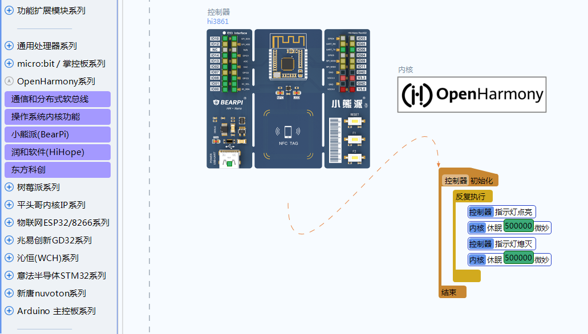


## OpenHarmony内核功能调用示例-微秒延时

材料准备: 准备一块搭载hi3861芯片的开发板, 并事先烧录好linkboy for OpenHARMony的引擎固件.

案例说明: 本案例展示如何调用OpenHarmony的底层功能接口. 通过专用模块拖进来后可以调用对应的封装好的功能. 例如本例中调用 "延时微秒" 的功能. 关于软总线, 分布式等功能, 目前正在封装, 后续将会开放. 用户也可以通过外挂模式自行封装后再去调用.

