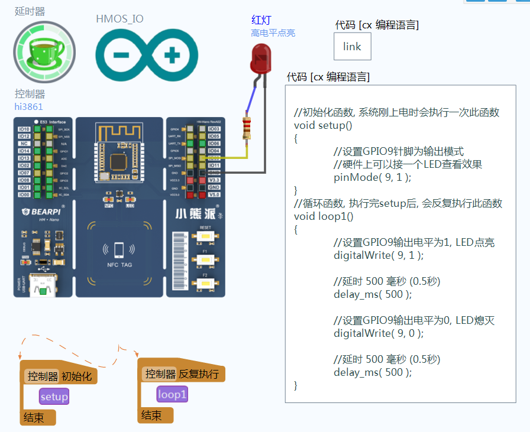


## OpenHarmony代码模式编程-1个LED闪烁

材料准备: 
搭载hi3861芯片的开发板, 需要预先烧录linkboy for OpenHARMony的引擎固件(vos)

案例说明:
本案例展示在OpenHarmony开发板上进行类似arduino的代码编程方式. 图中HMOS_IO是已经封装好的类似arudino函数的接口库, 然后代码框里就可以进行setup和loop函数的编写, 本例通过digitalWrite和delay函数完成一个外接LED的亮灭工作.

