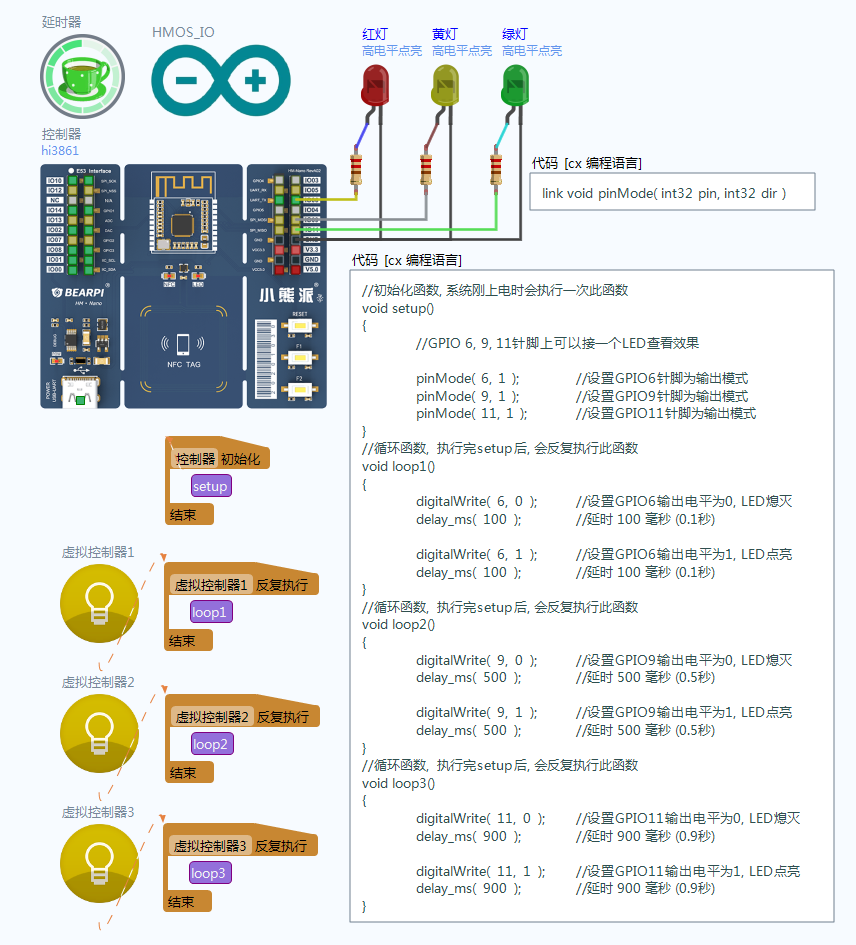


## OpenHarmony代码编程-多线程

材料准备: 需要准备一块搭载hi3861芯片的开发板, 并事先烧录好linkboy for OpenHARMony的引擎固件.

案例说明: 本案例展示如何在OpenHarmony开发板上编写多线程的arduino程序, 用户可定义多个loop函数, 系统内部会采用多线程方式同时运行这些loop函数, 各个函数之间调用延时函数互不干扰, 独立运行. 各个loop函数通过"虚拟控制器"来进行驱动.

