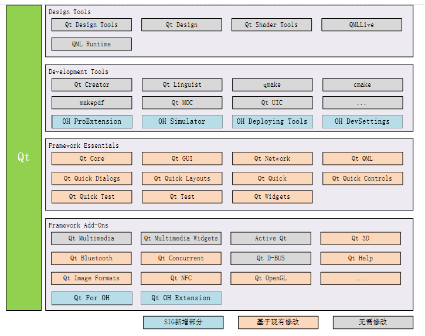

# SIG-Qt
English | [简体中文](./sig_qt_cn.md)

Note: The content of this SIG follows the convention described in OpenHarmony's PMC Management Charter [README](/zh/pmc.md).

## SIG group work objectives and scope

### work goals

The Qt SIG is responsible for completing the transplantation and adaptation of the Qt (http://qt.io) software development framework in OpenHarmony, and provides the OpenHarmony application development template and supporting development tools based on Qt Creator to realize the application migration and development based on Qt research and development. The R&D ecological supplement of OpenHarmony.

### work scope

- Qt SDK modules adaptation and porting
- Qt Creator supporting development tool plug-in

The contributions of the Qt Framework Porting and Adaptation Plan are as follows:

### Work Deliverables and Work Plans

- October 2022 ~ December 2022: Completion of the transplantation and adaptation of core modules such as Qt Core, Qt GUI, and Qt QML
- December 2022~March 2023: Porting Qt-related tools to match Qt-related project projects; Complete Qt additional module porting
- March 2023~June 2023: Qt examples and Demos porting adaptation verification; Qt unit test porting adaptation verification; Qt Creator Hongmeng application template development
- From June 2023 to December 2023: Based on the Qt API to package the OpenHarmony system feature library, and introduce system features such as the OpenHarmony soft bus; Qt Creator OpenHarmony application deployment and development; Qt Creator Hongmeng simulator development

### The repository 
- project name:
  - Qt Source Code: https://gitee.com/openharmony-sig/qt

## SIG Members

### Leader
- @cwc1987(https://gitee.com/cwc1987)

### Committers
- @zhu.wei(https://gitee.com/zhu.wei)
- @xiecy(https://gitee.com/xiecy)
- @wanglz(https://gitee.com/wanglz)
- @wangh(https://gitee.com/wangh)