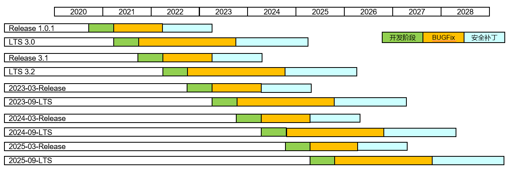

# SIG Relase
简体中文 | [English](./sig_release.md)

说明：本SIG的内容遵循OpenHarmony的PMC管理章程 [README](/zh/pmc.md)中描述的约定。

## SIG组工作目标和范围

### 工作目标
1. 规划和计划版本的发行时间表。
2. 在开发/测试周期中跟踪（更新updates或功能feature）的开发状态。
3. 发布协调（在QA，发布工程师，技术委员会等范围内），参与相关组和发布相关等会议。
4. 负责项目的交付过程协调。 

### 工作范围
#### 社区版本发布流程
openHarmony社区在每个发行版正式发布评审会议之前，通过邮件形式收集测试SIG、QA团队、法务、配置管理团队、版本发布团队、基金会等意见，以此确定本次正式发行版是否满足发行条件。
该会议称为：GO/NOGO会议。QA团队负责验证待正式发布版本是否满足openHarmony社区发行版正式发布标准。质量检查小组的决定必须基于拦截版本及组件质量问题流程（待发布）。
如果在版本正式发布之前已经执行了与发布阶段（Beta测试版或最终发布版）相对应的所有验证测试活动，并且在Beta测试版本和正式发行版中均没有待解决且影响版本或组件功能的问题的前提下，QA团队将会同意发布。
如果存在尚未解决的且各个团队评估影响版本或组件的关键问题时，或者验证测试任务没有结束或未执行，则QA不会批准该版本发布。如果存在其他版本发布反对意见团队或者参与者，则最终以GO/NOGO会议决策为准。

| **序号** | **关键活动** |**内容描述** |**活动要求说明** |**责任组织** |
| ------------ |  -------------------- | ---------------------- | ---------------------------------------------------------- | ------------- |
| 1          | 社区版本发布评审 | 评审入口条件检查 | 在正式发布评审会之前，对于评审入口条件进行检查，需社区代码工具告警清零、社区版本集成测试活动完成、无关键阻塞问题遗留、配套资料完成。 | SIG-QA | 
| 2          | 社区版本发布评审 | 组织社区版本发布评审| 正式组织社区版本发布评审会，正式评委包含：测试SIG、QA团队、法务、配置管理团队、版本发布团队、基金会基金会 | SIG-release |
| 3          | 社区版本发布评审 | 社区版本版本包发布 | 社区版本分支TAG归档，上传华为云，版本获取链接更新并验证（含SDK） | SIG-社区构建 |
| 4          | 社区版本发布评审 | 社区版本发布后用户验证 | 针对最终发布版本的验证，确保与计划发布版本一致，含两种方式： - Repo拉取源码获取、编译烧录、亮屏；- Docker环境下的编译、烧录、亮屏 | SIG-releas（基金会参与） |
| 5          | 社区版本发布评审 | Release notes发布社区 | Release notes发布社区 | SIG-release |
| 6          | 社区版本发布评审 | 版本发布社区邮件推送 | 版本发布社区邮件推送 | SIG-release |
| 7          | 社区版本发布评审 | 版本发布社区公告 | 版本发布社区公告 | SIG-社区构建 |

##### 会议组织

  - 会议通常由openHarmony社区版本发布 sig主持，主持人在会议开始前三天发送电子邮件通知，指定会议地点和时间，敬请关注以下OpenHarmony版本发布评审会议通知。
  - 在会议开始时，应明确确定openHarmony社区测试SIG、QA团队、法务、配置管理团队、版本发布团队、基金会等团队的代表成员;

##### 会议成果

  - 决定发布是否为同意发布。
    - 如果满足发布标准，则将发布声明为同意发布。
    - 如果发布标准不符合，顺延到下一个星期继续决策。
  - 测试SIG、QA团队、法务、配置管理团队、版本发布团队、基金会等团队的代表成员一致宣布发布为同意发布。
  - 一旦发布被声明为同意发布（满足openHarmony社区发布标准），其状态就无法更改。
  - 版本一旦发布，即使发现了其他错误，也无法撤消，直到下个补丁版本阶段以单组件更新方式修复解决。

##### 版本发布件清单
   - 本次版本发布涉及的需求清单、解决的缺陷清单。(归档路径：https://gitee.com/openharmony/docs/tree/master/zh-cn/release-notes)
   - 测试报告归档。(归档路径：https://gitee.com/openharmony/community/tree/master/release-management/QA)
   - SDK发布。(归档路径：https://mirror.iscas.ac.cn/openharmony/sdk)
   - 版本打TAG，代码压缩包和镜像发布。(归档路径：https://mirrors.huaweicloud.com/harmonyos/os/)
   - 版本ReleaseNotes归档和发布。(归档路径：https://gitee.com/openharmony/docs/tree/master/zh-cn/release-notes)
   - 资料发布，含API变更说明，API手册。(归档路径：https://gitee.com/openharmony/docs)
   - 社区发布版本公告(发布路径：https://gitee.com/openharmony)

#### 社区版本发行时间表
| **迭代计划** | **版本号**            |**API版本号**| **版本构建** | **版本转测试** | **版本发布** |
| ------------ | --------------------- | --------- | ------------ | -------------- | ---------------- |
| IT1          | OpenHarmony 2.2 Beta2  | 6         | 2021/7/21    | 2021/7/21      | **2021/7/30**    |
| IT2          | OpenHarmony 3.0 LTS   | 7         | 2021/9/22    | 2021/9/22      | **2021/9/28**    |
| IT3          | OpenHarmony 3.1 Beta | 8         | 2021/12/22   | 2021/12/22     | **2021/12/30**   |
| IT4          | OpenHarmony 3.1 Release | 8         | 2022/3/9    | 2022/3/9      | **2022/3/30**    |
| IT5          | OpenHarmony 3.2 Beta1 | 9         | 2022/5/25    | 2022/5/26      | **2022/5/30**    |
| IT6          | OpenHarmony 3.2 Beta2 | 9         | 2022/7/20    | 2022/7/21      | **2022/7/30**    |
| IT7          | OpenHarmony 3.2 Beta3 | 9         | 2022/9/21    | 2022/9/22      | **2022/9/30**    |
| IT8          | OpenHarmony 3.2 Beta4 | 9         | 2022/10/15    | 2022/10/17      | **2022/11/30** |

####  社区版本补丁发布流程和生命周期策略说明
 openHarmony版本开发周期大约为6个月，Release版本正式发布后，维护周期1年，1年安全补丁，LTS版本正式发布后，维护周期2年，1.5年安全补丁

| **分支类型** | **生命周期**          |
| ------------ | --------------------- | 
| LTS          | 每年Q3发布一次，维护2年 + 1.5年安全补丁 | 
| release      | 每年Q1发布一次，维护1年 + 1年安全补丁   | 

| **阶段** | **维护策略**          |
| ------------ | --------------------- | 
| BugFix          | 缺陷修复；安全漏洞修复（月度）;维护版本节奏（第一年每两月，第二年季度） | 
| 安全补丁阶段      | 严重缺陷被动响应;安全漏洞修复（月度）   | 

  

## 代码仓
- 代码仓地址：
  - release-management:  https://gitee.com/openharmony/release-management

## SIG组成员

### Leader
- [@davidwulanxi](https://gitee.com/davidwulanxi)

### Committers列表
- @[aiyongfu](https://gitee.com/aiyongfu)
- @[zhongxiaoming](https://gitee.com/shermanzhong)

### 会议
 - 会议时间：双周周五 16:30
 - 会议申报：[SIG_Release](https://shimo.im/sheets/KH3tTqXqctGWg3Vj/MODOC)
 - 会议链接: Welink
 - 会议通知: 请[订阅](https://lists.openatom.io/postorius/lists/dev.openharmony.io)邮件列表 dev@openharmony.io 获取会议链接

### 联系方式(可选)

- 邮件列表：dev@openharmony.io
- Zulip群组：https://zulip.openharmony.cn
- 微信：HRS2030
