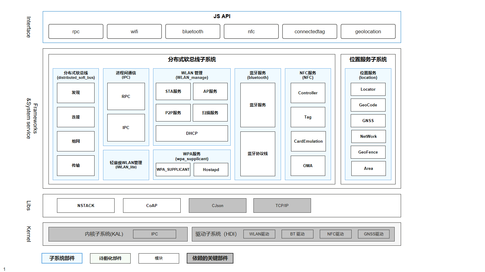

# SIG-SoftBus
简体中文 | [English](./sig_softbus.md)

说明：本SIG的内容遵循OpenHarmony的PMC管理章程 [README](/zh/pmc.md)中描述的约定。

## SIG组工作目标和范围

### 工作目标
为开源社区软总线持续贡献力量，实现近场设备间统一的分布式通信能力管理，提供不区分链路的设备发现、组网和传输能力。

### 工作范围
- 负责分布式软总线相关软件模块架构设计、评审和决策；
- 负责分布式软总线领域软件模块的代码审核、合入，禁止低质量代码合入开源版本主干，负责测试代码看护；
- 积极有效参与开源社区代码检视与点评，共享编程经验，与开源社区开发者交流，传递软件开发技能，有效辅导开源社区开发者写出好代码；
- 处理开源社区上的需求、issue、邮件列表和开发问题，闭环周期满足开源社区的SLA要求；
- 结合评审和开发活动，给予代码质量反馈与指导，促进开源社区代码质量提升。

## 代码仓

|部件名称|部件功能描述|部件仓名称|
|---|---|---|
|分布式软总线| 分布式软总线实现近场（LAN、WLAN、蓝牙）设备间统一的分布式通信管理能力，提供不区分链路的设备间发现连接、组网和传输能力，主要功能如下： 发现连接：提供设备发现和连接能力。 设备组网：提供统一的设备组网和拓扑管理能力，为数据传输提供已组网设备信息。 数据传输：提供数据传输通道，支持消息、字节、文件和流数据传输能力。 | communication_dsoftbus|
|进程间通信|进程间通信包含IPC(Inter-Process Communication)与RPC(Remote Procedure Call)，用于实现跨进程通信。 IPC用于设备内的跨进程通信，而RPC可提供设备间跨进程通信。| communication_ipc communication_ipc_lite|
|WLAN服务| 提供WLAN基础功能，包括WLAN STA、AP、P2P等功能的管理服务。为应用和系统服务提供用可以通过WLAN和其他设备互联互通|communication_wifi communication_wifi_lite|
|WPA服务|提供WiFi和P2P相关认证协议功能，包含WPA和HostAPD两个主要部分。|third_party_wpa_supplicant|
|蓝牙服务|提供蓝牙profile服务、蓝牙协议栈等相关能力。 为设备提供接入与使用Bluetooth的相关接口，包括BR配对连接，BLE广播、扫描，BLE设备gatt相关的操作及功能。|communication_bluetooth|
|NFC服务|提供NFC标签的读写能力，卡模拟能力等服务能力。|communication_nfc communication_connected_nfc_tag|
|位置服务|提供GNSS、网络定位、地理编码转换等位置服务框架能力。|base_location|
|DHCP服务|提供集中地管理、分配IP地址，使网络环境中的主机动态的获得IP地址、Gateway地址、DNS服务器地址等信息，同时提升地址的使用率。|communication_dhcp|

## SIG组成员

### Leader
- @MaErlii(https://gitee.com/maerlii)

### Committers列表
- @MaErlii(https://gitee.com/maerlii)
- @waibozie(https://gitee.com/waibozie)
- @fengyonghui123(https://gitee.com/fengyonghui123)
- @duxbbo(https://gitee.com/duxbbo)
- @fanxiaoyu321(https://gitee.com/fanxiaoyu321)
- @Xi_Yuhao(https://gitee.com/Xi_Yuhao)
- @yinyouzhan(https://gitee.com/yinyouzhan)
- @cheng_guohong(https://gitee.com/cheng_guohong)
- @rain_myf(https://gitee.com/rain_myf)
- @xujiang1981(https://gitee.com/xujiang1981)
- @knpingan(https://gitee.com/knpingan)
- @liu-binjun(https://gitee.com/liu-binjun)
- @zf0719(https://gitee.com/zf0719)

### 会议
 - 会议时间：双周例会，周一下午16:00，UTC+8
 - 议题申报: [OpenHarmony SIG-SoftBus Meeting Proposal](https://shimo.im/sheets/iDp1dGmnk3sVjJoE/MODOC)
 - 会议链接：Welink
 - 会议通知: 请[订阅](https://lists.openatom.io/postorius/lists/sig_dsoftbus.openharmony.io) 邮件列表 sig_dsoftbus@openharmony.io 获取会议链接
 - 会议纪要：查看往期会议纪要，请点此[会议纪要](https://gitee.com/openharmony-sig/sig-content/blob/master/softbus/meetings)

### 联系方式(可选)
| 地址                                 | 简介        | 用途说明                                                         |
| ---------------------------------------|---------- | ------------------------------------------------------------ |
| dev@openharmony.io  | 开发邮件列表  | OpenHarmony社区开发讨论邮件列表，任何社区开发相关话题都可以在邮件列表讨论。任何开发者可[订阅](https://lists.openatom.io/postorius/lists/dev.openharmony.io)。|
| sig_dsoftbus@openharmony.io  | Sig-Softbus邮件列表  | OpenHarmony社区SIG-Softbus开发讨论邮件列表，任何软总线开发相关话题都可以在邮件列表讨论。任何开发者可[订阅](https://lists.openatom.io/postorius/lists/sig_dsoftbus.openharmony.io/)。|
