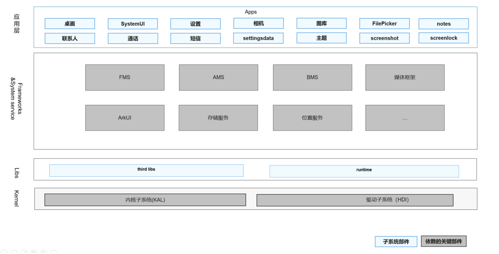

# SIG_SystemApplication
简体中文 | [English](./sig_systemapplications.md)

说明：本SIG的内容遵循OpenHarmony的PMC管理章程 [README](/zh/pmc.md)中描述的约定。

## SIG组工作目标和范围

### 工作目标
定义并构建OpenHarmony的系统应用，负责申请、实施孵化项目，广泛收集社区开发者需求，以持续完善系统应用的特性。

### 工作范围
1. 新一代系统应用架构及特性的孵化
2. 主干仓库系统应用的开发及维护
3. 识别应用对其他子系统的依赖，并提出相应需求，促进系统完善
4. 与开发者交流、合作，持续完善系统应用的特性
5. 组织社区相关问题的澄清并及时给予解答

系统应用SIG（ sig-systemapplications ）技术栈范围全景图如下图所示：

## 代码仓
|部件名称|部件功能描述|部件仓名称|
| ------------ | ------------ |------------ |
|系统桌面应用|Launcher 作为系统人机交互的首要入口，提供应用图标的显示、点击启动、卸载应用，并提供桌面布局设置以及最近任务管理等功能。	|applications_launcher|
|系统设置应用|设置应用是 OpenHarmony 系统中预置的系统应用，为用户提供设置系统属性的交互界面，例如设置系统时间，屏幕亮度等系统属性。	|applications_settings|
|系统SystemUI应用	|SystemUI应用是OpenHarmony中预置的系统应用，为用户提供系统相关信息展示及交互界面，包括系统状态、系统提示、系统提醒等，例如系统时间、电量信息。	|applications_systemui|
|系统联系人应用	|Contacts应用是OpenHarmony中预置的系统应用，主要的功能包含拨号盘、通话记录查看、通话记录批量删除、联系人列表、详情查看和联系人的新建等功能。	|applications_contacts|
|系统短信应用|Mms应用是OpenHarmony中预置的系统应用，主要的功能包含信息查看、发送短信、接收短信、短信送达报告、删除短信等功能。|applications_mms|
|系统通话应用	|基于系统平台能力，设计和开发通话应用，提供语音通话、视频通话、通话设置、移动网络设置、SIM卡管理设置、紧急拨号以及添加个人紧急信息的功能。	|applications_call|
|系统设置数据库应用|SettingsData是 OpenHarmony 系统中预置的系统应用，为用户提供数据库的访问存取服务，例如存储/读取系统时间格式、屏幕亮度等系统属性。|applications_settings_data|
|系统图库应用|图库是系统内置的可视资源访问应用，提供图片和视频的管理、浏览、显示、编辑操作等功能，并支持默认相册和用户相册管理。|	|applications_photos|
|系统相机应用	|相机应用是OpenHarmony标准系统中预置的系统应用，为用户提供基础的相机拍摄功能，包括预览、拍照、摄像、缩略图显示、跳转相册、多机位协同。|applications_camera|
|系统主题应用|主题应用是 OpenHarmony 系统中预置的系统应用，为用户提供设置系统主题、桌面壁纸的基础能力，并支持通过其他第三方应用设置用户自定义的主题与壁纸。|applications_theme|
|系统锁屏应用|锁屏应用是OpenHarmony中预置的系统应用，为用户提供锁屏的基础能力。提供滑动解锁、密码解锁等解锁能力，以及锁屏页面的信息展示能力。|	applications_screenlock|
|备忘录应用|备忘录应用是OpenHarmony中预置的应用，为用户提供文本编辑以及保存功能。|applications_notes|
系统截屏应用|ScreenShot应用是OpenHarmony中预置的系统应用，为用户提供截取当前屏幕并保存图片的功能。|applications_screenshot|
|文件选择器|FilePicker应用是OpenHarmony中预置的系统应用，为用户提供文件选择及保存功能|applications_filepicker|
|应用示例|为提高鸿蒙北向应用开发者开发效率，增加各个子系统特性的Sample样例，帮助开发者迅速掌握鸿蒙能力|applications_app_samples|
|权限管理应用|权限管理应用是OpenHarmony中预置的系统应用，为用户提供运行时权限弹框和权限管理设置能力。|applications_permission_manager|

- 代码仓地址：
  - applications_systemui：https://gitee.com/openharmony/applications_systemui
  - applications_settings: https://gitee.com/openharmony/applications_settings
  - applications_launcher: https://gitee.com/openharmony/applications_launcher
  - system_applications: https://gitee.com/openharmony-sig/system_applications
  - applications_photos: https://gitee.com/openharmony/applications_photos
  - applications_camera: https://gitee.com/openharmony/applications_camera
  - applications_contacts: https://gitee.com/openharmony/applications_contacts
  - applications_mms: https://gitee.com/openharmony/applications_mms
  - applications_call: https://gitee.com/openharmony/applications_call
  - applications_screenshot: https://gitee.com/openharmony-sig/applications_screenshot
  - applications_screenlock: https://gitee.com/openharmony-sig/applications_screenlock
  - applications_theme: https://gitee.com/openharmony-sig/applications_theme
  - applications_settingsdata: https://gitee.com/openharmony-sig/applications_settings_data
  - applications_notes: https://gitee.com/openharmony-sig/applications_notes
  - applications_app_samples: https://gitee.com/openharmony/applications_app_samples
  - applications_permission_manager: https://gitee.com/openharmony/applications_permission_manager
  - applications_filemanager: https://gitee.com/openharmony-sig/applications_filemanager
  - applications_inputmethod: https://gitee.com/openharmony-sig/applications_inputmethod

## SIG组成员

### Leader
- @nicolaswang(https://gitee.com/nicolaswang)

### Committers列表
- @starr666(https://gitee.com/starr666)
- @foyezhang(https://gitee.com/foyezhang)
- @blancwu(https://gitee.com/blancwu)
- @liuzhenyu2021(https://gitee.com/liuzhenyu2021)
- @zhuozengsi(https://gitee.com/zhuozengsi)
- @lv-zhongwei(https://gitee.com/lv-zhongwei)
- @hosphoto(https://gitee.com/hosphoto)
- @sunjunxiong(https://gitee.com/sunjunxiong)
- @quantumshark(https://gitee.com/quantumshark)
- @qano(https://gitee.com/qano)
- @sjtu_sp(https://gitee.com/sjtu_sp)
- @zeng_lingyi(https://gitee.com/zeng_lingyi)
- @zhuchengfeng1(https://gitee.com/zhuchengfeng1)
- @yangpeng85(https://gitee.com/yangpeng85)
- @xuchangzhou(https://gitee.com/xuchangzhou)
- @jiang-xiaofeng(https://gitee.com/jiang-xiaofeng)

### 会议
 - 会议时间：月度例会
 - 议题申报：https://shimo.im/sheets/t8cD88vk8qTJQcdh
 - 会议链接：邮件通知石墨文档中的议题参与人（申报议题时务必留下邮箱地址）

### 联系方式
- 邮件列表：sig_systemapplication.openharmony.io [点击订阅](https://lists.openatom.io/postorius/lists/sig_systemapplication.openharmony.io/)
- Zulip频道：[Systemapplication](https://zulip.openharmony.cn/#narrow/stream/1-general/topic/Systemapplication)
- 微信群：在Zulip Systemapplication频道留言您的微信号以及加入的原因，我们在审核通过后会邀请你进入OH-SystemApplication-SIG微信群
