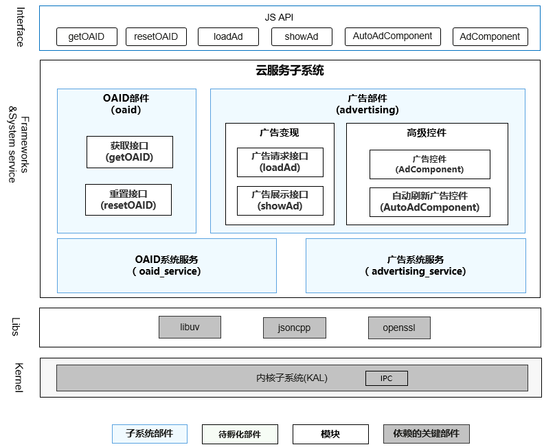

# sig_ads
English | [简体中文](./sig_ads_cn.md)

Note: The content of this SIG follows the convention described in OpenHarmony's PMC Management Charter [README](../../zh/pmc.md).

## SIG group work objectives and scope

### work goals
Unify advertising standards in the OpenHarmony community, build advertising technology capabilities, and prosper the application ecosystem through advertising.

### work scope
Standard development, requirement review, design review, etc. related to OAID and advertising monetization function.

Ads sig technology stack panoramic diagram:

## SIG Members

### Leader
- @njujimmy(https://gitee.com/njujimmy)

### Committers
- @jinyouqi(https://gitee.com/jingyouqi)
- @starkingwx(https://gitee.com/starkingwx)
- @zhongliyu(https://gitee.com/zhong-liyu0313)
- @guochao(https://gitee.com/charley_guo)

### Meetings
 - Meeting time：Biweekly meeting, Wednesday 16:00 ~ 17:30
 - Meeting application: https://docs.qingque.cn/s/home/eZQAyKZ6VHi9vyvvFPNiYkkDK?identityId=217zUB8tCGy
 - Meeting link: Welink Meeting or Others
 - Meeting notification: [Subscribe to](https://lists.openatom.io/postorius/lists/dev.openharmony.io) mailing list dev@openharmony.io for the meeting link
 - Meeting-Minutes: [Archive link address](https://gitee.com/openharmony-sig/sig-content)

### Contact (optional)

- Mailing list：dev@openharmony.io
- Wechat group：NA
