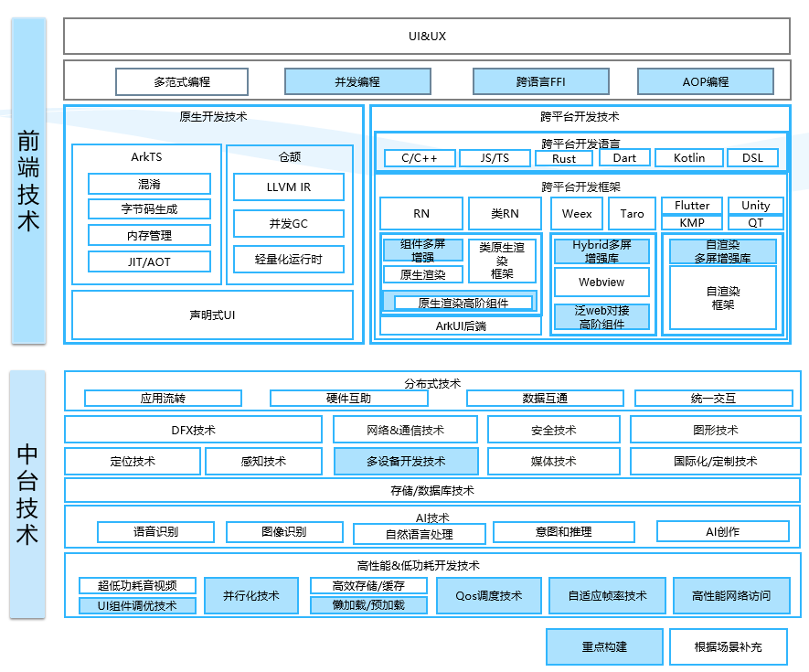

# sig_adss
简体中文 | [English](./sig_adss.md)

说明：本SIG的内容遵循OpenHarmony的PMC管理章程 [README](../../zh/pmc.md)中描述的约定。

## SIG组工作目标和范围

### 工作目标
应用场景套件是社区主导开发，结合各垂域场景和开发者场景构建开源解决方案。

### 工作范围
应用场景化套件是优先实现满足高性能、稳定性等高质量属性的库及配套解决方案。

### 工作交付件
应用开发场景套件是一套库、工具、指南和对开发者的解决方案。

### 会议
 - 会议时间：每周四 14:15
 - 会议申报：SIG相关申报人自行申请议题, https://docs.qq.com/sheet/DQ21qR1VVUmhJeHdq?tab=BB08J2
 - 会议链接: Welink或其他会议
 - 会议通知: 请[订阅](https://lists.openatom.io/postorius/lists/dev.openharmony.io)邮件列表 dev@openharmony.io 获取会议链接
 - 会议纪要: [归档链接地址](https://gitee.com/openharmony-sig/sig-content)

### 联系方式(可选)

- 邮件列表：dev@openharmony.io
- 微信群：NA
