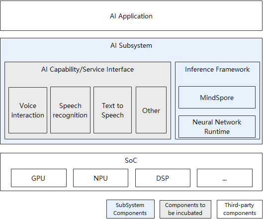

# sig_AI_Framework

English | [简体中文](./sig_ai_framework_cn.md)

Note: The content of this SIG follows the convention described in OpenHarmony's PMC Management Charter [README](/zh/pmc.md).

## SIG group work objectives and scope

### work goals

AI subsystem is a key subsystem on OpenHarmony. It provides an On-Device inference framework and AI capability/service interfaces. The inference framework efficiently integrates hardware computing resources in the southbond, shields underlying differences for AI application developers in the northbound, and unifies inference interfaces. AI capabilities/service interfaces have built-in general AI capabilities to provide AI application developers with out-of-the-box AI capailities. The AI subsystem integrates the AI technology stack, which simplifies the development and maintenance process of AI applications.

### work scope

- AI capaility/service interface

AI capability/service interfaces are classified into AI capability and AI service interfaces. AI capability interfaces encapsulate AI models and provide out-of-the-box AI capabilities for AI application developers, simplifying the AI application development processs. AI service interfaces allow users or third-party capability providers to service customized AI capabilities, enabling AI application developers.

- MindSpore

MindSpore is an ultra-fast, intelligent, and simplified AI engine that enables intelligent applications in all scenarios, provides E2E solutions for users, and helps users enable AI capabilities. For more information, please see [MindSpore official website](https://www.mindspore.cn/lite). MindSpore SIG not only needs to provide users with basic training and inference services, more importantly, in order to expand the ecosystem, we need to cooperate with developers and assist them in contributing their code.

- Neural Network Runtime

Neural Network Runtime is an important bridge between On-Device inference framework and AI chips. It unifies the northbound and southbound API of inference. The northbound native API provides unified IR Building online, Model Compilation, and Inference function for AI inference framework. The southbound HDI interface is open for hardware vendors, who can connect AI chips to OpenHarmony through HDI interface, to build a rich OpenHarmony AI southbound ecosystem. 

- AI Subsystem Architecture

## SIG Members

### Leader

- @ivss(https://gitee.com/ivss)
- @zhanghaibo5(https://gitee.com/zhanghaibo5)
- @silenchen(https://gitee.com/silenchen)

### Committers

- @zhaizhiqiang(https://gitee.com/zhaizhiqiang)
- @zhang_xue_tong(https://gitee.com/zhang_xue_tong)
- @HilbertDavid(https://gitee.com/HilbertDavid)
- @jpc_chenjianping(https://gitee.com/jpc_chenjianping)
- @yangyongjie-boom(https://gitee.com/yangyongjie-boom)
- @jianghui58(https://gitee.com/jianghui58)

 ### Meetings
 - Meeting time：Biweek Monday 19:00, UTC+8
 - Meeting notification: [Subscribe to](https://lists.openatom.io/postorius/lists/dev.openharmony.io) mailing list dev@openharmony.io for the meeting link

### Contact (optional)

- Mailing list：dev@openharmony.io
- Wechat group：xxx
