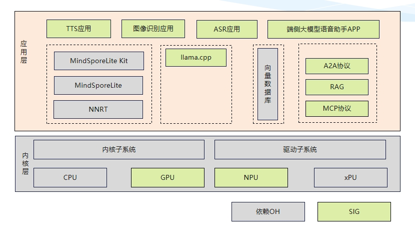

# sig_ai_model
简体中文 | [English](./sig_ai_model_en.md)

说明：本SIG的内容遵循OpenHarmony的PMC管理章程 [README](../../zh/pmc.md)中描述的约定。

## SIG架构

## SIG组工作目标和范围

### 工作目标
丰富大小应用模型并提供端到端范例

### 工作范围
- 北向应用，例如：DeepSeek云APP、语音助手APP、QA应用、ASR/TTS/CV等应用Demo
- 系统和三方库，例如：推理框架llama.cpp、RAG、MCP
- 南向芯片，例如：AMD GPU驱动、NPU驱动                                                     

### 成员加入的规则、流程
1. 企业身份申请加入SIG，需要承接1项共建任务，投入2名开发人员。
2. 个人/学校身份申请加入SIG，需要承接1项共建任务，有足够的时间投入。
3. 共建任务可以是共建开发任务表中，也可以是自提进行审核。
4. 申请邮件需发给<houpengfei@openvalley.net>评审，说明单位、人员投入以及共建任务即可。
5. 组长开鸿智谷和副组长华为为初始成员。

## SIG组成员

### Leader
- @talkweb_houpengfei(https://gitee.com/talkweb_houpengfei)

### Committers列表
-  @tanpengju(https://gitee.com/tanpengju)
-  @yuan-dan-1(https://gitee.com/yuan-dan-1)
-  @xfanonymous(https://gitee.com/xfanonymous)

### 会议
- 会议时间：前两个月每周一次，后续两周一次；周三10:00-12:00
- 会议申报：[OpenHarmony AI Model SIG Meeting Proposal](https://shimo.im/sheets/913JMRpR91T44oAE/MODOC)
- 会议链接：通过邮件通知

### 联系方式(可选)

- 邮件列表：sig_ai_model@openharmony.io
- 微信群：xxx
