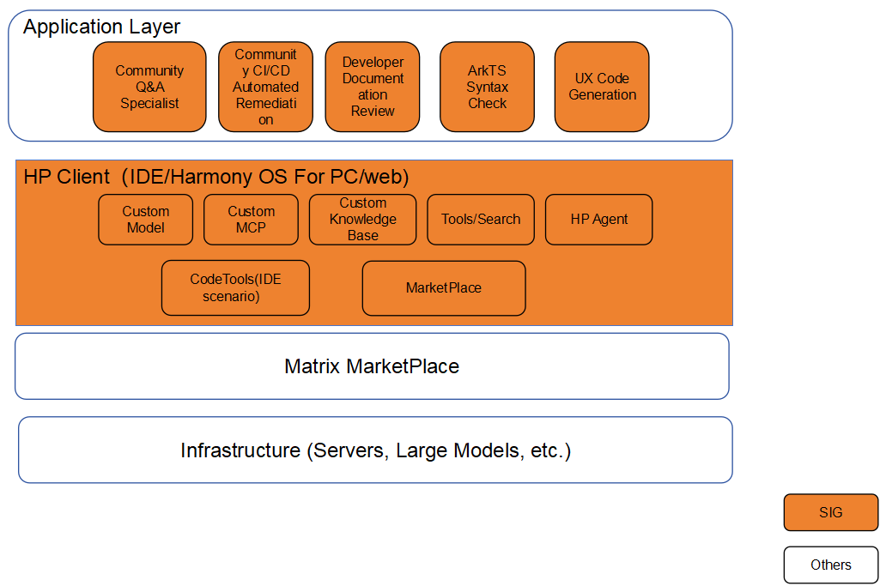

# sig_ai_swe
English | [简体中文](./sig_template_cn.md)

Note: The content of this SIG follows the convention described in OpenHarmony's PMC Management Charter [README](../../zh/pmc.md).

## SIG architecture

## SIG group work objectives and scope

### work goals
The AI SWE SIG is based on meeting the business needs of community-driven open-source development and the expansion of the HarmonyOS ecosystem. Through collaborative capability building and sharing, it provides intelligent "empowerment" and "low-cost, customized HarmonyOS capabilities," driving the growth of the HarmonyOS ecosystem. Starting with the goal of enriching the HarmonyOS ecosystem, it brings together collective intelligence, promotes open-source collaboration, and fosters co-creation and sharing to serve "diverse industries."

### work scope
- AI Capability Platform: Expanding demands around the HarmonyOS ecosystem, providing AI engineering capabilities, gathering talents from around the world, and promoting open-source collaboration.

- AIGC Enhances Developer Efficiency and Development Experience: Covering end-to-end R&D activities for developers, providing AI capabilities in scenarios such as code generation, review, static checking and repair, assisted testing, and issue analysis, thereby improving delivery quality and efficiency.

- Community Fuzz Testing Capability Co-construction: Engaging developers in building community fuzz testing capabilities.

- Developer Experience Enhancement: Community knowledge Q&A experts, community access control & daily build CI/CD assisted localization and repair, AI review, HarmonyOS developer documentation clarity detection, and optimization of community PR/ISSUE code contribution processes.

- UX Design Mockups to ArkUI Code Generation.

## SIG Members

### Leader
- @stxia88(https://gitcode.com/stxia88)

### Committers列表
- @youthdragon(https://gitcode.com/youthdragon)

### Meetings
- Time: Bi-weekly meeting, Wednesday 19:00 (evening)
- Meeting proposal：[OpenHarmony AI Software Engineering Meeting Proposal](https://shimo.im/sheets/rp3OMLlRrJh9RLkm/MODOC)
- Meeting link: Notify via email

### Contact (optional)

- Mailing list：dev@openharmony.io
- Wechat group：xxx
