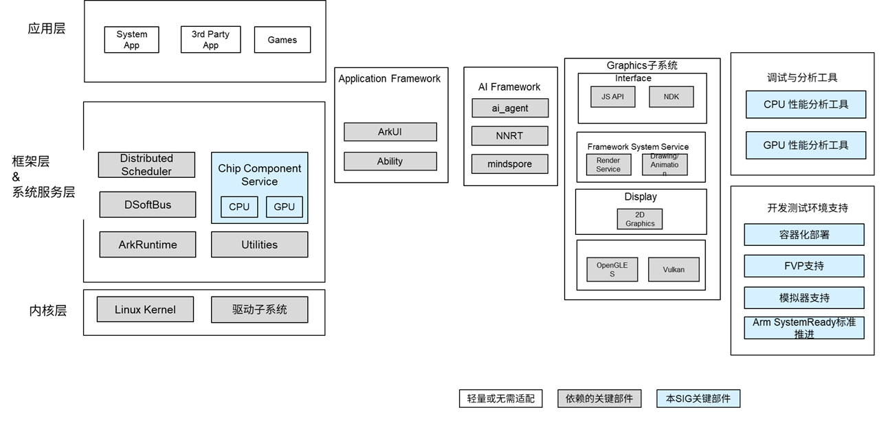

# sig_arm
English | [简体中文](./sig_arm_cn.md)

Note: The content of this SIG follows the convention described in OpenHarmony's PMC Management Charter [README](../../zh/pmc.md).

## SIG group work objectives and scope

### Background
 - Broad Adoption of the Arm Architecture
 - The Arm architecture, with its high energy efficiency and flexible IP combinations, has become the mainstream architecture in global embedded, mobile, IoT, and server domains.
 - Expansion of OpenHarmony Scenarios
 - OpenHarmony is evolving from small-scale devices to high-performance scenarios such as automotive, industrial control, and servers, which imposes higher requirements on system consistency and ecosystem compatibility.
Challenges
 - The community faces several challenges in supporting the Arm architecture, including the lack of a unified testing platform, insufficient documentation, and gaps in ecosystem validation, all of which impact product innovation and commercial deployment.

### work goals
#### Promoting Standardization
	 - Implement and maintain support for the Arm ISA and architecture standards. Ensure the availability and compatibility of Arm-based platforms within OpenHarmony.
	 - Publish best practice guides for typical Arm-based scenarios. Provide developers with comprehensive documentation and technical guidance to effectively apply Arm architecture in real-world OpenHarmony use cases.
	 - Contribute to standards development and localization alignment. Actively participate in the formulation of relevant technical standards and promote the integration of Arm specifications with localized industry requirements.

### work scope
The panoramic view of the Arm SIG technology stack is shown in the figure below:

 - Develop Linux kernel features for ARM architecture, including adaptation and optimization.
 - Design and maintain ArkRuntime components for ARM platforms to ensure efficient runtime support.
 - Provide ARM CPU/GPU component services for hardware acceleration and performance optimization.
 - Integrate ARM-related AI frameworks and NNRT (Neural Network Runtime) to enable intelligent computing scenarios.
 - Build debugging and performance analysis tools for ARM platforms (covering both CPU and GPU) to enhance development and tuning efficiency.
 - Support ARM virtualization environments, including KVM-based VMs, FVP simulators, and Docker containers.
 - Promote and implement ARM system standards such as SystemReady, driving ecosystem consistency.

## SIG Members

### Leader
- @justinhe2(https://gitcode.com/justinhe2)
- @xie_hai(https://gitcode.com/xie_hai)

### Committers
- @junhe_arm(https://gitcode.com/junhe_arm)
- @frman26(https://gitcode.com/frman26)
- @kalyxin(https://gitcode.com/kalyxin)
- @talkweb_houpengfei(https://gitcode.com/talkweb_houpengfei)
- @hongliang(https://gitcode.com/honglianglin)
- @niu-guoliang(https://gitcode.com/niu-guoliang)
- @lucici2018(https://gitcode.com/lucici2018)

### Meetings
 - Meeting time：Monthly first Thursday afternoon 
 - Meeting application: https://shimo.im/docx/vVAXM0MeJxSgeB3m
 - Meeting link: https://meeting.huaweicloud.com/#/j/985726402/EWmHgcyGmDYDQEamd0oT9TcSwzMUxZlLA
 - Meeting notification: [Subscribe to] (https://lists.openatom.io/postorius/lists/dev.openharmony.io) mailing list dev@openharmony.io for the meeting link
 - Meeting-Minutes: [View historical meeting minutes] (https://gitcode.com/openharmony/community/tree/master/sig/sig_armZZ/meetings)

### Contact (optional)

- Mailing list：dev@openharmony.io
