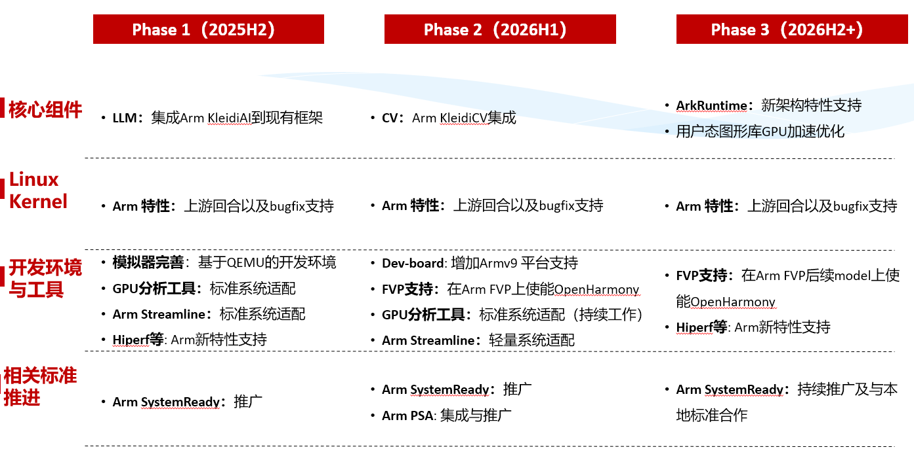

# sig_arm
简体中文 | [English](./sig_arm.md)

说明：本SIG的内容遵循OpenHarmony的PMC管理章程 [README](../../zh/pmc.md)中描述的约定。

## SIG组工作目标和范围

### 出现背景
 - Arm架构的广泛应用：Arm架构凭借高能效比和灵活的IP组合，已成为全球嵌入式、移动、IoT及服务器等领域的主流架构。
 - OpenHarmony的场景拓展：OpenHarmony正从小型设备扩展到车载、工业控制、服务器等高性能场景，对系统一致性和生态兼容性提出更高要求。
 - 挑战：社区在Arm架构支持方面面临缺乏统一测试平台、文档资料不足、生态验证缺失等问题，影响产品创新和商业落地。

### 工作目标
#### 推进标准
 - 实现和维护Arm指令集以及相关架构规范在OpenHarmony中的支持， 确保基于Arm架构的平台可用性和兼容性
 - 发布Arm架构在典型场景的最佳实践文档，指导开发者在项目中有效应用
 - 参与相关标准的制定，推动Arm技术规范与本地化标准的有机融合

#### 赋能生态
 - 基于OpenHarmony社区，建立专门面向Arm架构的开发者交流论坛，提供系统适配、构建与优化等指导，促进技术交流与合作
 - 帮助开发者和生态伙伴深入了解Arm最新技术及其应用，在OpenHarmony内核及关键组件中使能和优化Arm的先进特性，支持生态伙伴的成功并推动创新
 - 推动Arm的上游开源项目落地OpenHarmony，适配和推广用于Arm架构的各项工具，加速生态伙伴在Arm架构上的开发进程和性能提升

#### 发展共赢
 - 与芯片、板卡、系统和相关行业的生态伙伴保持密切合作，积极推进Arm架构特性的应用与生态建设

### 工作范围
Arm SIG技术栈范围全景图如下图所示:

 - 负责 Linux 内核 ARM 架构相关开发，包括内核特性适配与优化。
 - 开发和维护 ARM 平台的 ArkRuntime 组件，确保高效运行时支持。
 - 提供 ARM CPU/GPU 芯片组件服务，实现硬件加速与性能优化。
 - 集成 ARM 相关 AI 框架及 NNRT（神经网络运行时），支持智能计算场景。
 - 构建 ARM 平台调试与性能分析工具（涵盖 CPU 和 GPU），提升开发与调优效率。
 - 支持 ARM 虚拟化开发环境，包括 KVM 虚拟机、FVP 模拟器及 Docker 容器。
 - 推广并落地 ARM 系统标准（如 SystemReady），推动生态一致性。

### 工作交付件及工作计划

## SIG组成员

### Leader
- @justinhe2(https://gitcode.com/justinhe2)
- @xie_hai(https://gitcode.com/xie_hai)

### Committers列表
- @junhe_arm(https://gitcode.com/junhe_arm)
- @frman26(https://gitcode.com/frman26)
- @kalyxin(https://gitcode.com/kalyxin)
- @talkweb_houpengfei(https://gitcode.com/talkweb_houpengfei)
- @hongliang(https://gitcode.com/honglianglin)
- @niu-guoliang(https://gitcode.com/niu-guoliang)
- @lucici2018(https://gitcode.com/lucici2018)

### 会议
 - 会议时间：每月的第一个周四
 - 会议申报：https://shimo.im/docx/vVAXM0MeJxSgeB3m SIG相关申报人自行申请议题
 - 会议链接: https://meeting.huaweicloud.com/#/j/985726402/EWmHgcyGmDYDQEamd0oT9TcSwzMUxZlLA
 - 会议通知: 请[订阅](https://lists.openatom.io/postorius/lists/dev.openharmony.io)邮件列表 dev@openharmony.io 获取会议链接
 - 会议纪要: [查看历史会议记录](https://gitcode.com/openharmony/community/tree/master/sig/sig_arm/meetings)

### 联系方式(可选)

- 邮件列表：dev@openharmony.io
