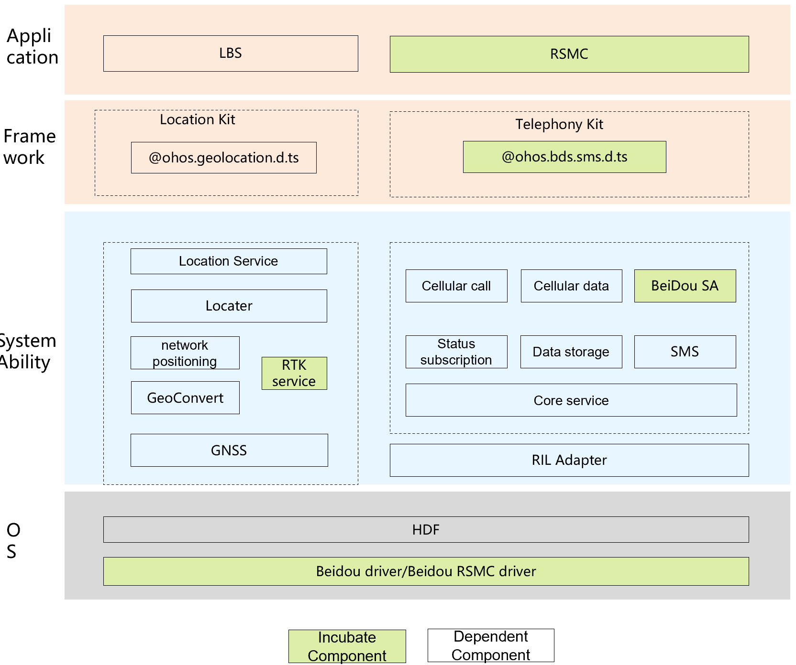

# sig_bdoh
English | [简体中文](./sig_bdoh_cn.md)

Note: The content of this SIG follows the convention described in OpenHarmony's PMC Management Charter [README](../../zh/pmc.md).

## SIG architecture

## SIG group work objectives and scope

### work goals
- 1. Based on the OpenHarmony community, work with industry ecosystem partners to build the application capabilities of Beidou industry IoT scenarios;
- 2. Fully empower the OpenHarmony Beidou industry, expand the application scope of the Beidou industry in all directions, explore the deep value of Beidou technology in various fields, and promote the vigorous development of the Beidou industry.

### work scope
- Beidou short message chip driver and protocol stack adaptation, including SIM card driver, authentication, short message encryption and decryption
- Beidou short message application

### work plan
#### Phase I: Basic Phase 2025 Q1
- 1. SA: Complete the short message SA service development
- 2. HDF: complete the short message HDF development
- 3. Driver layer: complete short message driver adaptation and SIM card adaptation.
#### Phase II: Refinement Phase 2025 Q3
- 1. Application: Beidou short message application development, on the shelf
- 2. SA: Complete the short message SA service development.
- 3. HDF: complete the short message HDF development
- 4. Driver layer: complete short message driver adaptation and SIM card adaptation.
#### Phase III: Exploration Phase 2026 Q3
- 1. Exploration of Beidou + OH high-precision positioning technology (such as RTK, PPP-RTK)
- 2. Standardized support for other Beidou services (timing, satellite-based enhancement, ground-based enhancement, international search and rescue)

## SIG Members

### Leader
- @BDOH(https://gitee.com/bdoh)

### Committers
- @hxdlj(https://gitee.com/hxdlj)
- @jiwenjun1013(https://gitee.com/jiwenjun1013)
- @huguangming123(https://gitee.com/huguangming123)
- @Spice_wu(https://gitee.com/Spice_wu)
- @huang-dengcheng(https://gitee.com/huang-dengcheng)
- @bradyD (https://gitee.com/dengchenyang95) 

### Meetings
 - Meeting time：Single Wednesday 14: 15-16: 00 pm
 - Meeting application: [OpenHarmony BDOH SIG Meeting Proposal](https://docs.qingque.cn/s/home/eZQDJYbKDlvXxNDqB9gn6_VFt?identityId=2D7couieItQ&section=2063819734)
 - Meeting link: Notify by email
 - Meeting notification: [Subscribe to](https://lists.openatom.io/postorius/lists/dev.openharmony.io) mailing list dev@openharmony.io for the meeting link
 - Meeting-Minutes: [Archive link address](https://gitee.com/openharmony-sig/sig-content)

### Contact (optional)

- Mailing list：dev@openharmony.io
- Wechat group：xxx