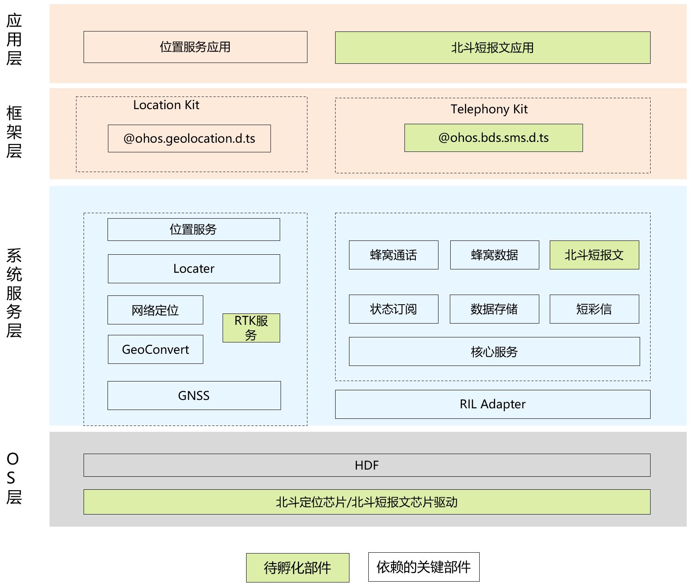

# sig_bdoh
简体中文 | [English](./sig_bdoh.md)

说明：本SIG的内容遵循OpenHarmony的PMC管理章程 [README](../../zh/pmc.md)中描述的约定。

## SIG技术栈

## SIG组工作目标和范围

### 工作目标
- 1.基于OpenHarmony社区，携手业界生态伙伴，全力构建北斗行业物联场景的应用能力，为北斗行业的发展筑牢根基；
- 2.充分赋能OpenHarmony北斗行业，全方位拓展北斗行业应用范围，挖掘北斗技术在各领域的深度价值，推动北斗行业蓬勃发展。

### 工作范围
#### 代码共建
 - 南向北斗短消息芯片驱动和协议栈适配，含SIM卡驱动，认证，短消息加解密
 - 北向北斗短消息应用程序
#### 立标准
 - 制定北斗定位服务的精度、数据格式、模块性能等技术标准。
 - 规范短报文格式、长度、编码、通信协议和优先级分类标准。
 - 定义软件接口标准和规范文件，包括 API 相关内容。

### 工作交付件及工作计划
#### 阶段一：基础阶段 2025Q1
- 1.SA：完成短报文SA服务开发
- 2.HDF：完成短报文HDF开发
- 3.驱动层：完成短报文驱动适配，SIM卡适配
#### 阶段二：完善阶段 2025Q3
- 1.应用：北斗短报文应用开发，上架
- 2.SA：完成短报文SA服务开发
- 3.HDF：完成短报文HDF开发
- 4.驱动层：完成短报文驱动适配，SIM卡适配
#### 阶段三：探索阶段 2026Q3
- 1.北斗+OpenHarmony高精度定位技术探索（如RTK，PPP-RTK ）
- 2.其他北斗业务（授时、星基增强、地基增强、国际搜救）等标准化支撑

## SIG组成员

### Leader
- @BDOH(https://gitee.com/bdoh)

### Committers列表
-  @hxdlj(https://gitee.com/hxdlj)
-  @jiwenjun1013(https://gitee.com/jiwenjun1013)
-  @huguangming123(https://gitee.com/huguangming123)
-  @Spice_wu(https://gitee.com/Spice_wu)
-  @huang-dengcheng(https://gitee.com/huang-dengcheng)
-  @bradyD (https://gitee.com/dengchenyang95) 

### 会议
 - 会议时间：每单周周三下午14:15-16:00
 - 会议申报：[OpenHarmony BDOH SIG Meeting Proposal](https://docs.qingque.cn/s/home/eZQDJYbKDlvXxNDqB9gn6_VFt?identityId=2D7couieItQ&section=2063819734)
 - 会议链接: 通过邮件通知
 - 会议通知: 请[订阅](https://lists.openatom.io/postorius/lists/dev.openharmony.io)邮件列表 dev@openharmony.io 获取会议链接
 - 会议纪要: [归档链接地址](https://gitcode.com/openharmony-sig/sig-content)

### 联系方式(可选)

- 邮件列表：dev@openharmony.io
- 微信群：xxx