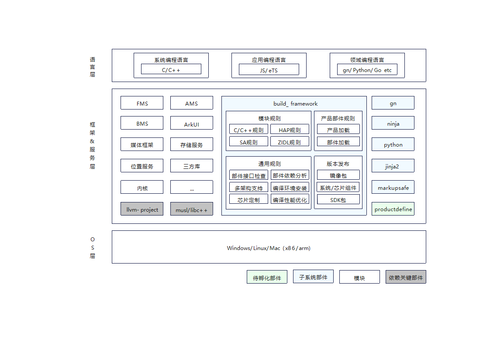

# SIG_BUILDSYSTEM
 English | [简体中文](./sig_build_system_cn.md)

 Note: The content of this SIG follows the convention described in OpenHarmony's PMC Management Charter [README](/zh/pmc.md).

## SIG group work objectives and scope

### work goals
- Construct a build system framework for 1+8+N devices in all scenarios to provide a convenient, efficient and easily extensible system.

### work scope
- Design, review, and make decisions on the architecture of build system.
- Review and incorporate the code of build system, prohibit low-quality code from being incorporated into the master branch.
- Actively and effectively participate in code review and comment, share programming experience, communicate with developers, transfer software development skills, and effectively coach open source community developers to write good code.
- Handle requirements, issues and mailing lists, and ensure that the closure period meets the SLA requirements of the OpenHarmony community.
- Provide feedback and guidance on code quality based on review and development activities to improve code quality in the OpenHarmony community.

+The overview of buildsystem
+

### The repository
- project name:
  - build: https://gitcode.com/openharmony/build
  - third_party_gn: https://gitcode.com/openharmony/third_party_gn
  - third_party_jinja2: https://gitcode.com/openharmony/third_party_jinja2
  - third_party_markupsafe: https://gitcode.com/openharmony/third_party_markupsafe
  - third_party_ninja: https://gitcode.com/openharmony/third_party_ninja
  - third_party_python: https://gitcode.com/openharmony/third_party_python

## SIG Members

### Leader
- @liwentao (https://gitee.com/liwentao)

### Committers
- @chenmudan (https://gitee.com/chenmudan)
- @belanLu (https://gitee.com/belanLu)
- @ychuawei (https://gitee.com/ychuawei)
- @shawshank506 (https://gitee.com/shawshank506)
- @xxlight (https://gitee.com/xxlight)
- @Ascnbio (https://gitee.com/Ascnbio)
- @fangting10 (https://gitee.com/fangting10)
- @ya-ning-liu (https://gitee.com/ya-ning-liu)
- @huanghuijin (https://gitee.com/huanghuijin)
- @guzhihao4 (https://gitee.com/guzhihao4)

 ### Meetings
 - Meeting time: Bi-weekly meeting, Monday 19:00 pm, UTC+8
 - Meeting application: [sig_buildsystem Meeting Proposal](https://shimo.im/sheets/m8AZV1JgE2UQ1KAb/MODOC/)
 - Meeting link: Welink Meeting or Others
 - Meeting notification: [Subscribe to](https://lists.openatom.io/postorius/lists/dev.openharmony.io) mailing list dev@openharmony.io for the meeting link
 - Meeting-Minutes: [Archive link address](https://gitcode.com/openharmony-sig/sig-content)

 ### Contact

 - Mailing list: dev@openharmony.io
 - Wechat group: NA
