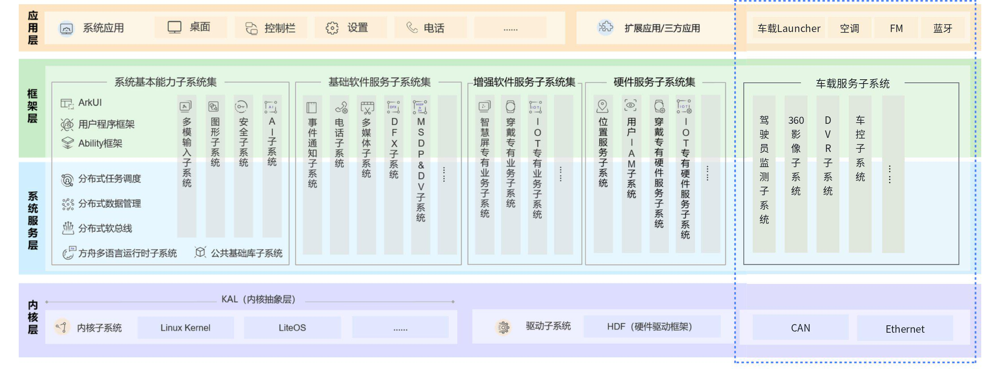
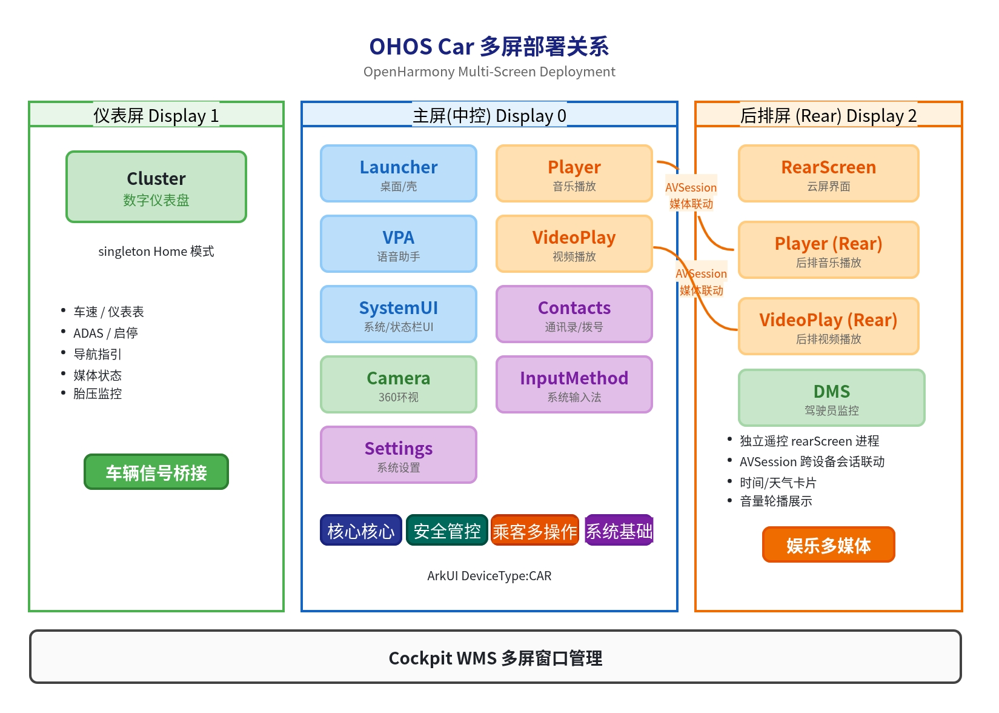

# SIG_Car
简体中文 | [English](./sig_car.md)

说明：本SIG的内容遵循OpenHarmony的PMC管理章程 [README](../../zh/pmc.md)中描述的约定。

## SIG组工作目标和范围

### 工作目标
- 针对汽车智能座舱需求，增强OpenHarmony的系统基本能力/基础软件服务、补齐Car专有软件和硬件服务框架能力，增强API支撑Car应用开发，完善Car HDF专有驱动支撑座舱硬件开发者开发。
- 提供对应的IDE工具链模拟器/开发板技术支撑生态伙伴方便开发Car应用和智能座舱产品，繁荣OpenHarmony生态。

### 工作范围
- OpenHarmony For Car的OS平台基础能力构建，主要是Car专有业务子系统、Car专有硬件子系统；
- OpenHarmony For Car的北向应用服务生态拓展技术支撑；
- OpenHarmony For Car的智能座舱硬件生态拓展技术支撑；

OpenHarmony For Car SIG（ sig_car ）技术栈范围全景图如下图所示：

### 多屏部署关系

## SIG组成员

### Leader
- @diao-meng(https://gitee.com/diao-meng)

### Committers列表
- @timeshi(https://gitee.com/timeshiai)
- @shao_min(https://gitee.com/shao_min)
- @EthanSun(https://gitcode.com/Ethanhy)
- @Miaojiao(https://gitcode.com/miaojiaojiao666)
- @YunLong(https://gitcode.com/m0_62937082)
- @Zhipeng(https://gitcode.com/jzp0409)

### 会议
 - 会议时间：月度会议，每月第一个周五下午14:00-16:00
 - 会议链接：腾讯会议
 - 会议纪要：查看往期会议纪要，请点此[链接](https://docs.qq.com/space/DSENOUVpCZE15VExv?resourceId=HBExSWyRGgRS&mode=wiki_mode)

### 联系方式(可选)

- 邮件列表：dev@openharmony.io
- 微信群：NA

