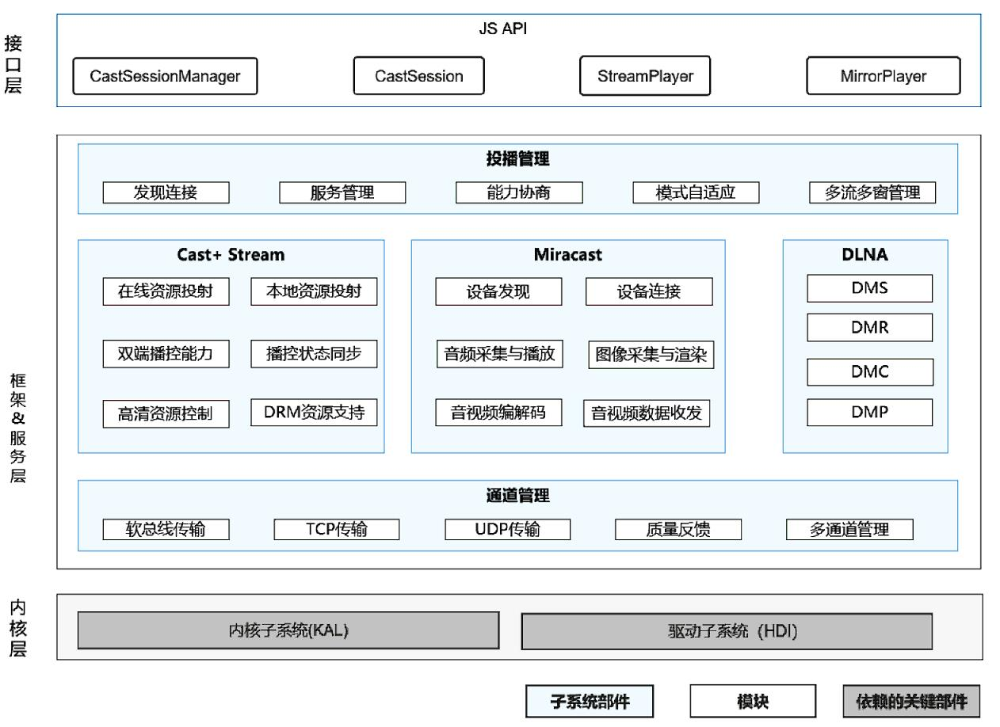

# sig_castengine
简体中文 | [English](./sig_castengine.md)

说明：本SIG的内容遵循OpenHarmony的PMC管理章程 [README](/zh/pmc.md)中描述的约定。

## SIG组工作目标和范围

### 工作目标
- 提供自适应Cast+ Stream，Wi-Fi Display，DLNA多种协议的音视频投播能力，为南北向开发者提供统一的接口及归一化的体验。

### 工作范围
- 投播框架模块：提供整体的投播框架，支持其他投屏协议的接入以及投屏协议自适应选择。
- Cast+ Stream模块：主要功能是实现媒体资源的投射到对端设备，并支持双端的播控。
- Wi-Fi Display模块：主要功能是实现以Wi-Fi直连（Wi-Fi Direct）为基础的无线显示标准。
- DLNA模块：实现DLNA标准协议。

无线投播服务SIG（ sig_castengine ）技术栈范围全景图如下图所示：

## SIG组成员

### Leader
- wanghao(https://gitee.com/wanghao_8866)

### Committers列表
- lijianzhao(https://gitee.com/JasonLi111)
- diaoyuelei(https://gitee.com/dyl-dev)
- dingkang(https://gitee.com/dk_dingkang)
- zhangge(https://gitee.com/zg2wvj)
- gaowei(https://gitee.com/solomongao)
- ibanezsc(https://gitee.com/ibanezsc)
- bayanxing(https://gitee.com/bayanxing)
- algoideas(https://gitee.com/algoideas)
- liziran(https://gitee.com/daziran96)

### 会议
 - 会议时间：双周例会 周四下午16:00-17:00
 - 会议申报：[sig_castengine Meeting Proposal](https://docs.qingque.cn/s/home/eZQC8DnY-lAvzY81PB4Kd-Ehk?identityId=1yOkXOqnIUl)
 - 会议链接: Welink或其他会议
 - 会议通知: 请[订阅](https://lists.openatom.io/postorius/lists/dev.openharmony.io)邮件列表 dev@openharmony.io 获取会议链接
 - 会议纪要: [归档链接地址](https://gitcode.com/openharmony-sig/sig-content)

### 联系方式(可选)

- 邮件列表：dev@openharmony.io
- 微信群：NA
