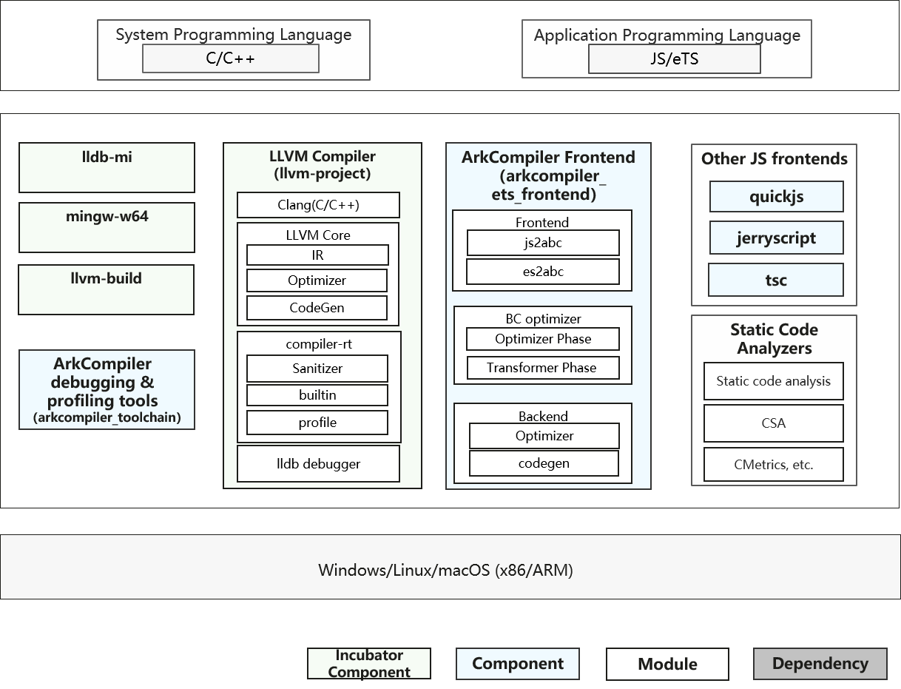
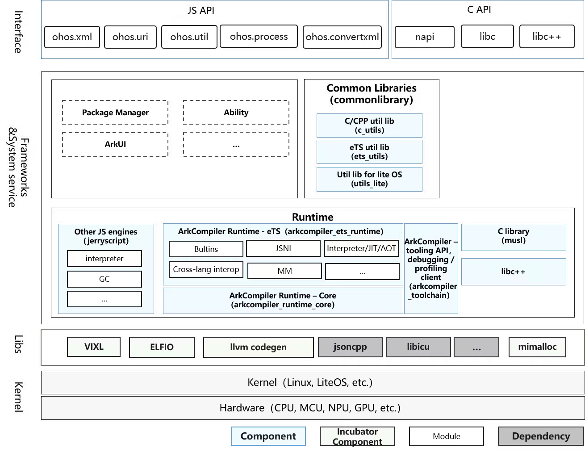

# SIG_COMPILERUNTIME
 English | [简体中文](./sig_compile-runtime_cn.md)
 
 Note: The content of this SIG follows the convention described in OpenHarmony's PMC Management Charter [README](/zh/pmc.md).

## SIG group objectives and work scope

### objectives

- Support JS/TS language compilation and execution, and create high-performance JS/TS virtual machines.
- Provide basic JSAPI capabilities, including concurrency, string encoding and decoding, and URL parsing capabilities, etc..
- Support C/C++ compilation, debugging based on Clang/LLVM.
- Provide basic library support such as musl and evolution of related abilities.
- Provide new programming language design and implementation based on OpenHarmony's requirements.

### work scope
- Programming language, compiler and runtime architecture design and review.
- Programming language, compiler and runtime implementation and review.
- Community requirements, issues and mailing lists processing.

### overview
- Compiler

- Runtime

## Repositories
|Component|Description|Code repo|
| ----- | ----------- | --------- |
|ArkCompiler runtime core|Core components of ArkCompiler runtime|arkcompiler_runtime_core|
|ArkCompiler eTS runtime|eTS language runtime of ArkCompiler|arkcompiler_ets_runtime|
|ArkCompiler eTS frontend|eTS compiler frontend of ArkCompiler|arkcompiler_ets_frontend|
|ArkCompiler toolchain|Debugging and profiling tools for ArkCompiler|arkcompiler_toolchain|
|ARM assembler / code generator|ARM instruction assembler and code generator library|third_party_vixl|
|jerryscript|Lightweight JS engine with extremely low memory footprint|third_party_jerryscript|
|quickjs|Small JS engine with full compatibility of ES2020|third_party_quickjs|
|LLVM|LLVM compiler and toolchain|third_party_llvm-project|
|LLDB Machine Interface|LLDB machine interface|third_party_lldb-mi|
|MinGW-w64|A complete runtime environment for GCC and LLVM for 32 and 64 bit Windows|third_party_mingw-w64|
|musl|Standard C library|third_party_musl|
|mimalloc Memory allocator|High performance memory allocator implementation|third_party_mimalloc|
|elfio|C++ library for reading and generating ELF files|third_party_elfio|
|miniz|Data compression library that implements most zlib interfaces|third_party_miniz|
|eTS util library|eTS library providing basic utilities|commonlibrary_ets_utils|
|C utils library|C library providing basic utilities|commonlibrary_c_utils|
|Utils library for lite OS|Library providing basic utilities for lite OS|commonlibrary_utils_lite|
|Memory utils|Libraries providing common system memory related operations|utils_memory|

- mainline repos:
  - arkcompiler_runtime_core: https://gitee.com/openharmony/arkcompiler_runtime_core
  - arkcompiler_ets_runtime: https://gitee.com/openharmony/arkcompiler_ets_runtime
  - arkcompiler_ets_frontend: https://gitee.com/openharmony/arkcompiler_ets_frontend
  - arkcompiler_toolchain: https://gitee.com/openharmony/arkcompiler_toolchain

  - third_party_jerryscript: https://gitee.com/openharmony/third_party_jerryscript
  - third_party_quickjs: https://gitee.com/openharmony/third_party_quickjs

  - third_party_llvm-project: https://gitee.com/openharmony/third_party_llvm-project
  - third_party_lldb-mi: https://gitee.com/openharmony/third_party_lldb-mi
  - third_party_mingw-w64: https://gitee.com/openharmony/third_party_mingw-w64
  - third_party_musl: https://gitee.com/openharmony/third_party_musl
  - third_party_miniz: https://gitee.com/openharmony/third_party_miniz

  - commonlibrary_ets_utils: https://gitee.com/openharmony/commonlibrary_ets_utils
  - commonlibrary_c_utils: https://gitee.com/openharmony/commonlibrary_c_utils
  - commonlibrary_utils_lite: https://gitee.com/openharmony/commonlibrary_utils_lite
  - utils_memory: https://gitee.com/openharmony/utils_memory

- dev repos:
  - arkcompiler_runtime_core: https://gitee.com/openharmony-sig/arkcompiler_runtime_core
  - arkcompiler_ets_runtime: https://gitee.com/openharmony-sig/arkcompiler_ets_runtime
  - arkcompiler_ets_frontend: https://gitee.com/openharmony-sig/arkcompiler_ets_frontend
  - third_party_vixl: https://gitee.com/openharmony-sig/third-party-vixl
  - third_party_elfio: https://gitee.com/openharmony-sig/third_party_elfio
  - third_party_mimalloc: https://gitee.com/openharmony-sig/third_party_mimalloc

## SIG Members

### Leader
- @klooer (https://gitee.com/klooer)

### Committers
- @huanghuijin (https://gitee.com/huanghuijin)
- @wuzhefengh (https://gitee.com/wuzhefengh)
- @gongjunsong (https://gitee.com/gongjunsong)
- @sunzhe23 (https://gitee.com/sunzhe23)
- @weng-changcheng (https://gitee.com/weng-changcheng)
- @yingguofeng (https://gitee.com/yingguofeng)
- @xliu-huanwei (https://gitee.com/xliu-huanwei)
- @flyingwolf (https://gitee.com/flyingwolf)
- @godmiaozi (https://gitee.com/godmiaozi)
- @dhy308 (https://gitee.com/dhy308)
- @pengzhuoli (https://gitee.com/zhuoli72)
- @JerryH1011 (https://gitee.com/JerryH1011)
- @dongduResearcher (https://gitee.com/dongduResearcher)

 ### Meetings
 - Meeting time: Bi-weekly, Friday 14:30, UTC+8
 - Meeting proposal submission: [Subscribe to](https://lists.openatom.io/postorius/lists/compiler.openharmony.io) the mailing list and send proposals to compiler@openharmony.io
 - Meeting link: Welink Meeting or Others [Sent out before the meeting]
 - Meeting notification: [Subscribe to](https://lists.openatom.io/postorius/lists/compiler.openharmony.io) mailing list compiler@openharmony.io for the meeting link
 - Meeting minutes: [Archive link address](minutes)
 
 ### Contact
 
 - Mailing list: compiler@openharmony.io
 - Zulip group: https://zulip.openharmony.cn (compileRuntime_sig stream)
 - Wechat group: NA
