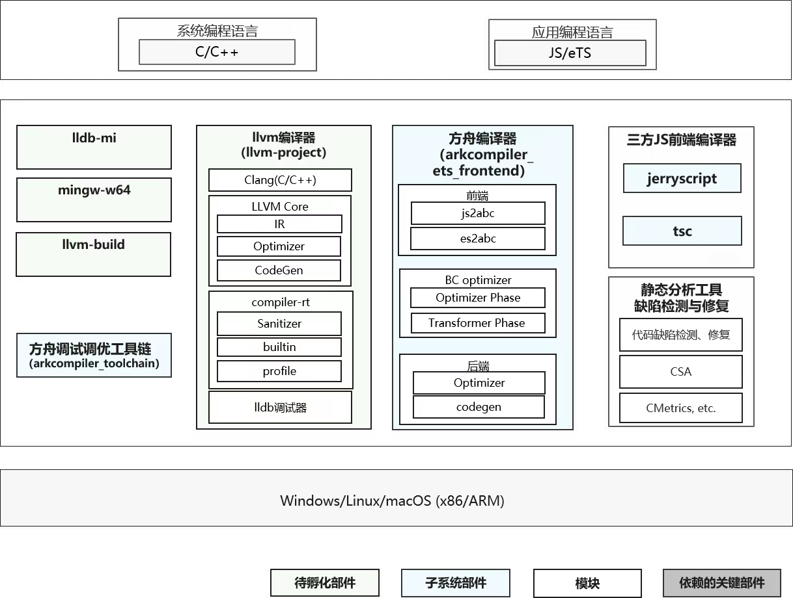

# SIG_COMPILERUNTIME
简体中文 | [English](./sig_compile-runtime.md)

说明：本SIG的内容遵循OpenHarmony的PMC管理章程 [README](../../zh/pmc.md)中描述的约定。

## SIG组工作目标和范围

### 工作目标
- 支持JS/TS语言编译及运行时，打造高性能JS/TS虚拟机。提供基础的JSAPI能力，包括多线程能力，字符串编解码能力，以及URL解析等能力。
- 基于Clang/LLVM提供C/C++编译构建、调试能力。
- 提供Musl等基础库支持, 及相关能力演进。

### 工作范围
- 负责语言编译和运行时相关软件模块架构设计、评审和决策；
- 负责语言编译和运行时领域软件模块的代码审核、合入，禁止低质量代码合入开源版本主干；
- 积极有效参与开源社区代码检视与点评，共享编程经验，与开源社区开发者交流，传递软件开发技能，有效辅导开源社区开发者写出好代码；
- 处理开源社区上的需求、issue、邮件列表和开发问题，闭环周期满足开源社区的SLA要求；
- 结合评审和开发活动，给予代码质量反馈与指导，促进开源社区代码质量提升。

### 技术栈范围
- Compiler

- Runtime

## 代码仓
|部件名称|部件功能描述|部件仓名称|
| ----- | ----------- | --------- |
|方舟运行时公共库|方舟运行时公共库|arkcompiler_runtime_core|
|方舟eTS运行时|方舟eTS(兼容JS/TS)运行时|arkcompiler_ets_runtime|
|方舟eTS编译器|方舟eTS(兼容JS/TS)前端编译器，解析eTS生成abc文件供方舟运行时执行|arkcompiler_ets_frontend|
|方舟工具链|方舟运行时调试调优工具链|arkcompiler_toolchain|
|ARM汇编器|ARM汇编器，提供生成ARM汇编的C接口|third_party_vixl|
|jerryscript|百K级别超轻量级JS引擎，低内存消耗|third_party_jerryscript|
|quickjs|QuickJS是一个小型并且可嵌入的Javascript引擎，支持ES2020|third_party_quickjs|
|LLVM|C/C++编译器，包含libcxx，lldb，crt等很多组件|third_party_llvm-project|
|LLDB MI|Lldb的machine interface，方便IDE使用lldb功能|third_party_lldb-mi|
|MinGW-w64|GCC，LLVM等编译器的windows 32/64平台运行环境|third_party_mingw-w64|
|musl|标准C库|third_party_musl|
|mimalloc|性能优化的内存分配器|third_party_mimalloc|
|elfio|Elf文件操作工具库|third_party_elfio|
|miniz|一种无损高效压缩算法库，支持zlib接口|third_party_miniz|
|eTS工具库|eTS语言函数库；当前主要由 js_sys_module js_util_module js_worker_module js_api_module 四个部分组成|commonlibrary_ets_utils|
|C工具库|C工具函数库|commonlibrary_c_utils|
|轻量级系统工具库|轻量级系统所使用的工具函数库|commonlibrary_utils_lite|
|内存工具库|内存使用和分析相关工具库|utils_memory|

## SIG组成员

### Leader
- @klooer (https://gitee.com/klooer)

### Committers
- @huanghuijin (https://gitee.com/huanghuijin)
- @wuzhefengh (https://gitee.com/wuzhefengh)
- @gongjunsong (https://gitee.com/gongjunsong)
- @sunzhe23 (https://gitee.com/sunzhe23)
- @weng-changcheng (https://gitee.com/weng-changcheng)
- @yingguofeng (https://gitee.com/yingguofeng)
- @xliu-huanwei (https://gitee.com/xliu-huanwei)
- @flyingwolf (https://gitee.com/flyingwolf)
- @godmiaozi (https://gitee.com/godmiaozi)
- @dhy308 (https://gitee.com/dhy308)
- @pengzhuoli (https://gitee.com/zhuoli72)
- @JerryH1011 (https://gitee.com/JerryH1011)
- @dongduResearcher (https://gitee.com/dongduResearcher)

### 会议
 - 会议时间：双周例会，周五14:30，UTC+8
 - 会议申报：请订阅并发送申报议题到邮件列表 [compiler@openharmony.io](https://lists.openatom.io/postorius/lists/compiler.openharmony.io)
 - 会议链接: Welink或其他会议
 - 会议通知: 请订阅邮件列表 [compiler@openharmony.io](https://lists.openatom.io/postorius/lists/compiler.openharmony.io) 获取会议链接
 - 会议纪要: [归档链接地址](minutes)

### 联系方式

- 邮件列表：compiler@openharmony.io
- 微信群：NA
