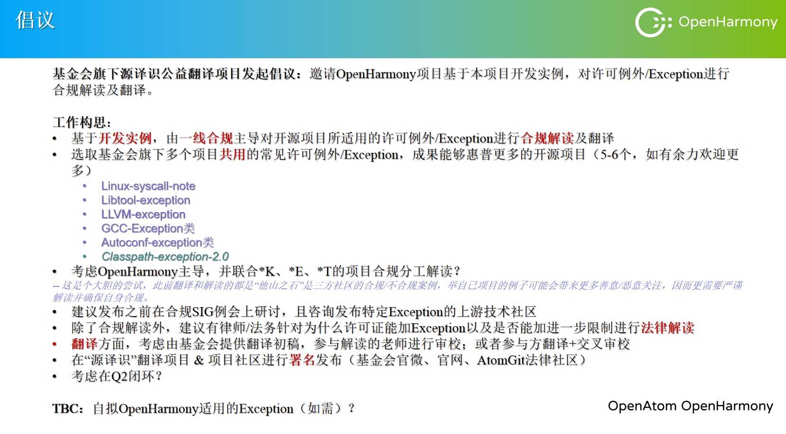

# OpenHarmony合规SIG例会 0411（Sig-compliance Meeting）

## 议题(Agenda)

议题1：2025年工作子类4个小组的牵头人及成员确认

议题2：许可证例外翻译与解读的倡议

议题3：许可证合规检测的技术进展

## 与会人(Attendees)

合规SIG组成员

## 会议纪要(Notes)

**议题1、2025年工作子类4个小组的牵头人及成员确认**  
汇报人：方晓  

主要内容：

2025年工作子类四个小组的牵头人分别是：高亮（流程规范文档组）、赵鹏（合规知识体系及布道推广组）、于洋（工程工具组）以及陶冶（合规评审及治理组）。如希望更新小组参与情况的SIG成员，请尽快在表格上完成更新，以便各位牵头人展开组内组织工作。在4月25日SIG双周例会开始前，根据各组牵头人的反馈，确认2025各组工作安排的拉通时间。

**议题2、许可证例外翻译与解读的倡议**  
汇报人：郭雪雯  

主要内容：

基金会旗下源译识公益翻译项目发起倡议，邀请OpenHarmony项目基于本项目开发实例，对许可例外/Exception进行合规解读及翻译。欢迎大家积极报名参与。具体工作构思如下：

**议题3、 许可证合规检测的技术进展**  
汇报人：武天乐 

主要内容：

1. 以OpenHarmony5.0的457个仓库为分析对象，对Scancode识别结果过滤后得到2312项非标许可证涉及37278项文件。

2. 使用大模型对非标许可证进行问题分类。

3. 针对不同类别的问题使用rag的方式进行分析。

后续工作：

1. 对工作内容第二点的非标许可证问题分类进行优化，提高准确率。

2. 对工作内容第三点优化rag分析结果，并形成相应的分析报告。