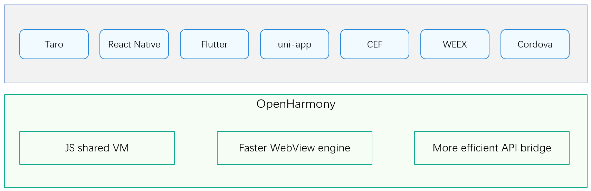

# sig_crossplatformui

sig_crossplatformui

English | [简体中文](./sig_crossplatformui_cn.md)

Note: The content of this SIG follows the convention described in OpenHarmony's PMC Management Charter [README](../../zh/pmc.md).

## SIG group work objectives and scope

### work goals

CrossPlatformUI SIG aims to reduce the cost and difficulty of OpenHarmony UI layer development, so that OpenHarmony can reuse the massive development ecology and application ecology of Web side and small program side, and improve the efficiency of cross-platform development.

CrossPlatformUI SIG allows applications developed based on frameworks such as Taro, React Native, Flutter, uni-app, CEF (Electron), WEEX, Cordova, etc. to run directly on the OpenHarmony platform.

### work scope

1. **Cross-platform framework adaptation scope**

   - Taro
   - React Native
   - Flutter
   - uni-app
   - CEF (Electron)
   - WEEX
   - Cordova

Develop and maintain cross platform adaptation cores, enabling developers to reuse cross platform UI framework code assets and achieve the ability to quickly adapt to OpenHarmony.   

2. **Component,  API library**

Develop and encapsulate cross platform component libraries and API libraries.

3. **Ecological expansion**

Including the development of OpenHarmony compatible UI library and various ecological tools library, etc.

Actively cooperate with communities, universities and relevant customers.

## SIG Members

### Leader
- [chenjj68](https://gitee.com/chenjj68)
- [peiyunhua](https://gitee.com/peiyunhua)
- [czg2022](https://gitee.com/czg2022)
- [szzwk875](https://gitee.com/szzwk875)
- [bocmbci-test](https://gitee.com/bocmbci-test)

### Committers
- [baosiqing](https://gitee.com/baosiqing)
- [medivhcai](https://gitee.com/medivhcai)
- [chenjj68](https://gitee.com/chenjj68)
- [advancedcat](https://gitee.com/advancedcat)
- [hawleyhuo](https://gitee.com/hawleyhuo)
- [evernoteHW](https://gitee.com/evernoteHW)
- [JSZabc](https://gitee.com/JSZabc)
- [showeb](https://gitee.com/showeb)
- [lumeiling3](https://gitee.com/lumeiling3)
- [xiaojianshang](https://gitee.com/xiaojianshang)
- [tangjiao11](https://gitee.com/tangjiao11)
- [xuanzebin](https://gitee.com/xuanzebin)
- [shuairuofukua](https://gitee.com/shuairuofukua)
- [lihui868](https://gitee.com/lihui868)
- [binai](https://gitee.com/binai)
- [appproject](https://gitee.com/appproject)
- [espaceHW](https://gitee.com/espaceHW)
- [yangxi23](https://gitee.com/yangxi23)
- [bocmbci-test](https://gitee.com/bocmbci-test)
- [bocmbci_001](https://gitee.com/bocmbci_001)

### Meetings
 - Meeting time：Every fortnight Thursday 17:00-18:00
 - Meeting application: [OpenHarmony Taro Meeting Proposal](https://etherpad.openharmony.cn/p/taro%E8%AE%AE%E9%A2%98%E7%94%B3%E6%8A%A5)
 - Meeting link: Tencent meeting
 - Meeting notification: [Subscribe to](https://lists.openatom.io/postorius/lists/dev.openharmony.io) mailing list dev@openharmony.io for the meeting link
 - Meeting-Minutes: [Archive link address](https://gitcode.com/openharmony-sig/sig-content/tree/master/crossplatformui/meetings)

### Contact (optional)

- Mailing list：[dev@openharmony.io](mailto:dev@openharmony.io)
- Wechat group：

