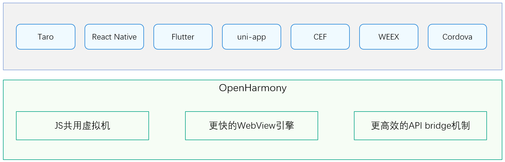

# sig-crossplatformui

跨平台开发框架（crossplatform-jsframework）兴趣小组

简体中文 | [English](./sig_crossplatformui.md)

说明：本SIG的内容遵循OpenHarmony的PMC管理章程 [README](../../zh/pmc.md) 中描述的约定。

## SIG组工作目标和范围

### 工作目标
CrossPlatformUI SIG 致力于降低 OpenHarmony UI 层的上手成本和开发难度，让 OpenHarmony 能够复用移动端海量的开发生态和应用生态，提升跨平台开发的效率。

CrossPlatformUI SIG 让基于Taro、React Native、Flutter、uni-app、CEF (Electron)、WEEX、Cordova等框架开发的应用程序能够直接运行在 OpenHarmony 平台。

### 工作范围
1. **跨平台UI开发框架适配范围**

   - Taro
   - React Native
   - Flutter
   - uni-app
   - CEF (Electron)
   - WEEX
   - Cordova

   开发和维护跨平台适配核心，让开发者复用跨平台UI框架代码资产，实现快速适配 OpenHarmony 的能力。

   

2. **组件库、API 库**

   开发封装跨平台的组件库和 API 库。

3. **生态拓展**

   包括开发适配 OpenHarmony 的 UI 库和各类生态工具库等。

   积极与社区、高校和相关客户展开合作。
   
   

## SIG组成员

### Leader
- [chenjj68](https://gitee.com/chenjj68)
- [peiyunhua](https://gitee.com/peiyunhua)
- [czg2022](https://gitee.com/czg2022)
- [szzwk875](https://gitee.com/szzwk875)
- [bocmbci-test](https://gitee.com/bocmbci-test)

### Committers列表
- [baosiqing](https://gitee.com/baosiqing)
- [medivhcai](https://gitee.com/medivhcai)
- [chenjj68](https://gitee.com/chenjj68)
- [advancedcat](https://gitee.com/advancedcat)
- [hawleyhuo](https://gitee.com/hawleyhuo)
- [evernoteHW](https://gitee.com/evernoteHW)
- [JSZabc](https://gitee.com/JSZabc)
- [showeb](https://gitee.com/showeb)
- [lumeiling3](https://gitee.com/lumeiling3)
- [xiaojianshang](https://gitee.com/xiaojianshang)
- [tangjiao11](https://gitee.com/tangjiao11)
- [xuanzebin](https://gitee.com/xuanzebin)
- [shuairuofukua](https://gitee.com/shuairuofukua)
- [lihui868](https://gitee.com/lihui868)
- [binai](https://gitee.com/binai)
- [appproject](https://gitee.com/appproject)
- [espaceHW](https://gitee.com/espaceHW)
- [yangxi23](https://gitee.com/yangxi23)
- [bocmbci-test](https://gitee.com/bocmbci-test)
- [bocmbci_001](https://gitee.com/bocmbci_001)

### 会议
 - 会议时间：每双周周四 17:00-18:00
 - 会议申报：[OpenHarmony sig_crossplatformui Meeting Proposal](https://shimo.im/sheets/RKAWMXGbw2FbyOq8/MODOC)
 - 会议链接: 腾讯会议
 - 会议通知: 请[订阅](https://lists.openatom.io/postorius/lists/dev.openharmony.io)邮件列表 dev@openharmony.io 获取会议链接
 - 会议纪要: [归档链接地址](https://gitcode.com/openharmony-sig/sig-content/tree/master/crossplatformui/meetings)

### 联系方式

- 邮件列表：[dev@openharmony.io](mailto:dev@openharmony.io)
- 微信群：

