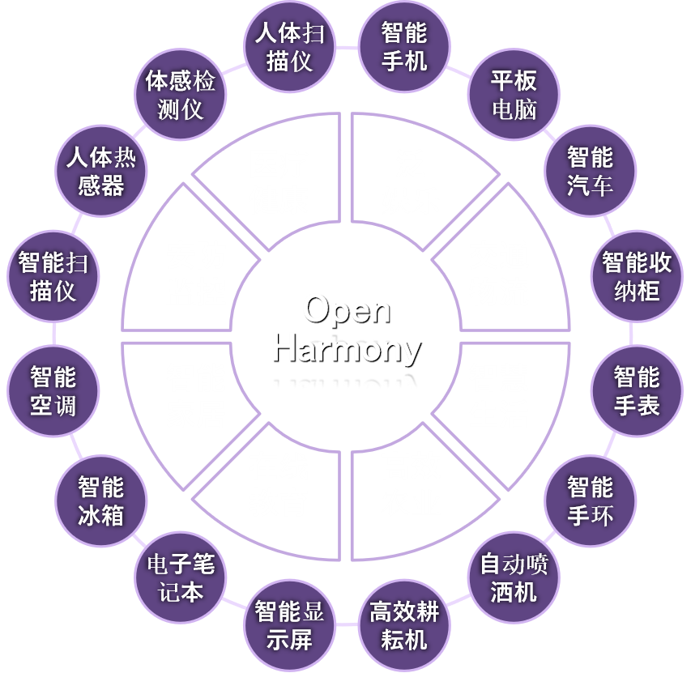
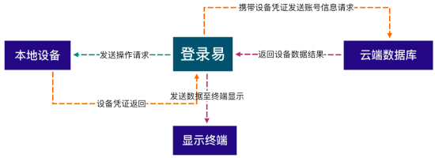
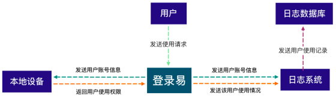

# sig_dengluyi
English |[简体中文 ](./sig_dengluyi_cn.md)

Note: The content of this SIG follows the convention described in OpenHarmony's PMC Management Charter [README](../../zh/pmc.md).

##  SIG Group Work Objectives and Scope

### Work Goals

To solve the question about information protection in the system of OpenHarmony and data security issues in the IoT industry, we hope to create a full-scenario IoT device data security management platform for each user based on the Dengluyi system. 

The platform provides enterprises with high-quality and safe device data protection and guarantees information security in the era of Internet of Everything. 

It is hoped that exploiting innovative service models and safe and mature technologies to provide Huawei and other outstanding domestic brand  with data security protection barriers to help domestic products. We hope to do our best to guarantee national data security, and create a new era of secure interconnection of all things. 

### Work Scope

#### Establishing an OpenHarmony User Ecosystem 

By embedding a standard multi-account management module in the OpenHarmony environment, communicating and interoperating with the Dengluyi App to realize automatic registration, automatic login, automatic password modification and other functions, the establishment of the "Dengluyi + OpenHarmony" ecological account system to build OpenHarmony Account security ecological community. 

In addition to using the original Huawei account system, users can also use the Dengluyi account system added in the OpenHarmony open source environment to perform security verification and authorization resource sharing with other OpenHarmony users (and devices), or to delineate individuals through accounts Private domain space, establish personal cloud database. In this way, the user stickiness is improved, and the OpenHarmony ecological community with complete security functions is established.

#### Establishing a centralized, unified, single-point management and control information and device management terminal for each user, and implement unified authentication management for multiple devices by individual users

The users can directly control all their smart IoT devices equipped with the OpenHarmony system in a centralized, unified, and single-point manner through Dengluyi. Dengluyi automatically sets a strong password for the device and can automatically modify it. Users only need to "swipe their card" through smart devices such as mobile phones equipped with the Dengluyi App to complete the authentication, which reduces the memory cost of the product key and solves the data security problem of the product

#### Implementing Authority Management/Audit Records

When user uses a smart IoT device equipped with the "Dengluyi + OpenHarmony" system, the user needs to authenticate and record information through the Dengluyi App. Use account information to restrict the usage rights of the device and upload usage records to the log system. Users who do not have the rights to use the device can submit usage requests through Dengluyi, and users without rights can also submit requests for use of some core functions through Dengluyi. , The account information of all users who request to use the device will be recorded in the log system and stored in the log database, which is convenient for the administrator to call and audit at any time. 

## Application Scenarios

In our daily life, we often involve the authority of equipment. For example, everyone needs to have the authority to lock the door when entering the house. At this time, if the head of the household wants to give the nanny door lock temporary permission (valid for a period of time or by the number of times), he can let the nanny use the OpenHarmony user account management system based on easy login for a limited time and a limited number of times. Before entering the house, the nanny needs to send a request to the head of the household through the door lock with the OpenHarmony system to apply for authorization. After receiving the request, the head of household can approve/reject the request. In addition, the head of the household can manage the permissions of other smart homes in the home, and grant part of the smart home permissions to the nanny, etc. 

##  The repository

- openharmony-denlgu1-sig：https://gitee.com/youngp7/openharmony-competition

##  SIG Members

### Leader
- [@YoungP7 ](https://gitee.com/YoungP7)
- [@csliuwy](https://gitee.com/csliuwy)

###  Committers

- [@qqsummer](https://gitee.com/qqsummer)
- [@wizardk](https://gitee.com/wizardk)
- [@Pacific_D](https://gitee.com/Pacific_D)
- [@ez-yang](https://gitee.com/ez-yang)
- [@yan-wensheng](https://gitee.com/yan-wensheng)
- [@zeke](https://gitee.com/zekeGitee_admin)

###  Meetings

 - Meeting time：Every biweekly Wednesday 14:00-16:00 
 - Meeting link：Welink or other meeting

###  Contact

- Mailing list：liuwy@gdut.edu.cn; dengluyi@openharmony.io
- Zulip group: https://zulip.openharmony.cn/#narrow/stream/18-dengluyi
- Wechat group：sig-dengluyi(登录易)
