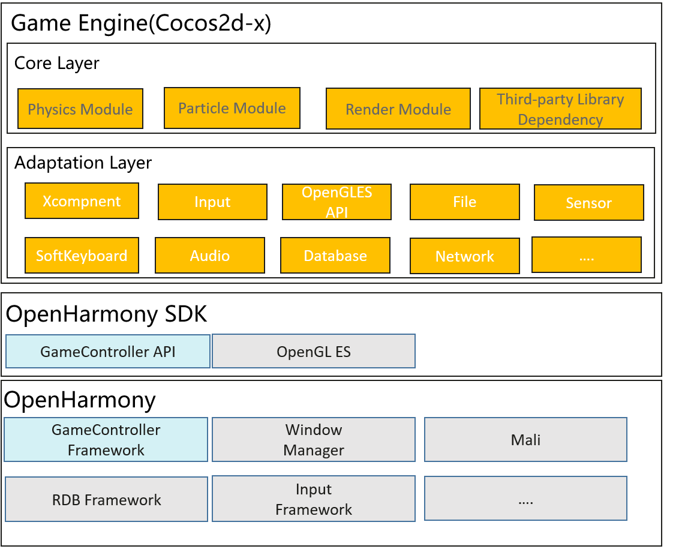

# SIG-Gaming
English | [简体中文](./sig_gaming_cn.md)

Note: The content of this SIG follows the convention described in OpenHarmony's PMC Management Charter [README](/zh/pmc.md).

## SIG group work objectives and scope

### work goals
Build game application migration and development capabilities based on OHOS. Connect game related technologies from end to end on the OH, so that game applications can run efficiently and conveniently on the OH. At the same time, combined with the distributed ability of OH, create and improve the distributed experience of the game.

### work scope
- From the game business logic, game engine, to the OpenHarmony system, we are end-to-end integrating game-related technologies to enable game applications to run efficiently and conveniently on OpenHarmony.
- Evolution and maintenance of the Cocos2d-x component.
- Evolution and maintenance of the GameController component, as well as the review of the GameController API.

Technology stack

## Code Repository

| Component              | Function                                                                                                                                                                                                                                                                                                                                                                              | Path                                                                                                         |
|------------------------|---------------------------------------------------------------------------------------------------------------------------------------------------------------------------------------------------------------------------------------------------------------------------------------------------------------------------------------------------------------------------------------|--------------------------------------------------------------------------------------------------------------|
| Cocos2d-x              | Cocos2d-x is a multi-platform framework for building 2d games, interactive books, demos and other graphical applications. It is based on cocos2d-iphone, but instead of using Objective-C, it uses C++. It works on iOS, Android, OS X, Windows, Linux and Web platforms.  | [cocos2d-x](https://gitcode.com/openharmony-sig/cocos2dx/tree/cocos2d-x-3.17.2-ohos)                          |
| GameController| Provide InnerAPI to terminal device manufacturers, enabling them to manage game peripheral device information and configure input-to-touch conversion. | [domains/game/game_controller_framework](https://gitcode.com/openharmony-sig/game_game_controller_framework) |

## SIG Members

### Leader
- @zleoyu(https://gitee.com/zleoyu)

### Committers列表
- @honglianglin(https://gitee.com/honglianglin)
- @lz-230(https://gitee.com/lz-230)
- @He_r(https://gitee.com/He_r)
- @niu2x(https://gitee.com/niu2x)

### Meetings
 - Meeting time：Every two weeks' Friday 14:30-15:15
 - Meeting application: [OpenHarmony Sig-Gaming Meeting Proposal](https://shimo.im/file-invite/6LUJkovmJuABaTcW8v8a9TpZAl9d6/)
 - Meeting link: Welink
