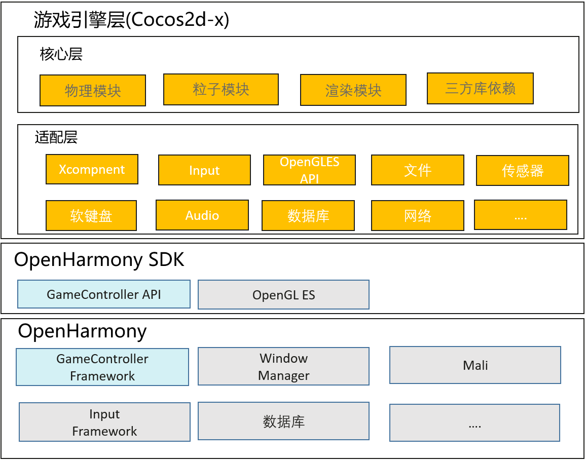

# SIG-Gaming
English | [简体中文](./sig-gaming_cn.md)

Note: The content of this SIG follows the convention described in OpenHarmony's PMC Management Charter [README](/zh/pmc.md).

## SIG group work objectives and scope

### work goals
Build game application migration and development capabilities based on OHOS. Connect game related technologies from end to end on the OH, so that game applications can run efficiently and conveniently on the OH. At the same time, combined with the distributed ability of OH, create and improve the distributed experience of the game.

### work scope
- Porting and adapting game engine for OpenHarmony

## The repository 
- project name:
  - https://gitee.com/openharmony-sig/cocos2dx
  - https://gitee.com/openharmony-sig/third_party_cocos2d

## SIG Members

### Leader
- @frank-huangran(https://gitee.com/frank-huangran)

### Committers
- @honglianglin(https://gitee.com/honglianglin)
- @zleoyu(https://gitee.com/zleoyu)
- @lz-230(https://gitee.com/lz-230)
- @He_r(https://gitee.com/He_r)
- @niu2x(https://gitee.com/niu2x)

### Meetings
 - Meeting time：Every two weeks' Friday 14:30-15:15
 - Meeting application: [OpenHarmony Sig-Gaming Meeting Proposal](https://shimo.im/file-invite/6LUJkovmJuABaTcW8v8a9TpZAl9d6/)
 - Meeting link: Welink
