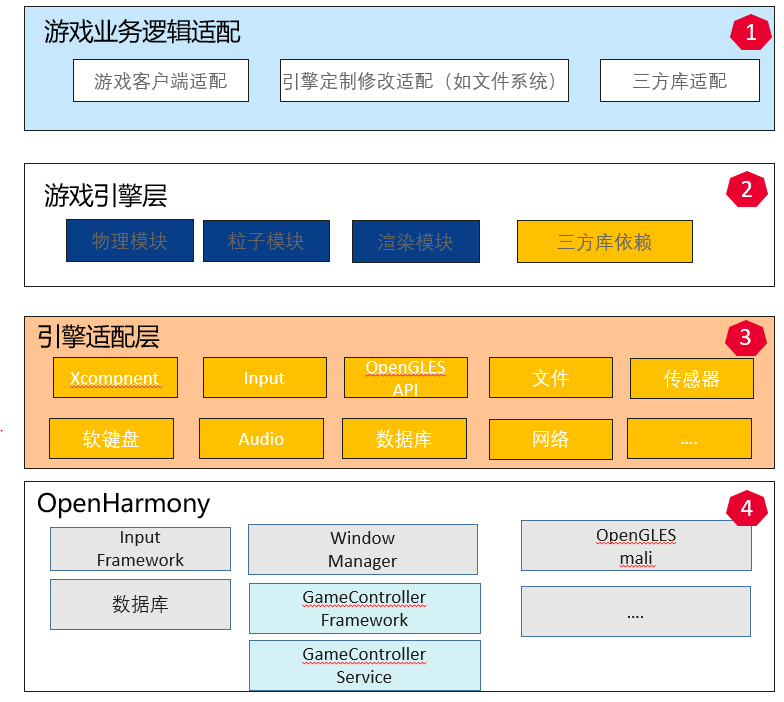

# sig_Gaming
简体中文 | [English](./sig_gaming.md)

说明：本SIG的内容遵循OpenHarmony的PMC管理章程 [README](../../zh/pmc.md)中描述的约定。

## SIG组工作目标和范围

### 工作目标
构建基于OHOS上的游戏应用程序迁移及开发能力。在OH上端到端拉通游戏相关技术，让游戏类应用高效，方便的在OH上运行。同时结合OH分布式能力，打造和提升游戏的分布式体验。

### 工作范围
- 为OpenHarmony移植与适配游戏引擎

## 代码仓

|部件名称|部件功能描述|部件仓名称|
| ------------ | ------------ |------------ |
|cocos2dx|开源、轻量的跨平台游戏引擎|cocos2dx|
|third_party_cocos2d|开源、轻量的跨平台游戏引擎|third_party_cocos2d|

## SIG组成员

### Leader
- @frank-huangran(https://gitee.com/frank-huangran)

### Committers列表
- @honglianglin(https://gitee.com/honglianglin)
- @zleoyu(https://gitee.com/zleoyu)
- @lz-230(https://gitee.com/lz-230)
- @He_r(https://gitee.com/He_r)
- @niu2x(https://gitee.com/niu2x)

### 会议
 - 会议时间：双周周五14:30-15:15
 - 会议申报：[OpenHarmony sig_Gaming Meeting Proposal](https://shimo.im/file-invite/6LUJkovmJuABaTcW8v8a9TpZAl9d6/)
 - 会议链接: Welink
