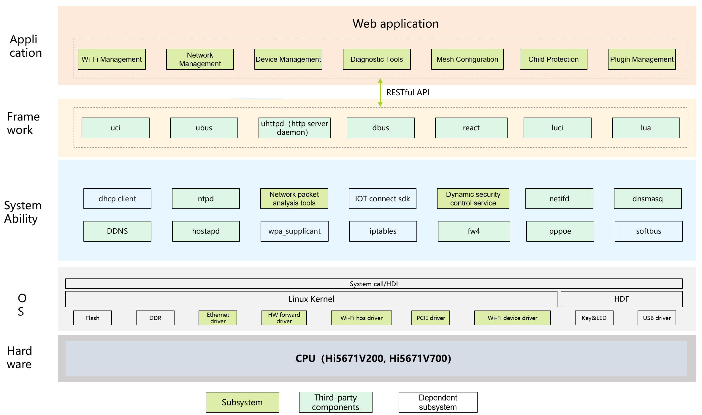

# sig_gateway
English | [简体中文](./sig_gateway_cn.md)

Note: The content of this SIG follows the convention described in OpenHarmony's PMC Management Charter [README](../../zh/pmc.md).

## SIG architecture

## SIG group work objectives and scope

### work goals
- 1. Based on the openharmony community, work with industry ecosystem partners such as routers/gateways/CPE,
- 2. Increase the key technical capabilities of routers, promote industry standardization, strengthen ecosystem cooperation, and promote the prosperity of the openharmony ecosystem

### work scope
- Web management interface unified standard and restful api unified standard.
- Plug-in life cycle management standard: download, installation, configuration, uninstallation standard.
- "Information technology equipment interconnection smart home interconnection Part 1: Architecture and general requirements",
- "Information technology equipment interconnection smart home interconnection Part 2: Test specifications"
- "Information technology information equipment interconnection smart home system evaluation index system and evaluation method"
- "Internet of Things system interface requirements""Building and residential digital technology application home Internet of Things collaborative management protocol"

### work plan
#### Phase I: Basic Phase 2025Q1
- [Security] Support security upgrade, secure boot, network anti-hijacking
- [Configuration] Unified WEB, network management, log management and other basic functions;
- [Operation and Maintenance] Support local log
- [Basics] Routing function, network interconnection, data processing
- [Memory] Available memory (taking 256M RAM as an example) is greater than 60M
- [Performance] Under the same hardware configuration conditions, the maximum throughput, maximum number of connected devices, and power consumption are the same
- [Forwarding] Basic 900Mbps
#### Phase II: Perfection Phase 2025Q4
- [Configuration] Support remote management and remote log acquisition;
- [Operation and maintenance] Support AI intelligent maintainability and testability
- [Basics] Upper-layer plug-in adaptation, network probe, green Internet access and other functions;
- [Intelligence] Internet of Things (IoT) functions, multi-device control, soft forwarding enhancement, green energy saving, network sharing, human perception and other advanced functions
- [Performance] Under the same hardware configuration conditions, the maximum throughput and the maximum number of device accesses in terms of performance are increased by more than 10%, and the power consumption is reduced by 5%;
- [Performance] In the case of more functions (interconnection), the available memory decreases by no more than 10%, and the performance decreases by no more than 5%
- [Forwarding] Basic 1.6Gbps
#### Phase III: Exploration stage 2026Q4
- Kernel innovation: Focus on Linux kernel transformation, try to replace Linux with LiteOS-A, rely on lightweight architecture to accurately trim redundancy, reduce memory consumption, optimize task scheduling and interrupt processing, improve operation speed, and stimulate device potential
- Communication integration: Create multi-mode communication equipment, compatible with WiFi, Star Flash, Bluetooth multi-protocol, create super Combo combination, fully covering communication scenarios with different distances, speeds, and power consumption requirements, broadening the boundaries of device connection
- Standard interconnection: deeply integrated into the GIIC interconnection standard to create an open and compatible IoT ecosystem. Relying on stable communication protocols and interface adaptation under standard specifications, ensure that all IoT devices interact with each other stably and orderly, truly realizing the interconnection of all things

## SIG Members

### Leader
- @shi-chao-cmcc(https://gitee.com/shi-chao-cmcc)

### Committers
- @hxdlj(https://gitee.com/hxdlj)
- @hu-weiwei-jiayou(https://gitee.com/hu-weiwei-jiayou)
- @zhoupengcmcc(https://gitee.com/zhoupengcmcc)
- @hurui01(https://gitee.com/hurui01)
- @liangyiwen001(https://gitee.com/liangyiwen001)
- @wangzhcs(https://gitee.com/wangzhcs)
- @jucy99(https://gitee.com/jucy99)
- @osprey(https://gitee.com/osprey)

### Meetings
 - Meeting time：Single thursday 14: 15-16: 00 pm
 - Meeting application: [OpenHarmony Gateway SIG Meeting Proposal](https://docs.qingque.cn/s/home/eZQDvBVvUxUyUAZ9chWhhxAjd?identityId=2D7couieItQ&section=2172595)
 - Meeting link: Notify by email
 - Meeting notification: [Subscribe to](https://lists.openatom.io/postorius/lists/dev.openharmony.io) mailing list dev@openharmony.io for the meeting link
 - Meeting-Minutes: [Archive link address](https://gitee.com/openharmony-sig/sig-content)

### Contact (optional)

- Mailing list：dev@openharmony.io
- Wechat group：xxx