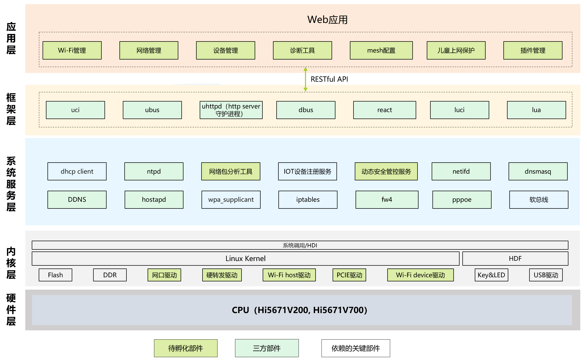

# sig_gateway
简体中文 | [English](./sig_gateway.md)

说明：本SIG的内容遵循OpenHarmony的PMC管理章程 [README](../../zh/pmc.md)中描述的约定。

## SIG技术栈

## SIG组工作目标和范围

### 工作目标
- 1.基于OpenHarmony社区，携手路由器/网关/CPE等业界生态伙伴，
- 2.增加路由器关键技术能力、推动行业标准化、加强生态合作、促进OpenHarmony生态繁荣

### 工作范围
#### 代码共建
 - 南向路由器/网关/CPE芯片驱动和协议栈适配
 - 北向web管理应用，插件应用
#### 立标准
 -  web管理界面统一标准和restful api统一标准。
 -  插件生命周期管理标准：下载、安装、配置、卸载标准。
 - 《信息技术设备互连智能家居互联互通 第 1 部分：架构与通用要求》、
 - 《信息技术设备互连 智能家居互联互通 第2部分：测试规范》
 - 《信息技术 信息设备互连 智能家居系统评价指标体系和评价方法》
 - 《物联网 系统接口要求》《建筑及居住区数字化技术应用家居物联网协同管理协议》

### 工作交付件及工作计划
#### 阶段一：基础阶段 2025Q1
- [安全]支持安全升级、安全启动、网络防劫持
- [配置]统一WEB、网络管理、日志管理等基本功能；；
- [运维]支持本地日志
- [基础] 路由功能、网络互联、数据处理
- [内存]可用内存(以256M的RAM为例)大于60M
- [性能]同等硬件配置条件下性能方面最大吞吐量、最大设备接入数、功耗持平
- [转发]基础900Mbps
#### 阶段二：完善阶段 2025Q4
- [配置]支持远程管理和远程日志获取；
- [运维]支持AI智能可维可测
- [基础]上层插件适配、网络探针、绿色上网等功能；
- [智能]物联网(IoT)功能、多设备管控、软转发增强、绿色节能、网络共享、人体感知等进阶功能
- [性能]同等硬件配置条件下性能方面最大吞吐量、最大设备接入数提升超10%，功耗降低5%；
- [性能]更多功能情况下(互联互通)，可用内存下降不超过10%，性能下降不超过5%
- [转发]基础1.6Gbps
#### 阶段三：探索阶段 2026Q4
- 内核革新：聚焦Linux内核改造，尝试用LiteOS-A替代Linux，凭借轻量化架构精准剪裁冗余，降低内存消耗，同时优化任务调度与中断处理，提升运行速率，激发设备潜能
- 通信融合：打造多模通信设备，兼容 WiFi、星闪、蓝牙多协议，打造超强 Combo组合，全方位覆盖不同距离、速率、功耗需求的通信场景，拓宽设备连接边界
- 标准互联：深度融入GIIC互联互通标准，打造开放兼容的 IoT 生态。依托标准规范下的稳定通信协议与接口适配，确保全量 IoT 设备稳定、有序交互数据，真正实现万物互联

## SIG组成员

### Leader
- @shi-chao-cmcc(https://gitee.com/shi-chao-cmcc)

### Committers列表
- @hxdlj(https://gitee.com/hxdlj)
- @hu-weiwei-jiayou(https://gitee.com/hu-weiwei-jiayou)
- @zhoupengcmcc(https://gitee.com/zhoupengcmcc)
- @hurui01(https://gitee.com/hurui01)
- @liangyiwen001(https://gitee.com/liangyiwen001)
- @wangzhcs(https://gitee.com/wangzhcs)
- @jucy99(https://gitee.com/jucy99)
- @osprey(https://gitee.com/osprey)

### 会议
 - 会议时间：每单周周四下午14:15-16:00
 - 会议申报：[OpenHarmony Gateway SIG Meeting Proposal](https://docs.qingque.cn/s/home/eZQDvBVvUxUyUAZ9chWhhxAjd?identityId=2D7couieItQ&section=2172595)
 - 会议链接: 通过邮件通知
 - 会议通知: 请[订阅](https://lists.openatom.io/postorius/lists/dev.openharmony.io)邮件列表 dev@openharmony.io 获取会议链接
 - 会议纪要: [归档链接地址](https://gitee.com/openharmony-sig/sig-content)

### 联系方式(可选)

- 邮件列表：dev@openharmony.io
- 微信群：xxx