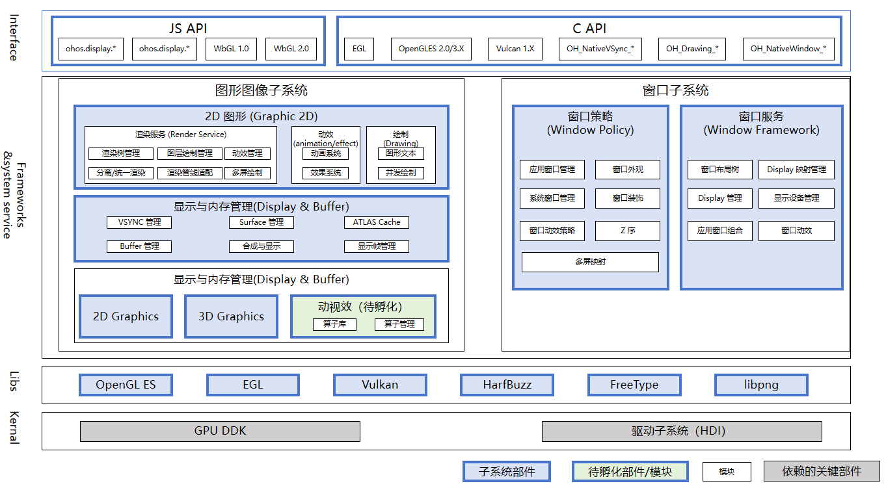

# sig_Graphics
简体中文 | [English](./sig_graphics.md)

说明：本SIG的内容遵循OpenHarmony的PMC管理章程 [README](../../zh/pmc.md)中描述的约定。

## SIG组工作目标和范围

### 工作目标
OpenHarmony 图形管理。

### 工作范围
图形和窗口相关的设计和提交评审。
1. 新一代图形系统、窗口系统架构及特性的孵化
2. 主干仓库的图形系统需求的开发与维护
3. 识别图形对其他子系统的依赖，并提出相应需求，促进系统完善
4. 与开发者交流、合作，持续完善图形子系统、窗口子系统特性
5. 组织社区相关问题的澄清并及时给予解答

图形SIG（ sig_graphics ）技术栈范围全景图如下图所示：

## 代码仓

|部件名称|部件功能描述|部件仓名称|
| ------------ | ------------ |------------ |
|2D图形【graphic_2d】|提供2D图形的绘制，渲染，合成，支持egl,OpenGLES等图形标准化接口 |graphic_graphic_2d|
|3D图形【graphic_3d】|提供系统的3D绘制能力，包含引擎的加载、自定义灯光、相机以及纹理等能力，供开发者自定义3D模型|graphic_graphic_3d|
|窗口管理【window_manager】|提供窗口管理和Display管理的基础能力，是系统图形界面显示所需的基础子系统 |windowmanager|
|显示与内存管理【graphic_surface】|管理和传递图形和媒体的共享内存|graphic_graphic_surface|
|动视效部件【graphics_effect】|提供必需的动视效算法能力，包括模糊、阴影、渐变、灰阶、提亮、反色、取色等|graphic_graphics_effect|
|EGL|EGL 是 OpenGL ES 渲染 API 和本地窗口系统(native platform window system)之间的一个中间接口层，它主要由系统制造商实现。EGL提供如下机制：与设备的原生窗口系统通信、查询绘图表面的可用类型和配置、创建绘面、在OpenGL ES 和其他图形渲染API之间同步渲染、管理纹理贴图等渲染资源 |third_party_egl|
|OpenGL ES|OpenGL ES 是从 OpenGL 裁剪的定制而来的，去除了glBegin/glEnd，四边形（GL_QUADS）、多边形（GL_POLYGONS）等复杂图元等许多非绝对必要的特性的三维图形API子集 |third_party_opengles|
|HarfBuzz|HarfBuzz是用于文字塑形的软件开发库，亦即用于转换Unicode文本到字形指标及方位的过程 |third_party_harfbuzz|
|libpng|libpng 是官方的 PNG 参考库。它支持几乎所有的PNG功能，是可扩展的，并且已经过超过23年的广泛测试 |third_party_libpng|
|FreeType|用来将字符栅格化并映射成位图|third_party_freetype|
|vulkan-loader|vulkan-loader是在Vulkan应用程序和Vulkan驱动程序（任意数量）之间的库，支持多个驱动程序和跨驱动程序的实例级功能。此外，Vulkan-Loader在应用程序和驱动程序之间插入Vulkan层，例如验证层。|third_party_vulkan-loader|

图形Review规则：
https://gitcode.com/openharmony-sig/sig-content/tree/master/graphics/docs

## SIG组成员

### Leader
- @frank-huangran(https://gitee.com/frank-huangran)
- @lijj01(https://gitee.com/lijj01)

### Committers列表
- @lijj01(https://gitee.com/lijj01)
- @xuyuqiong(https://gitee.com/xuyuqiong)
- @liuchao92(https://gitee.com/liuchao92)
- @stonesxd(https://gitee.com/stonesxd)
- @chen-yuheng5(https://gitee.com/chen-yuheng5)
- @aslklw(https://gitee.com/aslklw)
- @kaixin-liu(https://gitee.com/kaixin-liu)
- @hm1991(https://gitee.com/hm1991)
- @dujnan(https://gitee.com/dujnan)

### 会议
 - 会议时间：双周周五17:00-18:00
 - 会议申报：[OpenHarmony sig_Graphics Meeting Proposal](https://shimo.im/sheets/m4kMLLgagotBK9qD/MODOC)
 - 会议链接: [腾讯会议] 会议链接参考邮件列表通知（graphics_dev@openharmony.io）
 - 会议通知: 请[订阅](https://lists.openatom.io/postorius/lists/graphics_dev@openharmony.io)邮件列表 graphics_dev@openharmony.io 获取会议链接
 - 会议纪要：查看往期会议纪要，请点此链接（https://gitcode.com/openharmony-sig/sig-content/tree/master/graphics/meetings）

### 联系方式(可选)

- frank.huangran@huawei.com
- lijunjie29@huawei.com
