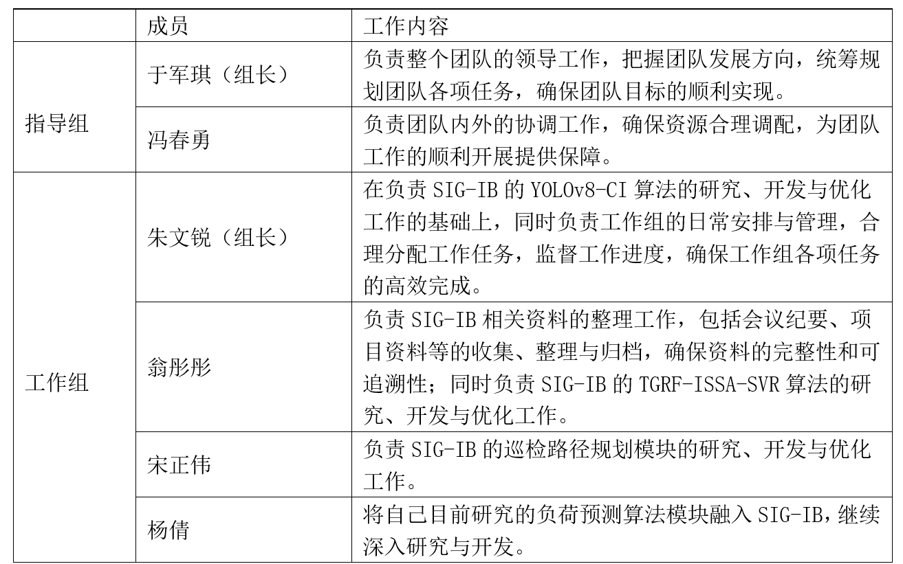

# 2025/1/11 21:00-22:00 GMT+8  深圳

## 议题(Agenda)
- 议题1、明确团队此前在施工安全监控应用与自动巡检、园区能源负荷预测与优化调度等方面已取得的成果如何与OH融合促进
- 议题2、确定团队分工和开发流程
- 议题3、更改汇报中的表述：“智能建筑专属OS”改为“智能建筑专属OS模块”，“AI视觉算法模块”改为“施工检测AI视觉算法模块”

## 与会人(Attendees) 
- 于军琪 [@yujunqi1](https://gitee.com/yujunqi1)
- 冯春勇(线上参会) [@fengchunyong](https://gitee.com/fengchunyong)
- 朱文锐 [@wenruizhu](https://gitee.com/wenruizhu)
- 杨倩 [@yang-qian1126](https://gitee.com/yang-qian1126)
- 翁彤彤 [@wengtongtong19](https://gitee.com/wengtongtong19)
- 宋正伟 [@songzhengwei11](https://gitee.com/songzhengwei11)

## 会议纪要(Notes)
### 议题1、明确团队此前在施工安全监控应用与自动巡检、园区能源负荷预测与优化调度等方面已取得的成果如何与OH融合促进
#### 会议结论：
1) 梳理清楚团队已有成果，加入Openharmony社区后，需要明确Openharmony能为工作带来哪些新内容、新形式和不同点，作为工作的提升点。
#### 遗留问题：
1) 梳理使用Openharmony相关资源库的情况，对官方仓及自主开发内容进行区分。明确在技术地图中。
### 议题2、确定团队分工和开发流程
#### 会议结论：
1) 团队分工

2) 要求绘制算法流程图，明确各环节适用的编程语言。
#### 遗留问题：
无。
### 议题3、更改汇报中的表述：“智能建筑专属OS”改为“智能建筑专属OS模块”，“AI视觉算法模块”改为“施工检测AI视觉算法模块”
#### 会议结论：
1) 同意将“智能建筑专属OS”改为“智能建筑专属OS模块”，“AI视觉算法模块”改为“施工检测AI视觉算法模块”。
#### 遗留问题：
无。