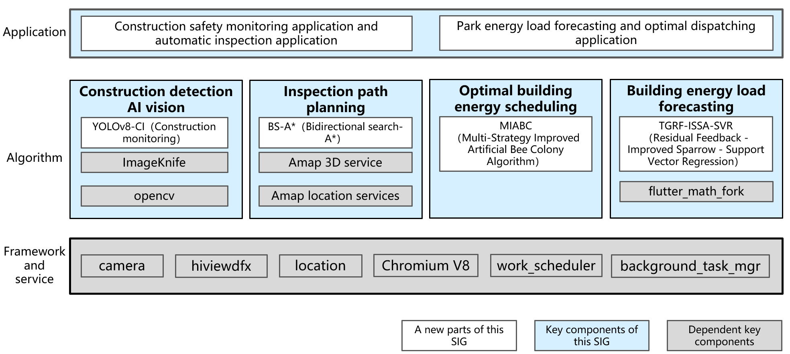

# sig_ib
English | [简体中文](./sig_ib_cn.md)

Note: The content of this SIG follows the convention described in OpenHarmony's PMC Management Charter [README](../../zh/pmc.md).

## SIG architecture

## SIG group work objectives and scope

### work goals
#### Intelligent building construction site safety monitoring and automatic inspection:
- Use AI vision algorithms for construction detection to monitor the construction site in real time and identify the wearing of safety helmets by construction workers.
-With the help of the inspection path planning algorithm, a safe and effective inspection path covering the critical area is planned for the inspection robot.
#### Industrial Park energy load forecasting and optimal scheduling:
- Collect and analyze the monitoring data of building energy consumption, use the building load forecasting algorithm to predict the future building energy system demand, according to the prediction results, use the energy optimization scheduling algorithm to select the lowest cost scheme to realize the optimal allocation of resources.

### work plan
#### Phase I: 2025.01
- 1.Complete the research and evaluation of existing OpenHarmony libraries and new algorithms.
- 2. Determine the feasible solutions for intelligent building inspection system and intelligent building integrated energy management and control system.
- Deliverables include new algorithm research reports and project implementation plans.
#### Phase II: 2025.07
- 1. Develop selected algorithms based on existing libraries and interfaces, such as YOLOv8-CI, BS-A* algorithm, MIABC algorithm, and TGRF-ISSA-SVR model, and integrate them into existing systems.
- Deliverables include algorithm development code, system integration documentation, and interim project implementation reports.
#### Phase III: 2025.12
- 1. Refine the development of selected algorithms, conduct final testing and documentation.
- 2. Complete comprehensive testing of the system, optimize performance, and complete deployment.
- Deliverables include system test reports, performance evaluation reports, deployment documentation, and project summary reports.

### Meetings
 - Meeting time：Monthly meeting, first Friday of each month
 - Meeting link: [OpenHarmony sig_ib Meeting Proposal](http://shimo.im/sheets/913JMp6jLOsvM8AE/MODOC)
 - Meeting notification: Wechat group for notification
 - Meeting-Minutes: [Archive link address](https://gitee.com/openharmony/community/tree/master/sig/sig_ib/meetings)

### Contact (optional)

- Mailing list：dev@openharmony.io
- Wechat group：OH-SIG-IB