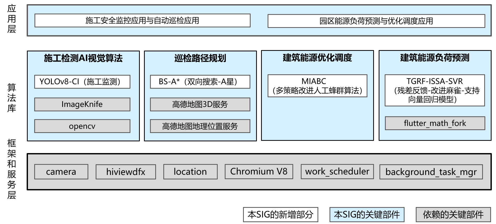

# sig_ib
简体中文 | [English](./sig_ib.md)

说明：本SIG的内容遵循OpenHarmony的PMC管理章程 [README](../../zh/pmc.md)中描述的约定。

## SIG技术栈

## SIG组工作目标和范围

### 工作目标
- 基于 OpenHarmony 平台，开发施工检测 AI 视觉算法、巡检路径规划算法、建筑负荷预测算法、能源优化调度算法等智能建筑相关应用案例。

### 工作范围
#### 智能建筑施工现场安全监控与自动巡检：
 - 运用施工检测 AI 视觉算法，实时监控施工现场，识别施工人员安全帽佩戴情况。
 - 借助巡检路径规划算法，为巡检机器人规划全面覆盖关键区域的安全有效巡检路径。
#### 产业园区能源负荷预测与优化调度：
- 采集分析建筑能耗监测数据，运用建筑负荷预测算法预估未来建筑能源系统需求，根据预测结果，利用能源优化调度算法选定最低成本方案，实现资源最优分配。

### 工作交付件及工作计划
#### 阶段一：2025.01
- 1.完成对OpenHarmony已有库及新增算法的研究和评估。
- 2.确定可落地的关于智能建筑巡检系统和智能建筑综合能源管控系统的解决方案。
- 交付件包括新增算法研究报告和项目实施计划。
#### 阶段二：2025.07
- 1.基于已有库和接口开发选定的算法，如YOLOv8-CI、BS-A*算法、MIABC算法和TGRF-ISSA-SVR模型，并集成到现有系统中。
- 交付件包括算法开发代码、系统集成文档和中期项目实施报告。
#### 阶段三：2025.12
- 1.完善选定的算法开发，进行最终测试与文档编写。
- 2.完成系统的全面测试，优化性能，并完成部署。
- 交付件包括系统测试报告、性能评估报告、部署文档和项目总结报告。

### 会议
 - 会议时间：月度例会，每月第一个周五
 - 会议链接: [OpenHarmony sig_ib Meeting Proposal](http://shimo.im/sheets/913JMp6jLOsvM8AE/MODOC)
 - 会议通知: 微信群通知
 - 会议纪要: [归档链接地址](https://gitee.com/openharmony/community/tree/master/sig/sig_ib/meetings)

### 联系方式(可选)

- 邮件列表：dev@openharmony.io
- 微信群：OH-SIG-IB