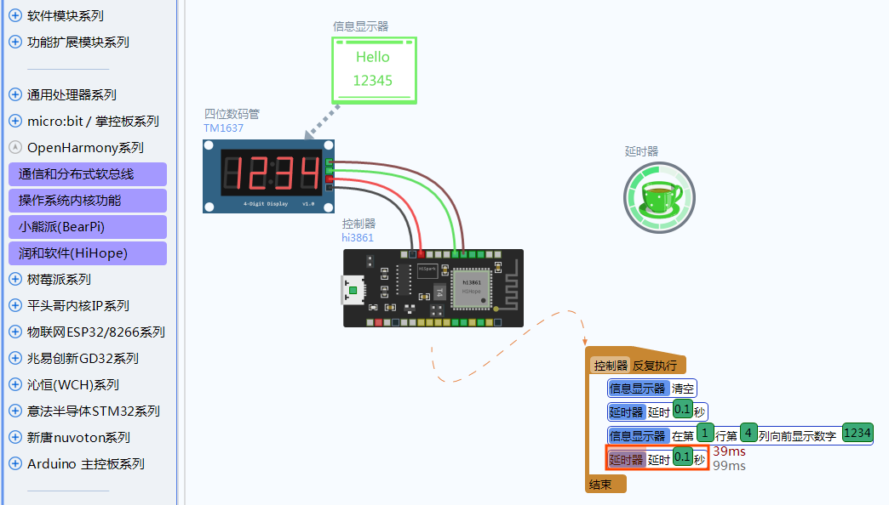


## OpenHarmony开发板驱动数码管显示数字

本案例基于润和的OpenHarmony开发板完成驱动数码管显示数字的功能. 数码管型号为TM1637. 程序中通过"信息显示器"模块完成对数码管的控制. 信息显示器有多种显示数字和信息的指令, 以及清屏等. 根据需要添加指令到界面上. 本程序中通过延时器在数码管上闪烁显示 1234 数字. 修改程序也可以显示动态数字, 例如传感器数值等.

