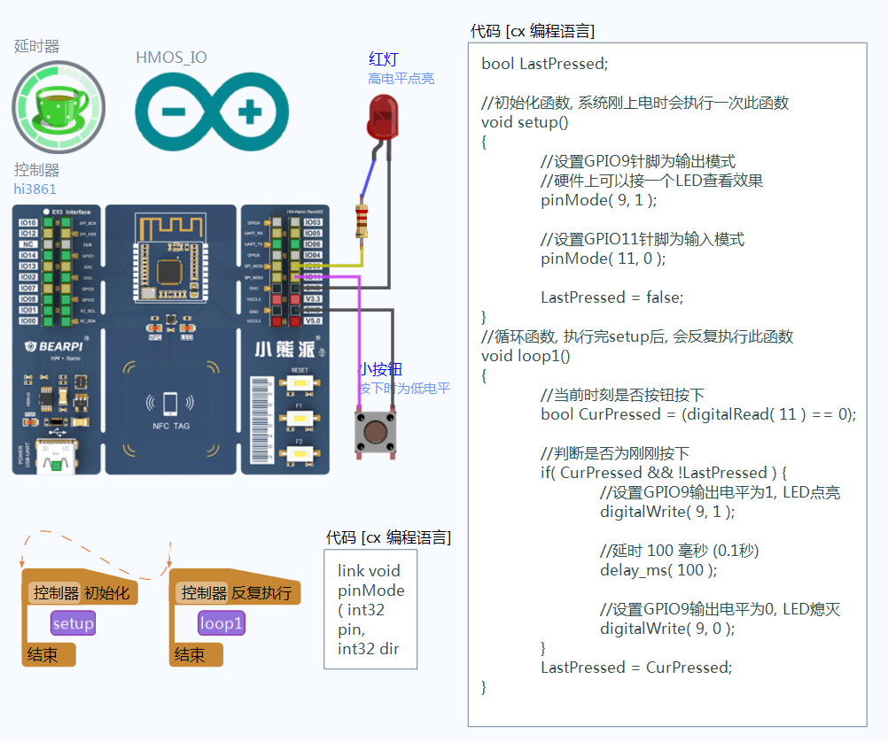


## OpenHarmony代码编程模式-按钮控制LED

材料准备: 准备一块搭载hi3861芯片的开发板, 需要事先烧录好linkboy for OpenHARMony的引擎固件

案例说明: 本案例展示如何在OpenHarmony开发板上进行arduino代码编程, 通过digitalRead函数读取针脚电平, 并控制外接LED亮灭. 没有硬件的话可通过电脑仿真进行验证, 仿真时鼠标点击按钮, 即可控制屏幕上的LED亮灭.

