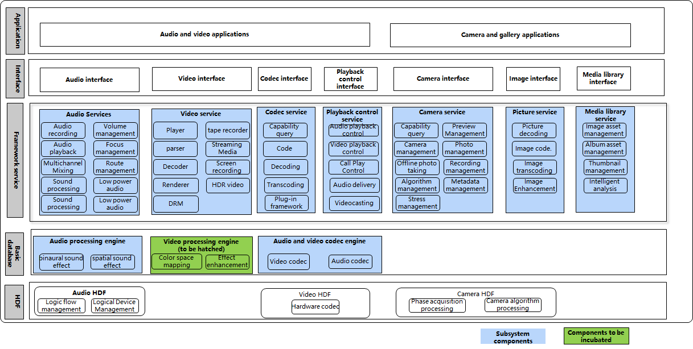

# sig_Media
English | [简体中文](./sig_media_cn.md)

Note: The content of this SIG follows the convention described in OpenHarmony's PMC Management Charter [README](../../zh/pmc.md).

## SIG group work objectives and scope

### work goals
Manage OpenHarmony Media

### work scope
OpenHarmony media related design and review.

The panoramic view of the technical stack scope of the sig_media is shown in the following figure:

|Component Name|Component Function Description|Component gitee Name|
| ------------ | ------------ |------------ |
|Audio Service|The audio component is used to implement audio-related functions, including audio playback, recording, volume management, and device management|multimedia_audio_framework|
|Video Service|Provides media data pipeline processing for scenarios such as playback and recording|multimedia_media_foundation|
|Codec Service|Provides unified audio and video encoding, decoding, packaging, and unpackaging capabilities|multimedia_av_codec|
|Playback Control Service|Provides unified media control capabilities|multimedia_av_session|
|Camera Service|Supports the development of camera business, providing interfaces to access, operate, and develop new functions for camera hardware|multimedia_camera_framework|
|Image Service|Provides a series of easy-to-use interfaces for storing source code information of images, and provides the ability to create image sources and manage bitmaps|multimedia_image_framework|
|Media Library Service|Provides a series of easy-to-use interfaces for obtaining metadata information of media files|multimedia_media_library|
|Video Processing Engine|Provides basic capabilities such as detail enhancement, contrast enhancement, brightness enhancement, and dynamic range enhancement|multimedia_video_processing_engine|
## SIG Members

### Leader
- @dumingliang_hw(https://gitee.com/dumingliang_hw)

### Committers
- @zhu-mingliang(https://gitee.com/zhu-mingliang)
- @liuyuehua1(https://gitee.com/liuyuehua1)
- @wangjuntao(https://gitee.com/buranfanchen)

### Meetings
 - Meeting time：Every two weeks' Friday 14:30-15:30
 - Meeting application: [OpenHarmony sig_Media Meeting Proposal](https://shimo.im/sheets/DTgCtcgrHhyTq6tD/MODOC)
 - Meeting link: Welink
 - Meeting notification: [Subscribe to](https://lists.openatom.io/postorius/lists/dev.openharmony.io) mailing list dev@openharmony.io for the meeting link

### Contact (optional)

- dumingliang@huawei.com

- Mailing list：dev@openharmony.io
- Wechat group：SIG-Media
