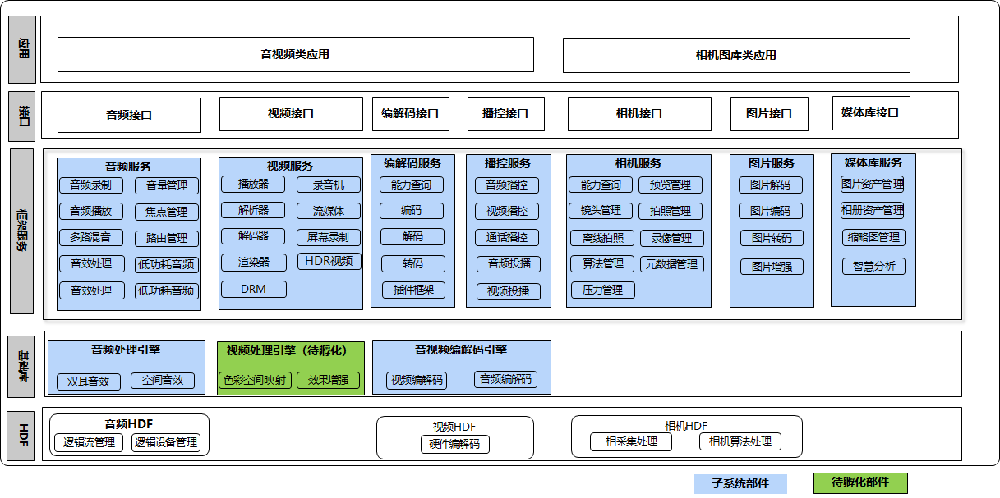

# sig_Media
简体中文 | [English](./sig_media.md)

说明：本SIG的内容遵循OpenHarmony的PMC管理章程 [README](../../zh/pmc.md)中描述的约定。

## SIG组工作目标和范围

### 工作目标
OpenHarmony 媒体管理。

### 工作范围
媒体相关的设计和提交评审。

媒体SIG（ sig_media ）技术栈范围全景图如下图所示：

|部件名称|部件功能描述|部件仓名称|
| ------------ | ------------ |------------ |
|音频服务|音频组件用于实现音频相关的功能，包括音频播放，录制，音量管理和设备管理|multimedia_audio_framework|
|视频服务|提供播放、录制等场景的媒体数据流水线处理|multimedia_media_foundation|
|编解码服务|提供了统一的[音视频编解码](https://gitcode.com/openharmony/docs/blob/master/zh-cn/application-dev/media/avcodec/avcodec-support-formats.md)、封装、解封装能力|multimedia_av_codec|
|播控服务|提供了统一的媒体控制能力|multimedia_av_session|
|相机服务|支持相机业务的开发，提供接口实现相机硬件的访问、操作和新功能开发|multimedia_camera_framework|
|图片服务|提供了一系列易用的接口用于存放image的源码信息，提供创建图片源和位图管理能力|multimedia_image_framework|
|媒体库服务|提供了一系列易用的接口用于获取媒体文件元数据信息|multimedia_media_library|
|视频处理引擎|提供细节增强、对比度增强、亮度增强、动态范围增强等基础能力|multimedia_video_processing_engine|

## SIG组成员

### Leader
- @dumingliang_hw(https://gitee.com/dumingliang_hw)

### Committers列表
- @zhu-mingliang(https://gitee.com/zhu-mingliang)
- @liuyuehua1(https://gitee.com/liuyuehua1)
- @wangjuntao(https://gitee.com/buranfanchen)

### 会议
 - 会议时间：双周周五14:30-15:30
 - 会议申报：[OpenHarmony sig_Media Meeting Proposal](https://shimo.im/sheets/DTgCtcgrHhyTq6tD/MODOC)
 - 会议链接: Welink
 - 会议通知: 请[订阅](https://lists.openatom.io/postorius/lists/dev.openharmony.io)邮件列表 dev@openharmony.io 获取会议链接

### 联系方式(可选)

- dumingliang@huawei.com

- 邮件列表：dev@openharmony.io
- 微信群：SIG-Media
