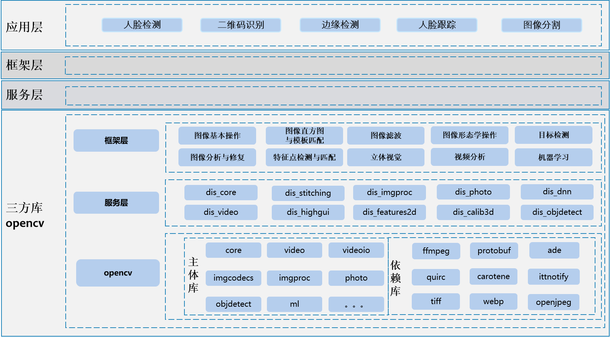

# sig_opencv
简体中文 | [English](./sig_opencv.md)

说明：本SIG的内容遵循OpenHarmony的PMC管理章程 [README](/zh/pmc.md)中描述的约定。

## SIG组工作目标和范围

### 工作目标
基于OpenHarmony平台移植OpenCV，针对该平台不适用的模块进行适配，并增加OpenCV基于OpenHarmony平台的的分布式加速方式。

### 工作范围
1. 基于NAPI框架，为移动终端的应用开发提供NAPI接口
2. 基于OH的分布式能力，实现OpenCV的分布式计算能力
3. 面向不同行业应用场景，开发基于OpenHarmony的典型应用场景

工作范围全景图如下所示：

## 代码仓
- 代码仓地址：
    - openCV: https://gitee.com/openharmony-sig/third_party_opencv

## SIG组成员

### Leader
- [@melody_wxy](https://gitee.com/melody_wxy)

### Committers列表
1. [@bayanxing](https://gitee.com/bayanxing)
2. [@zhangshouzhong](https://gitee.com/zhangshouzhong) 
3. [@bianshaolei](https://gitee.com/bianshaolei)

### 会议
 - 会议时间：双周例会，周四上午09:30, UTC+8
 - 会议通知：请[订阅](https://lists.openatom.io/postorius/lists/dev.openharmony.io/)邮件列表dev@openharmony.io获取会议链接
 - 会议纪要：https://gitee.com/openharmony-sig/sig-content/tree/master/opencv

### 联系方式(可选)
- 邮件列表：xxx
- Zulip群组：https://zulip.openharmony.cn
- 微信群：xxx

