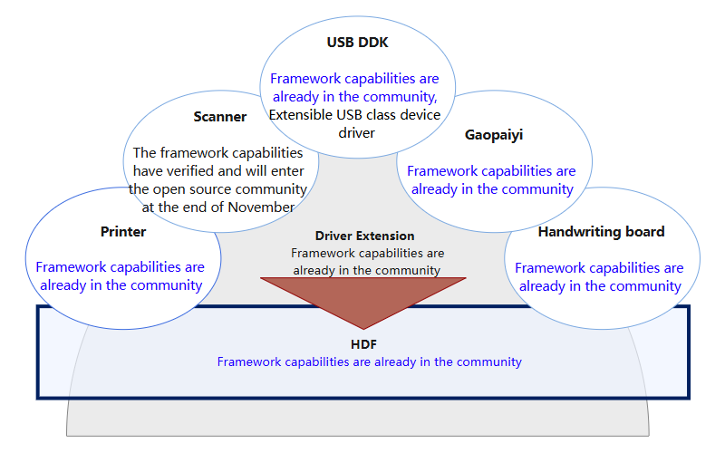
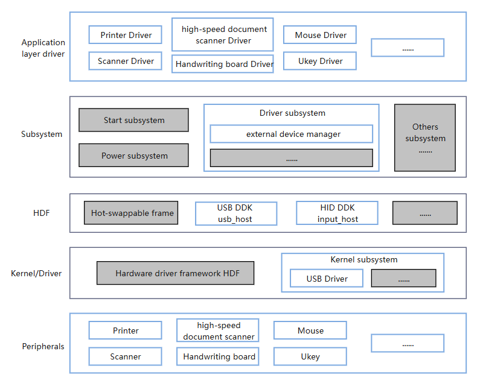

# SIG_Peripherals

[简体中文](./sig_peripherals_cn.md) | English

> **NOTE**
>
> The content of this special interest group (SIG) follows the conventions described in OpenHarmony's [PMC Management Charter](../../zh/pmc.md).

## Objectives and Scope

### Objectives

- 1、Complete the OpenHarmony system platform capability construction for peripherals and support ecological partners to access the OpenHarmony peripheral ecosystem efficiently, safely and at low cost.
- 2、Provide IDE tool/development board technical support, support ecological partners to develop peripheral drivers and supporting applications, and jointly build and share ecological achievements to rapidly prosper the OpenHarmony peripheral ecosystem.

### Work Scope

The core work content of this group is mainly to rely on the OpenHarmony platform to build various categories of peripheral driver extension framework sharing and co-construction, and support the entire process (development/deployment/installation/update/run/capability opening) life cycle management of the extended driver package. The following commonly used drivers The extension framework has been open sourced in the community.

Peripheral driver technology stack scope panorama

Target users：
- Equipment developers: peripheral manufacturers such as printers, scanners, high-definition cameras, tablets, etc.
- Application developer: application software supporting peripherals, such as handwriting and painting software.

## Code Repository

- **peripherals repository**

| Peripheral name | Driver function | Path |
| ----------- | --------------- | --------- |
| printer | Provide development samples for printer peripheral drivers, including functions such as setting print parameters and sending print requests. | peripherals_driver_samples/driver_printer(To be hatched) |
| scanner | Provide development samples for scanner peripheral drivers, including functions such as scanning files and exporting files. | Not open source yet |
| gaopaiyi | Provide development samples for peripheral drivers for high-speed cameras, including functions such as selecting cameras, selecting camera parameters, previewing, and taking photos. | peripherals_driver_samples/driver_high-speed_ducument_scanner(To be hatched) |
| handwriting board | Provide development samples for peripheral drivers for handwriting boards, including handwriting board area settings, handwriting board key shortcut settings, and other functions. | peripherals_driver_samples/driver_handwriting(To be hatched) |
| mouse | Provide development samples for non-standard mouse peripheral drivers, including functions such as modifying mouse side buttons. | peripherals_driver_samples/driver_mouse(To be hatched) |
| ukey | Provide development samples for Ukey peripheral drivers for banks, including functions such as querying key information and verifying pin codes. | peripherals_driver_samples/driver_ukey(To be hatched) |

## SIG Members

### Leader

- @yihaitao(https://gitee.com/yihaitao8686)

### Committers

- @lujianying(https://gitee.com/SiWuPan)

- @chenchong(https://gitee.com/cc13335166233)

- @yuanyulu(https://gitee.com/yuan-yulu)

- @fuqing(https://gitee.com/fuqing-sz)

- @huangqiaohua(https://gitee.com/daddykiko)

- @liukuo(https://gitee.com/kuokuozaixian)

- @lixinsheng(https://gitee.com/lixinsheng2)

- @liudimin(https://gitee.com/Danny_liuXu)
  
### Meetings
  
  - Meeting time: bi-weekly meeting, at 16:00 Wednesday, UTC-8
  - Meeting application: 
  - Meeting link: Tencent or other meetings
  - Meeting notice: [Subscribe to](https://lists.openatom.io/postorius/lists/dev@openharmony.io/) the email address to obtain the meeting link.
  - Meeting minutes: Click [here](https://gitee.com/openharmony-sig/sig-content) to view previous meeting minutes.

### (Optional) Contact

- Email list: [dev@openharmony.io](https://lists.openatom.io/postorius/lists/dev@openharmony.io/)
- WeChat group: xxx
